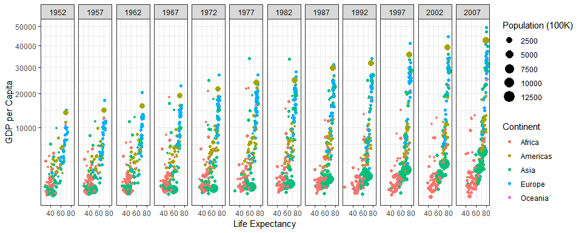
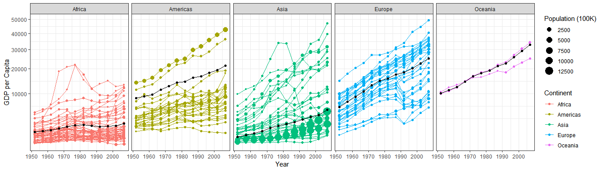

## Background

This assignment taught me how to use ggplot. These plots gave me a lot of problems while I was making them but I was able to become better at problem solving and debugging. I learned that the package dplyr is great but can get a little confusing.


## Images 

```r
gapminder %>%
  filter(country != "Kuwait") %>%
  #want to get the population size right 
  mutate(pop = pop / 100000) %>%
  #graphs in years
  group_by(year) %>%
  mutate(gdpPercap1 = weighted.mean(gdpPercap)) %>% 
ggplot(mapping = aes(x = lifeExp, y = gdpPercap)) + 
  geom_point(mapping = aes( size = pop, color = continent)) +
  facet_wrap(~ year, nrow = 1) +
 labs(x = "Life Expectancy", y = "GDP per Capita", color = "Continent", size = "Population (100K)") +
    scale_y_continuous(trans = "sqrt") +
  theme_bw()
```

<!-- -->


```r
gapminder %>%
  filter(country != "Kuwait") %>%
  group_by(year, continent) %>% 
  #want to get the population size right 
  mutate(pop = pop / 100000) %>%
  mutate(gdpPercap1 = weighted.mean(gdpPercap, pop)) %>%
ggplot(aes(x = year, y = gdpPercap)) + 
  geom_point(aes(color = continent, size = pop)) +
  geom_line(aes(group = country, color = continent)) +
  geom_point(aes(group = country, y = gdpPercap1)) +
  geom_line(aes(group = country, y = gdpPercap1)) +
  facet_wrap(~ continent, nrow = 1) +
  labs(x = "Year", y = "GDP per Capita", color = "Continent", size = "Population (100K)") +
  scale_y_continuous(trans = "sqrt") +
  theme_bw()
```

<!-- -->
    
