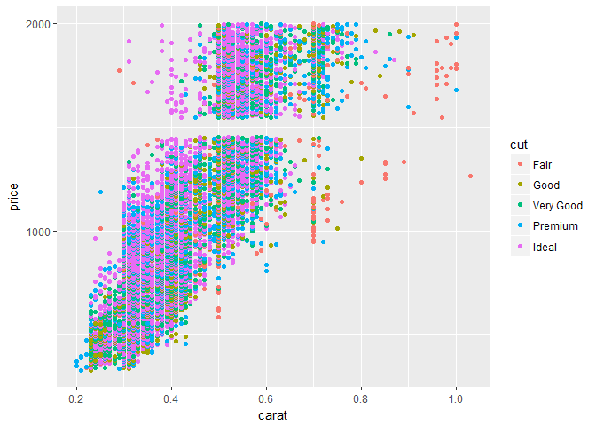
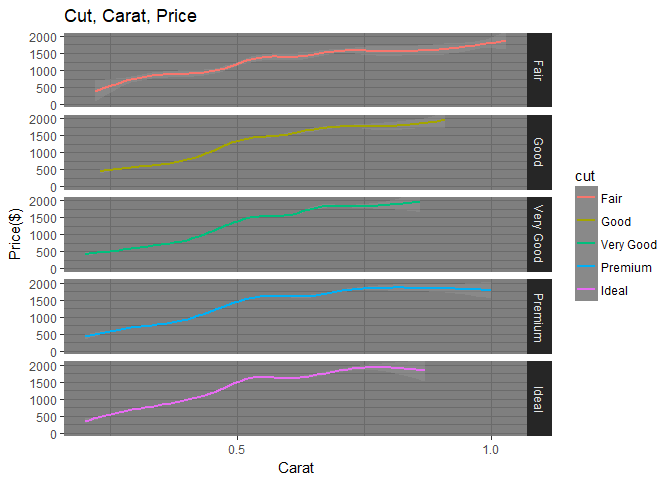

```r
library(ggplot2)
library(dplyr)
```

```
## 
## Attaching package: 'dplyr'
```

```
## The following objects are masked from 'package:stats':
## 
##     filter, lag
```

```
## The following objects are masked from 'package:base':
## 
##     intersect, setdiff, setequal, union
```


 

```r
diamonds %>%
  filter(price <= 2000) %>%
ggplot(mapping = aes(x = carat, y = price)) +
  geom_point(aes(color = cut)) +
  scale_y_continuous(breaks = seq(0, 2000, by = 1000)) 
```

<!-- -->


```r
diamonds2 <- diamonds %>%
  filter(price <= 2000)


ggplot(data = diamonds2, aes(x = carat, y = price)) +
  #geom_point() +
  geom_smooth(aes(color = cut)) +
  facet_grid(cut ~ .) +
  scale_x_continuous(breaks = seq(0, 1, by = 0.5)) + 
  coord_cartesian(ylim = c(0,2000)) +
  labs(x = "Carat", 
       y = "Price($)", 
       fill = "Cut",
       title = "Cut, Carat, Price") +
  theme_dark()
```

```
## `geom_smooth()` using method = 'gam'
```

<!-- -->

The first graph shows bad visualizations. The graph has no title so you have to look at the axis’s to see what is being compared. You have to look at the dots and try to line them up and put time into looking at the colors to make inferences. There are better ways to represent area, volume, Shading, and color saturation.

The second graph is a good visualization because you can look at it and tell that you are sacrificing cut for more carats. The graph gets the point across and grouped charts are really good.

