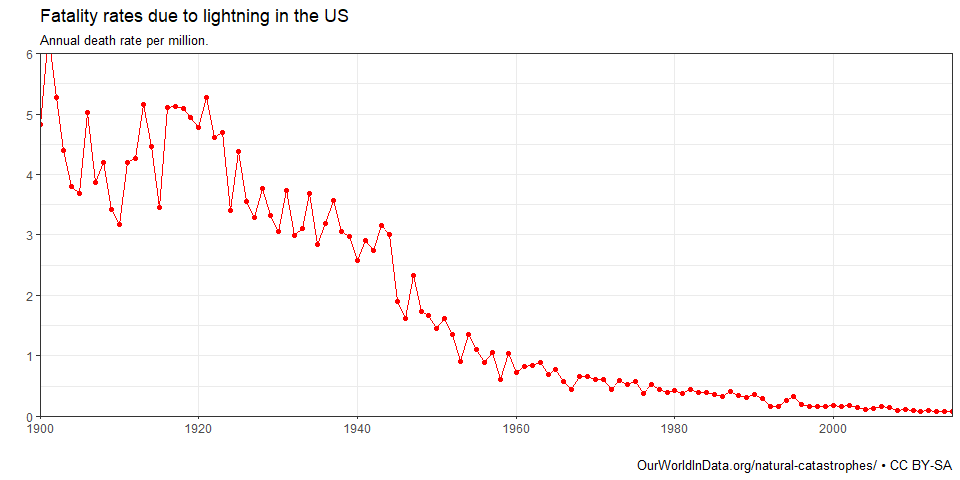
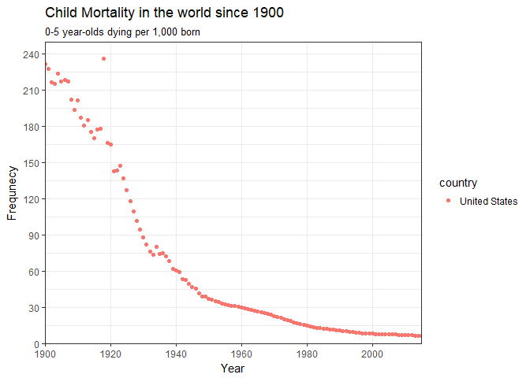

```r
library(tidyverse)
library(dplyr)
library(ggplot2)
library(devtools)
library(ourworldindata)
library(readr)

fatality_rates <-  read_csv("C:/Users/kgund/Documents/Winter Math 335/M335_GundersonK/M335_Tasks/Case_Study_03/Class_Task_06/fatality-rates-due-to-lightning-in-the-us.csv")
```

My first plot represents Fatality rates due to lightning in the US. You are able to look at a year and see how many deaths (in the millions) there was that year. The graph is also in linear form so it’s easier to follow the flow from 1900 to 2015.
My second plot is Child Mortality in the world since 1900. This chart represents the frequency of 0-5 year-olds dying per 1,000 born. I am in the process of adding more countries that can make this graph fuller but not add to many so it’s still easy to read and present if needed. 


```r
ggplot(data = fatality_rates) +
  geom_point(aes(x = Year, 
                 y = `Lightning (deaths per million)`), color = "red") +
  geom_line(aes(x = Year, 
                 y = `Lightning (deaths per million)`), color = "red") +
   labs(title = "Fatality rates due to lightning in the US",
        y = "",
        x = "",
        subtitle = "Annual death rate per million.",
        caption = "OurWorldInData.org/natural-catastrophes/ • CC BY-SA") +
  scale_y_continuous(breaks = seq(0, 6, by = 1), expand = c(0, 0)) +
  coord_cartesian(xlim = c(1900, 2015), ylim = c(0, 6)) +
  scale_x_continuous(breaks = seq(1900, 2015, by = 20), minor_breaks = seq(1900, 2015, 20), expand = c(0, 0)) +
  theme_bw()
```

<!-- -->


```r
child_mortality1 <- child_mortality %>%
  filter(country == "United States")


ggplot(data = child_mortality1) +
  geom_point(aes(x = year, 
                 y = child_mort, color = country)) +
 labs(title = "Child Mortality in the world since 1900",
        y = "Frequnecy",
        x = "Year",
        subtitle = "0-5 year-olds dying per 1,000 born") +
  scale_y_continuous(breaks = seq(0, 250, by = 30), expand = c(0, 0)) +
  coord_cartesian(xlim = c(1900, 2015), ylim = c(0, 250)) +
  scale_x_continuous(breaks = seq(1900, 2015, by = 20), minor_breaks = seq(1900, 2015, 20), expand = c(0, 0)) + 
                       theme_bw()
```

```
## Warning: Removed 1 rows containing missing values (geom_point).
```

<!-- -->

