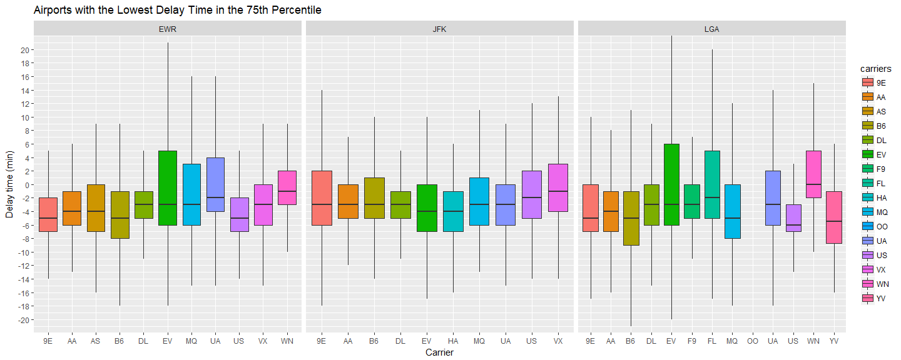
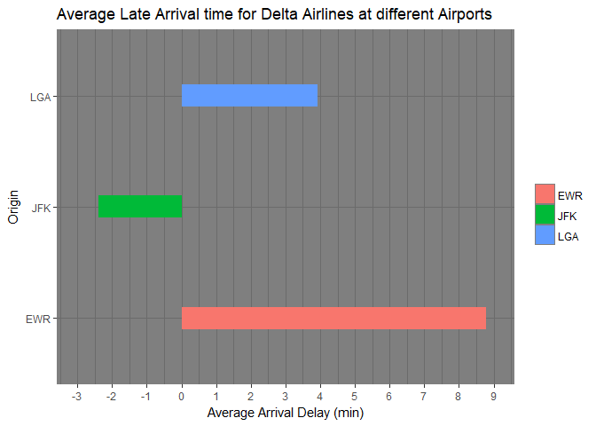

If I am leaving before noon, which two airlines do you recommend at each airport (JFK, LGA, EWR) that will have the lowest delay time at the 75th percentile?


```r
flights1 <- flights %>%
  select(sched_dep_time, dep_delay, origin, carrier) %>%
  filter(!is.na(dep_delay), !is.na(sched_dep_time), sched_dep_time <= 1200)

  

ggplot(data = flights1) +
  geom_boxplot(aes(x = carrier, 
                 y = dep_delay,
                 fill = carrier), 
               outlier.shape = NA) +
  coord_cartesian(ylim = c(-20, 20)) +
scale_y_continuous(breaks = seq(-20, 20, by = 2)) +
                     facet_wrap(~origin, scales = "free_x") +
  labs(x = "Carrier", 
       y = "Delay time (min)", 
       fill = "carriers",
       title = "Airports with the Lowest Delay Time in the 75th Percentile ") +
  theme_gray()
```

<!-- -->

##Plot 1

I have constructed a box plot that illustrates each airports time delay. A boxplot was the easiest way to show this because they provide a lot of information. The top of each of the boxes is the 75th percentile with regards to delay time. This plot offers you the ability to see the see what the median, min, max, and quartile 1 are if you wanted to get more information on each airports time delay. I would 


Which origin airport is best to minimize my chances of a late arrival when I am using Delta Airlines?


```r
flights2 <- flights %>%
  select(arr_delay, origin, carrier) %>%
  filter(!is.na(arr_delay), carrier == "DL") %>%
  group_by(origin) %>% 
  summarize(arr_delay1 = mean(arr_delay))

ggplot(data = flights2, aes(x = origin, y = arr_delay1, fill = origin)) +
  geom_bar(stat = "identity", width = .2) +
  coord_flip(ylim = c(-3, 9)) +
  scale_y_continuous(breaks = seq(-10, 10, by = 1)) +
  #facet_wrap( ~ origin, scales = "free_x") +
  labs(x = "Origin", 
       y = "Average Arrival Delay (min)", 
       fill = "",
       title = "Average Late Arrival time for Delta Airlines at different Airports") +
  theme_dark()
```

<!-- -->

##Plot 2

This bar graph shows the average late arrival time for Delta Airlines at different Airports. This graph clearly answers "Which origin airport is best to minimize my chances of a late arrival when I am using Delta Airlines?" LGA and JFK have the lowest average arrival delay. JFK even has a negative average arrival delay which means that it usually arrives early and LGA usually has an arrival delay of about four minutes.  


