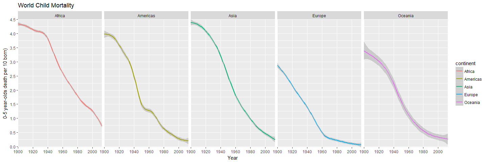

```r
financing_healthcare1 <-  financing_healthcare %>%
  select(continent, child_mort, year) %>%
  filter(!is.na(child_mort), year >= 1900, !is.na(continent)) %>%
  mutate(child_mort1 = child_mort / 100)


ggplot(data = financing_healthcare1) +
  geom_smooth(aes(x = year, 
                 y = child_mort1,
                 color = continent)) +
  scale_y_continuous(breaks = seq(0, 6, by = .5), expand = c(0, 0)) +
scale_x_continuous(breaks = seq(1900, 2015, by = 20), minor_breaks = seq(1900, 2015, 20), expand = c(0, 0)) +
  facet_grid(~continent) +
  labs(x = "Year", 
       y = "0-5 year-olds death per 10 born)", 
       fill = "",
       title = "World Child Mortality") +
  theme_gray()
```

<!-- -->

Just a graphic that shows mortality rate for each continent. 
