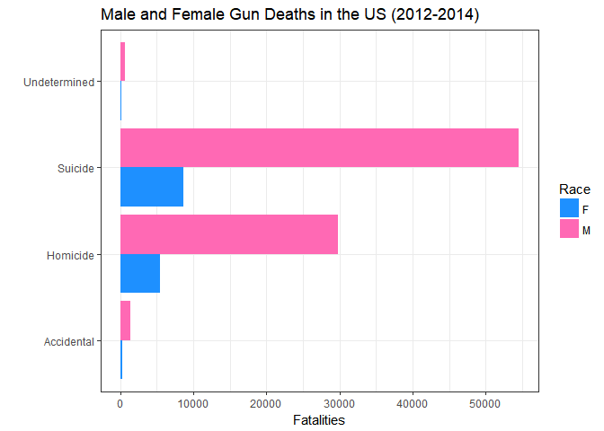
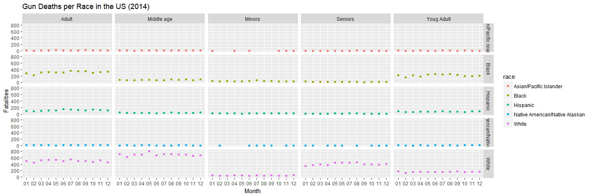
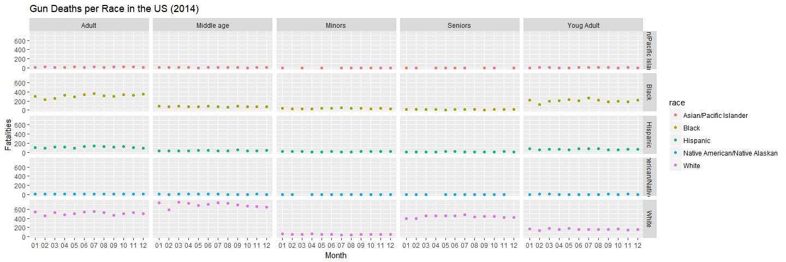
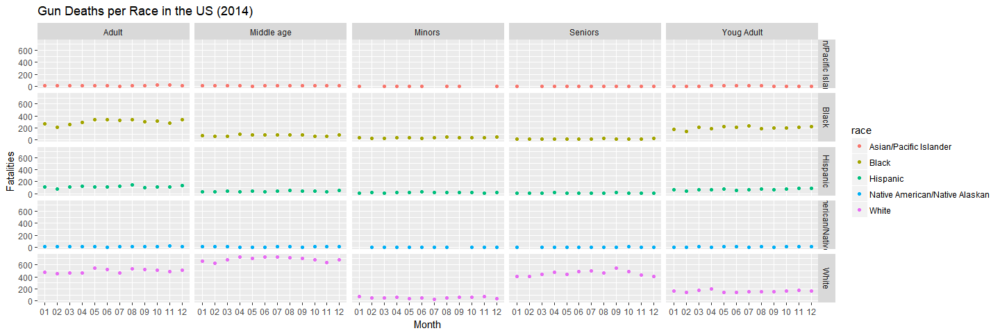

```r
library(tidyverse)
library(dplyr)
library(ggplot2)
library(devtools)
library(readr)

full_data <- read_csv("C:/Users/kgund/Documents/Winter Math 335/M335_GundersonK/M335_Tasks/Case_Study_04/analysis/full_data.csv")

#full_data <- read_csv("K:/Documents/Winter Math 335/M335_GundersonK/M335_Tasks/Case_Study_04/analysis/full_data.csv")
```


"Effectively Communicating Numbers" had a lot of good information. I learned a lot of things like avoid having the scale on the right side of the graph, categorical data is good with horizontal bars, and bars must start at a value of zero but other types of graphs can narrow the scale. I really liked the summary at the end so I am going to include it for future reference. 

 * Determine your message and identify your data
 * Determine if a table, graph, or combination of both is needed to communicate your message
 * Determine the best means to encode the values
 * Determine where to display each variable
 * Determine the best design for the remaining objects
 * Determine if particular data should be featured, and if so, how


```r
five <- full_data %>%
  select(intent, sex) %>%
  filter(!is.na(intent))

ggplot(data = five) +
  geom_bar(aes(x = intent, fill = sex), position = "dodge") +
  coord_flip() +
  scale_y_continuous(breaks = seq(0, 55000, by = 10000)) +
  scale_fill_manual(values = c("dodgerblue", "hotpink")) +
  labs(x = "" , 
       y = "Fatalities", 
       fill = "Race",
       title = "Male and Female Gun Deaths in the US (2012-2014)") +
  theme_bw()
```

<!-- -->

Their article was about gun deaths in America. The article was about talked a lot about suicude gun related death. The article also talked about  race, gender, and age. They want there to be awareness about all the types of gun death not just terrorism, mass shootings, etc. 


```r
full_data1 <- full_data %>%
  select(race, age, month, year) %>%
  filter(year == 2012) %>%
  mutate(
    seasons = case_when(
      month >= "03" & month <= "05" ~ "Spring",
      month >= "06" & month <= "08" ~ "summer",
      month >= "09" & month <= "11" ~ "Fall",
      TRUE                          ~ "Winter"
    )
  ) %>%
  mutate(
    age_group = case_when(
      age >= 65            ~ "Seniors",
      age < 65 & age >= 45 ~ "Middle age",
      age < 45 & age >= 25 ~ "Adult",
      age < 25 & age >= 18 ~ "Youg Adult", 
      TRUE                 ~ "Minors"
    )
  ) %>%
  group_by(race, month, age_group) %>%
  summarise(n = n())

  
ggplot(data = full_data1) +
  geom_point(aes(x = month, y = n, color = race)) +
  scale_fill_brewer(palette = "Set1") +
  facet_grid(race ~ age_group) +
  labs(x = "Month" , 
       y = "Fatalities", 
       fill = "Race",
       title = "Gun Deaths per Race in the US (2014)") +
  theme_gray()
```

<!-- -->


```r
full_data1 <- full_data %>%
  select(race, age, month, year) %>%
  filter(year == 2013) %>%
  mutate(
    seasons = case_when(
      month >= "03" & month <= "05" ~ "Spring",
      month >= "06" & month <= "08" ~ "summer",
      month >= "09" & month <= "11" ~ "Fall",
      TRUE                          ~ "Winter"
    )
  ) %>%
  mutate(
    age_group = case_when(
      age >= 65            ~ "Seniors",
      age < 65 & age >= 45 ~ "Middle age",
      age < 45 & age >= 25 ~ "Adult",
      age < 25 & age >= 18 ~ "Youg Adult", 
      TRUE                 ~ "Minors"
    )
  ) %>%
  group_by(race, month, age_group) %>%
  summarise(n = n())

  
ggplot(data = full_data1) +
  geom_point(aes(x = month, y = n, color = race)) +
  scale_fill_brewer(palette = "Set1") +
  facet_grid(race ~ age_group) +
  labs(x = "Month" , 
       y = "Fatalities", 
       fill = "Race",
       title = "Gun Deaths per Race in the US (2014)") +
  theme_gray()
```

<!-- -->


```r
full_data1 <- full_data %>%
  select(race, age, month, year) %>%
  filter(year == 2014) %>%
  mutate(
    seasons = case_when(
      month >= "03" & month <= "05" ~ "Spring",
      month >= "06" & month <= "08" ~ "summer",
      month >= "09" & month <= "11" ~ "Fall",
      TRUE                          ~ "Winter"
    )
  ) %>%
  mutate(
    age_group = case_when(
      age >= 65            ~ "Seniors",
      age < 65 & age >= 45 ~ "Middle age",
      age < 45 & age >= 25 ~ "Adult",
      age < 25 & age >= 18 ~ "Youg Adult", 
      TRUE                 ~ "Minors"
    )
  ) %>%
  group_by(race, month, age_group) %>%
  summarise(n = n())

  
ggplot(data = full_data1) +
  geom_point(aes(x = month, y = n, color = race)) +
  scale_fill_brewer(palette = "Set1") +
  facet_grid(race ~ age_group) +
  labs(x = "Month" , 
       y = "Fatalities", 
       fill = "Race",
       title = "Gun Deaths per Race in the US (2014)") +
  theme_gray()
```

<!-- -->


I have provided a graph for each year from the dataset, that's 2012, 13, and 14. I grouped the months to fit the seasons of the year. March - May is spring, June-August is summer, September-November is fall, and December-February is winter.  I also grouped the ages together by groups: below 18 is a minor, 18-25 is young adult, 26-45 is adult, 46-65 is middle age, and 65+ is senior.  I wanted the gun deaths in the US show by seasons, age, and race. 


