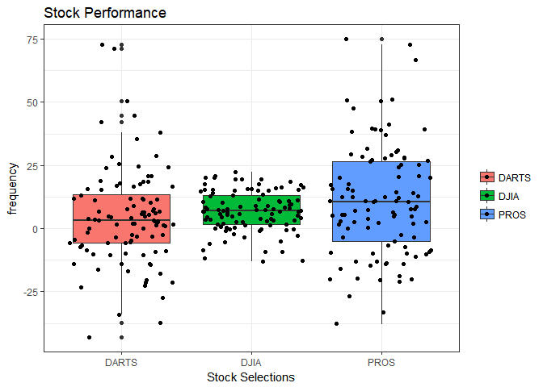

```r
ggplot(data = x) +
  geom_boxplot(aes(x = variable,
                   y = value,
                   fill = variable)) +
  geom_point(aes(x = variable,
                 y = value,
                 fill = variable), position = "jitter") +
  #scale_y_continuous(breaks = seq(24, 42, by = 2)) +
     labs(x = "Stock Selections", 
       y = "frequency", 
       fill = "",
       title = "Stock Performance") +
  theme_bw()
```

<!-- -->

```r
ggsave("stock.png")
```


