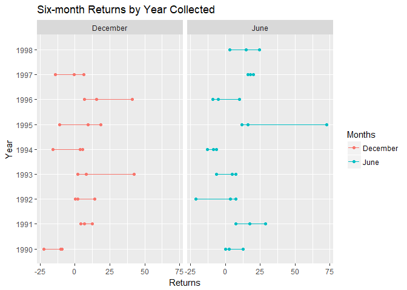

There are three interrelated rules which make a dataset tidy:
 1. Each variable must have its own column.
 2. Each observation must have its own row.
 3. Each value must have its own cell.

```r
 #count(x$contest_period)
y <- x %>%
  filter(contest_period != "Average") %>%
  separate(contest_period, c("month_end1", "year_end1")) %>%
  select(-`month_end1`) %>%
  separate(`year_end1`, c("month_end", "year_end"), sep = -5, convert = TRUE)
```

```
## Warning: Too many values at 3 locations: 43, 143, 243
```

```r
y$month_end[y$month_end %in% "Dec"] <- "December"
y$year_end[y$year_end %in% "Dec"] <- "1993"
y$month_end[y$month_end %in% "Febuary"] <- "February"

saveRDS(y, "Tidydata.rds")
 
 #separate() splits a single column into multiple columns
  #You can also de-select variables by using "-" prior to name or function.  The following produces the inverse of functions above
  #filter() provides basic filtering capabilities
  #filter(!is.na(year_end), !is.na(month_end))
```


```r
graph <- y %>%
  select(variable, month_end, year_end, value) %>%
  filter(month_end == "June" | month_end == "December") 
 
ggplot(data = graph, aes(x = year_end, y = value)) +
  geom_line(aes(color = month_end)) +
  geom_point(aes(color = month_end)) +
  #geom_point()) + 
  #jitter makes it too messy
  #scale_fill_brewer(palette = "Set1") +
  coord_flip() +
  facet_grid(.~month_end) +
  labs(x = "Year" , 
       y = "Returns", 
       color = "Months",
       title = "Six-month Returns by Year Collected") +
  theme_gray()
```

<!-- -->

It is supposed to output a graph that shows the returns every six months by the year in which the returns are collected. 


```r
c <- y %>%
  select(variable, month_end, year_end, value) %>%
  filter(variable == "DJIA") %>% 
  select(-`variable`) %>% 
  spread(key = year_end, value = value, fill = NA)
```

