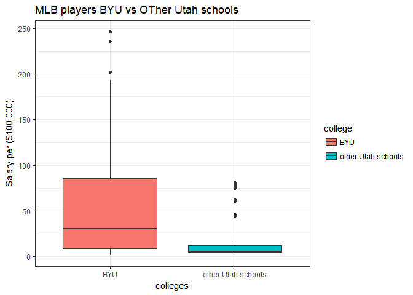

```r
library(tidyverse)
```

```
## -- Attaching packages -------------------------------------------- tidyverse 1.2.1 --
```

```
## v ggplot2 2.2.1     v purrr   0.2.4
## v tibble  1.4.1     v dplyr   0.7.4
## v tidyr   0.7.2     v stringr 1.2.0
## v readr   1.1.1     v forcats 0.2.0
```

```
## -- Conflicts ----------------------------------------------- tidyverse_conflicts() --
## x dplyr::filter() masks stats::filter()
## x dplyr::lag()    masks stats::lag()
```

```r
library(ggplot2)
library(Lahman)
library(blscrapeR)
library(dplyr)
```


 1. Schools
 2. Salaries
 3. CollegePlaying
 4. AwardsPlayers
 5. AllstarFull
 

```r
#inflation_adjust(2017)
ball <- Salaries %>%
  left_join(CollegePlaying, by = "playerID") %>%
  rename(year = yearID.y)

  x <- inflation_adjust(2017) 
x$year <- as.numeric(as.character(x$year))

  
ball1 <- ball %>%
        left_join(x, by = "year") %>%
  select(-base_year) %>% 
  left_join(Schools, by = "schoolID") %>% 
  filter(state == "UT") %>%
  mutate(
    college = case_when(
      name_full == "Brigham Young University" ~ "BYU",
      TRUE ~ "other Utah schools"
      
    )
  ) %>%
  select(-country, -schoolID, -avg_cpi) %>%
  mutate(Asalary = salary / adj_value) %>%
  mutate(adjustedsalary = Asalary/100000) %>% 
  select(-Asalary)
```


```r
ggplot(data = ball1, aes(x = college, y = adjustedsalary, fill = college )) +
  geom_boxplot() +
  labs(x = "colleges",
       y = "Salary per ($100,000)",
       title = "MLB players BYU vs OTher Utah schools") +
  theme_bw()
```

<!-- -->

