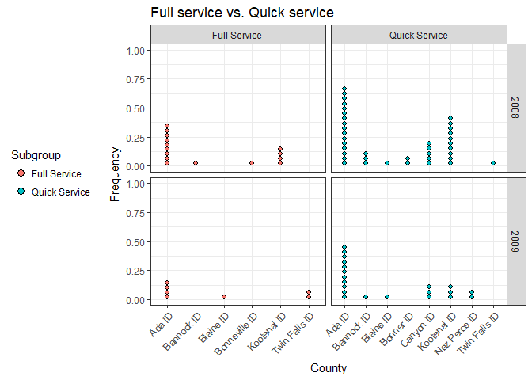
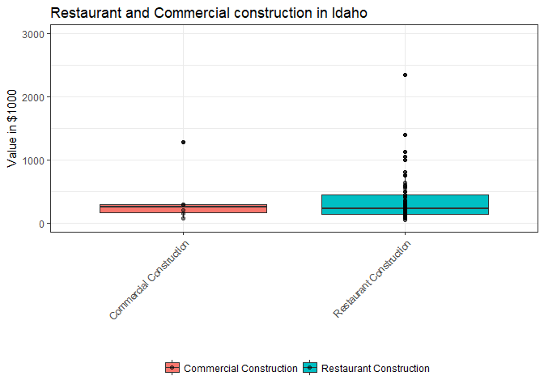
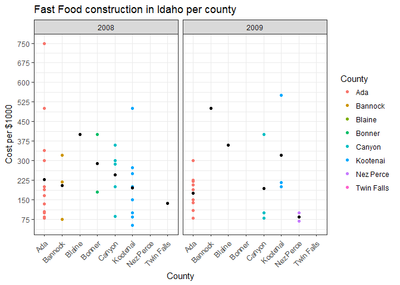
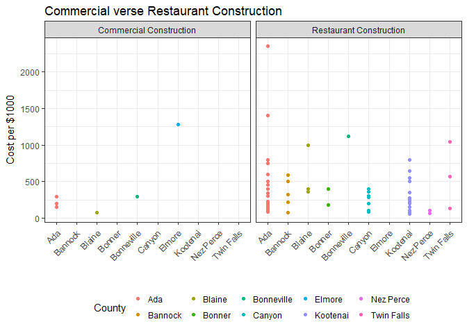

```r
library(tidyverse)
library(ggplot2)
library(blscrapeR)
library(dplyr)
library(readr)
library(downloader)
library(devtools)
library(buildings)
```


```r
fulldata <- buildings0809 %>% 
  left_join(climate_zone_fips, by = c("FIPS.county", "FIPS.state")) %>%  #joing FIPS
  filter(Type == "Food_Beverage_Service") %>% #Use fbs as type
  mutate(ProjectTitle = str_to_lower(ProjectTitle)) %>%#ProjectTitle all lowercase standardized
  mutate(Type = str_to_lower(Type))#Type all lowercase standardized  

restaurants <- restaurants %>%
    mutate(Restaurant = str_to_lower(Restaurant)) %>%  #Restaurants all lowercase standardized 
    mutate(Type = str_to_lower(Type)) #Type all lowercase standardized 

#fulldata1 <- fulldata %>%
  #full_join(restaurants, by = "Type")
#dont join the restaurants because the code below does that.
```


```r
not_restaurants <- c("development","Food preperation center", "Food Services center","bakery","Grocery","conceession","Cafeteria", "lunchroom","school","facility"," hall ")

standalone_retail <- c("Wine","Spirits","Liquor","Convenience","drugstore","Flying J", "Rite Aid","walgreens","Love's Travel")

full_service_type <- c("Ristorante","mexican","pizza","steakhouse","grill","buffet","tavern","bar","waffle","italian","steak house")

quick_service_type <- c("coffee"," java ","Donut","Doughnut","burger","Ice Cream ","custard ","sandwich","fast food","bagel")

quick_service_names <- restaurants$Restaurant[restaurants$Type %in% c("coffee","Ice Cream","Fast Food")]

full_service_names <- restaurants$Restaurant[restaurants$Type %in% c("pizza","casual Dining","fast casual")]
```


```r
#self note FALSE becomes 0 and TRUE becomes 1 with string dectect  
#error cause it was not 87 or one 
#error pattern is missing 
#detect to get the column ProjecTitle to match elements of the full_service_names then paste is concatenating them
#Thanks Blake for the help!!!!!!
fulldata1 <- fulldata %>%
  mutate(Subgroup = case_when(
    str_detect(ProjectTitle, paste(str_to_lower(not_restaurants), collapse = "|")) ~ "Not Restaurant",
    str_detect(ProjectTitle, paste(str_to_lower(standalone_retail), collapse = "|")) ~ "Standalone Retail",
    str_detect(ProjectTitle, paste(str_to_lower(full_service_type), collapse = "|")) ~ "Full Service", 
    str_detect(ProjectTitle, paste(str_to_lower(quick_service_type), collapse = "|")) ~ "Quick Service", 
    str_detect(ProjectTitle, paste(str_to_lower(quick_service_names), collapse = "|")) ~ "Quick Service",
    str_detect(ProjectTitle, paste(str_to_lower(full_service_names), collapse = "|")) ~ "Full Service",
    SqFt >= 4000 ~ "Full Service",
    SqFt < 4000 ~ "Quick Service"
   )
  )
```


```r
#How did full-service restaurant construction compare to quick service restaurant construction across county and years?
q1 <- fulldata1 %>%
  filter(Subgroup == "Full Service" | Subgroup == "Quick Service")

ggplot(data = q1) +
  geom_dotplot(aes(x = County.y,
                   fill = Subgroup)) +
  facet_grid(Year ~ Subgroup, scales = "free_x") +
  labs(title = "Full service vs. Quick service",
        y = "Frequency",
        x = "County") +
  theme_bw() +
  theme(axis.text.x = element_text(angle = 45, hjust = 1), legend.position = "left")
```

<!-- -->

Across the years 2008 and 2009 we can see that quick service restaurant construction has been more frequent than full service restaurant construction. In 2008 there was far more construction than in 2009. Ada county has also been very consistent with construction. 


```r
#How did restaurant construction fare compare to the other commercial construction in Idaho?
q2 <- fulldata1 %>%
  select(Subgroup, Value1000, Ownership) %>%
  mutate(constructtype = case_when(
    Subgroup == "Not Restaurant" ~ "Commercial Construction",
    TRUE ~ "Restaurant Construction"
    )
  )

ggplot(data = q2) +
  geom_boxplot(aes(x = as.factor(constructtype), y = Value1000, fill = as.factor(constructtype))) +
  geom_point(aes(x = as.factor(constructtype), y = Value1000, fill = as.factor(constructtype)), alpha = 0.5) +
  coord_cartesian(ylim = c(0, 3000)) +
  #facet_grid(.~ Ownership) +
  labs(title = "Restaurant and Commercial construction in Idaho ",
        y = "Value in $1000",
        x = "",
        fill = "") +
  theme_bw() +
  theme(axis.text.x = element_text(angle = 45, hjust = 1), legend.position = "bottom")
```

<!-- -->
To answer the question "How did restaurant construction fare compare to the other commercial construction in Idaho?" I have made a graph that shows restaurant and commercial construction between county, federal, private, and state. We can see that commercial construction is highest between county, federal, and state but private had more restaurant construction.


```r
#Which county in Idaho spent the most on fast food construction each year?
q3 <- fulldata1 %>%
  select(Value1000, County.y, Subgroup, Year) %>% 
  separate(`County.y`, c("County", "State"), sep = -3) %>%
  select(-State) %>% 
  filter(Subgroup == "Quick Service")

mean_set <- q3 %>%
group_by(County, Year) %>%
summarise(mean_cost = mean(Value1000))

ggplot(data = q3) +
  geom_point(aes(x = County, y = Value1000, fill = Subgroup, color = County)) +
  geom_point(data = mean_set, aes( x = County, y = mean_cost)) +
  scale_y_continuous(breaks = seq(0, 750, by = 75)) +
  #coord_flip() +
  facet_grid(~ Year) +
  labs(title = "Fast Food construction in Idaho per county",
        y = "Cost per $1000",
        x = "County",
        fill = "") +
  theme_bw() +
  guides(fill = FALSE) +
    theme(axis.text.x = element_text(angle = 45, hjust = 1))
```

<!-- -->

The graph be show how much each county spent each year on fast food construction each year.  We can see that Kooteni spends has spent the most amount of money in 2009 and Ada county had spent the most in 2008. Twin Falls and Nez Perce spent the least amount in 2008 while Twin Falls and Bonner count spent the least amount in 2009.


```r
#In that county how did other commercial construction compare?

q4 <- fulldata1 %>%
  select(Value1000, County.y, Subgroup, Year) %>% 
  separate(`County.y`, c("County", "State"), sep = -3) %>%
  select(-State) %>%
  mutate(constructtype = case_when(
    Subgroup == "Not Restaurant" ~ "Commercial Construction",
    TRUE ~ "Restaurant Construction"
    )
  )

ggplot(data = q4) +
  geom_point(aes(x = County, y = Value1000, color = County)) +
  facet_grid(.~ constructtype) +
  labs(title = "Commercial verse Restaurant Construction",
        y = "Cost per $1000",
        x = "",
        fill = "") +
  theme_bw() +
  theme(axis.text.x = element_text(angle = 45, hjust = 1), legend.position = "bottom")
```

<!-- -->

I have compared commercial construction to fast food construction in counties that have spent money on fast food construction in 208 and 2009. The only county to spend more on commercial construction than fast food construction was Bmoore.


