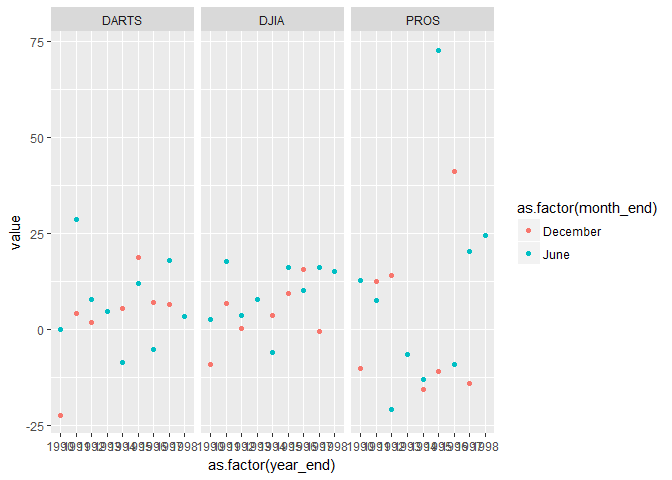

```r
stock1 %>% 
  filter(variable %in% "DJIA") %>%
  select(-contest_period, -variable) %>%
  spread(key = year_end, value = value) %>% 
  mutate(month_end = case_when(
    month_end == "Dec." ~ "December",
    month_end == "Febuary" ~ "February", 
    TRUE ~ month_end)) %>% 
  group_by(month_end) %>% 
  summarise_all(sum, na.rm = TRUE) %>% 
  mutate(month_end = fct_relevel(.$month_end, "January","February","March","April",
                                     "May","June","July","August",
                                     "September", "October", "November", "December")) %>% 
  arrange(month_end) %>% 
  pander()
```


----------------------------------------------------------------------------
 month_end   1990    1991   1992   1993   1994   1995   1996   1997   1998  
----------- ------- ------ ------ ------ ------ ------ ------ ------ -------
  January      0     -0.8   6.5    -0.8   11.2   1.8     15    19.6   -0.3  

 February      0      11    8.6    2.5    5.5    3.2    15.6   20.1   10.7  

   March       0     15.8   7.2     9     1.6    7.3    18.4   9.6     7.6  

   April       0     16.2   10.6   5.8    0.5    12.8   14.8   15.3   22.5  

    May        0     17.3   17.6   6.7    1.3    19.5    9     13.3   10.6  

   June       2.5    17.7   3.6    7.7    -6.2    16    10.2   16.2    15   

   July      11.5    7.6    4.2    3.7    -5.3   19.6   1.3    20.8    7.1  

  August     -2.3    4.4    -0.3   7.3    1.5    15.3   0.6    8.3    -13.1 

 September   -9.2    3.4    -0.1   5.2    4.4     14    5.8    20.2   -11.8 

  October    -8.5    4.4     -5    5.7    6.9    8.2    7.2     3       0   

 November    -12.8   -3.3   -2.8   4.9    -0.3   13.1   15.1   3.8      0   

 December    -9.3    6.6    0.2     8     3.6    9.3    15.5   -0.7     0   
----------------------------------------------------------------------------


```r
stock1 %>% 
  select(year_end, month_end, value, variable) %>%
  filter(month_end == "June" | month_end == "December") %>% 
  ggplot() +
  geom_point(aes(x = as.factor(year_end) , y = value , color = as.factor(month_end))) +
  facet_grid(~ variable)
```

<!-- -->

```r
  labs(title = "Six month return per year",
        y = "Year",
        x = "Value",
       color = "") +
  theme_bw() +
  theme(axis.text.x = element_text(angle = 45, hjust = 1))
```

```
## NULL
```

```r
  #facet_grid(~ variable)
```


