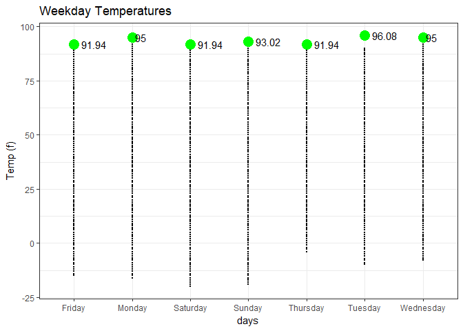
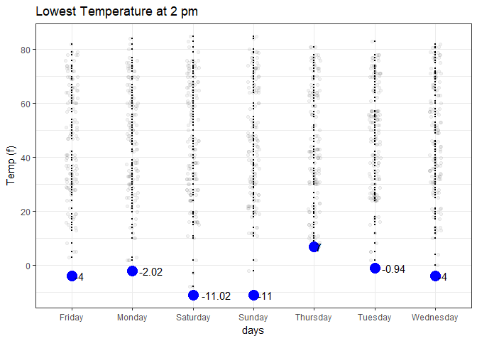

```r
day_of_week <- RXE %>%
  mutate(second = second(RXE$valid) ,
         minute = second(RXE$valid),
         hour = hour(RXE$valid),
         day = wday(RXE$valid),
         month = month(RXE$valid),
         year = year(RXE$valid))
```
What day of the week had the highest temperature reading?


```r
day_of_week1 <- day_of_week %>% 
  mutate(days = case_when(
    day == 1 ~ "Monday",
    day == 2 ~ "Tuesday",
    day == 3 ~ "Wednesday",
    day == 4 ~ "Thursday",
    day == 5 ~ "Friday",
    day == 6 ~ "Saturday",
    TRUE ~ "Sunday")) %>%
    filter(!is.na(tmpf))

#two_pm <- subset(day_of_week1, hour == 2)
                   
ggplot(data = day_of_week1, aes(x = as.factor(days), y = tmpf)) +
  geom_point(size = 0) +
  #geom_jitter(position = position_jitter(width = 0.1, height = 0), alpha = .05)+
  stat_summary(fun.y = max, colour = "Green", geom = "point", size = 5) +
  #stat_summary(fun.y = min, colour = "blue", geom = "point", size = 5) +
  stat_summary(aes(label = round(..y..,2)), fun.y = max,geom = "text", size = 4, hjust = -0.3) +
  labs(title = "Weekday Temperatures",
       x = "days",
       y = "Temp (f)") +
  theme_bw()
```

<!-- -->

```r
ggsave("plot1.png")
```

```
## Saving 7 x 5 in image
```


What day of the week had the lowest temperature at 2 pm?


```r
two_pm <- day_of_week1 %>%
  select(tmpf, hour, days) %>% 
  filter(hour == 2)

ggplot(data = two_pm, aes(x = as.factor(days), y = tmpf)) +
  geom_point(size = 0) +
  geom_jitter(position = position_jitter(width = 0.1, height = 0), alpha = .05) +
  #stat_summary(fun.y = max, colour = "Green", geom = "point", size = 5) +
  stat_summary(fun.y = min, colour = "blue", geom = "point", size = 5) +
  stat_summary(aes(label = round(..y..,2)), fun.y = min,geom = "text", size = 4, hjust = -0.3) +
  labs(title = "Lowest Temperature at 2 pm",
       x = "days",
       y = "Temp (f)") +
  theme_bw()
```

<!-- -->

```r
ggsave("plot2.png")
```

```
## Saving 7 x 5 in image
```


