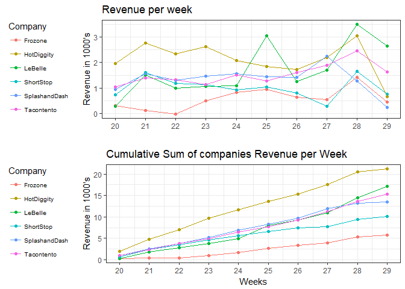
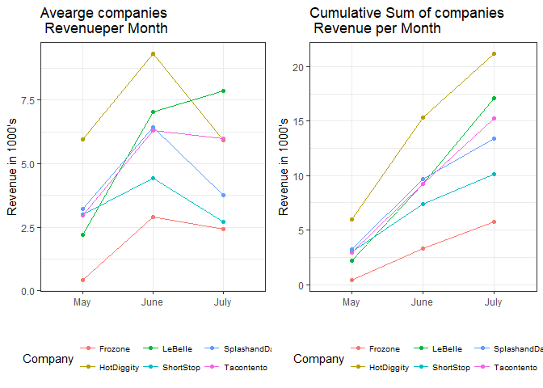

```r
data <- df %>%
  filter(Type != "Missing", Name != "Missing") %>% 
    mutate(Time = str_replace(.$Time, "T", " ")) %>%
    mutate(Time = str_replace(.$Time, "Z", "")) %>% 
  mutate(Year = year(.$Time), 
         Month = month(.$Time, label = TRUE, abbr = FALSE),
         Year = year(.$Time),
         Day = wday(.$Time),
         Hour = hour(.$Time),
         Week = week(.$Time),
         Week_day = wday(.$Time,label = TRUE, abbr = FALSE)) %>%
  filter(Week != 16)  # One business starts at week 16 so I took that data out 
```
Below are the hourly, daily, weekly, and monthly gross revenue summaries and comparisons for each company.

Hourly comparison 

```r
hour <- data %>%
  group_by(Name, Hour, Hour) %>% 
  summarise(Amount = sum(Amount)) %>% 
  mutate(cumsum = cumsum(Amount))

ggplot(data = hour, aes(x = Hour, y = Amount/1000, color = Name)) +
  geom_point() +
  geom_line() +
  facet_wrap(~Name) +
  labs(title = "Avearge companies Revenue per hour",
       x = "",
       y = "Revenue in 1000's",
       color = "Company") +
  theme_bw()
```

<!-- -->

Daily comparison

```r
#Daily
days <- data %>%
  group_by(Name, Week_day) %>% 
  summarise(Amount = sum(Amount)) %>% 
  mutate(cumsum = cumsum(Amount))

adays <- ggplot(data = days, aes(x = Week_day, y = Amount/1000, fill = Name, color = Name,  group = Name)) +
  geom_point() +
  geom_line() +
  labs(title = "Avearge companies Revenue per day",
       x = "",
       y = "Revenue in 1000's",
       color = "Company") +
  guides(fill = FALSE) +
  theme_bw() +
  theme(legend.position = c(0.12, 0.75), legend.text = element_text(size = rel(.72)), axis.text.x = element_text(angle = 45, hjust = 1)) 


cumsumdays <- ggplot(data = days, aes(x = Week_day, y = cumsum/1000, fill = Name, color = Name,  group = Name)) +
  geom_point() +
  geom_line() +
  labs(title = "Cumulative Sum of companies Revenue per day",
       x = "",
       y = "Revenue in 1000's",
       color = "Company") +
  guides(fill = FALSE) +
  theme_bw() +
  theme(legend.position = c(0.12, 0.7), legend.text = element_text(size = rel(.70)), axis.text.x = element_text(angle = 45, hjust = 1))

grid.arrange(adays, cumsumdays,  ncol = 2)
```

<!-- -->

Weekly comparison 

```r
#Weekly 
week <- data %>% 
  group_by(Name, Week) %>% 
  summarise(Amount = sum(Amount)) %>% 
  mutate(cumsum = cumsum(Amount))

aweek <- ggplot(data = week, aes(x = Week, y = Amount/1000, fill = Name, color = Name,  group = Name)) +
  geom_point() +
  geom_line() +
  scale_x_continuous(breaks = seq(12, 29, by = 1)) +
  labs(title = "Revenue per week",
       x = "",
       y = "Revenue in 1000's",
       color = "Company") +
  guides(fill = FALSE) +
  theme_bw() +
  theme(legend.position = "left", legend.text = element_text(size = rel(.65))) 

cumsumweek <- ggplot(data = week, aes(x = Week, y = cumsum/1000, fill = Name, color = Name)) +
  geom_point() +
  geom_line() +
  scale_x_continuous(breaks = seq(12, 29, by = 1)) +
  labs(title = "Cumulative Sum of companies Revenue per Week",
       x = "Weeks",
       y = "Revenue in 1000's",
       color = "Company") +
  guides(fill = FALSE) +
  theme_bw() +
  theme(legend.position = "left", legend.text = element_text(size = rel(.65)))

grid.arrange(aweek, cumsumweek,  nrow = 2)
```

<!-- -->

Monthly comparison 

```r
#Monthly
month <- data %>% 
  group_by(Name, Month) %>% 
  summarise(Amount = sum(Amount)) %>% 
  mutate(cumsum = cumsum(Amount))


amonth <- ggplot(data = month, aes(x = Month, y = Amount/1000, fill = Name, color = Name,  group = Name)) +
  geom_point() +
  geom_line() +
  labs(title = "Avearge companies \n Revenueper Month",
       x = "",
       y = "Revenue in 1000's",
       color = "Company") +
  guides(fill = FALSE) +
  theme_bw() +
  theme(legend.position = "bottom", legend.text = element_text(size = rel(.65))) 


cumsummonth <- ggplot(data = month, aes(x = Month, y = cumsum/1000, fill = Name, color = Name,  group = Name)) +
  geom_point() +
  geom_line() +
  labs(title = "Cumulative Sum of companies \n Revenue per Month",
       x = "",
       y = "Revenue in 1000's",
       color = "Company") +
  guides(fill = FALSE) +
  theme_bw() +
  theme(legend.position = "bottom", legend.text = element_text(size = rel(.65)))

grid.arrange(amonth, cumsummonth,  ncol = 2)
```

<!-- -->

Note that each cumulative sum graph is a final comparison of each company by either day, week, or month. 

On two separate weeks LaBelle earned more than HotDiggity. I find it interesting that Labelle consecutively did better on Friday than any other company. Frozone and ShortStop were always the worst performing company in terms of money gained. Other than Labelle and Hotdiggity all other companies performed about the same. After looking at the amount revenue for each company by hour, day, week, and month I would conclude that HotDiggity did the best and I would give them the loan.
