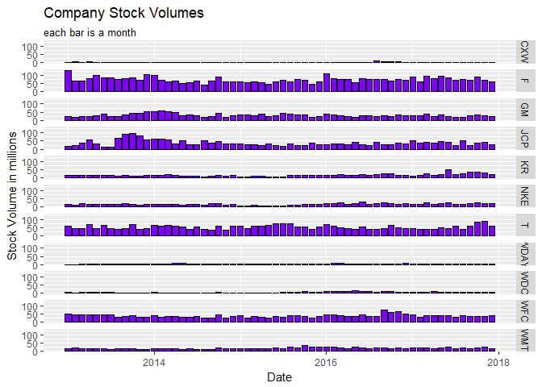
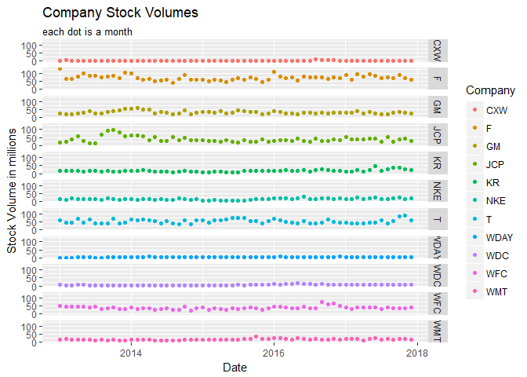

```r
#get stock ticker
tickers <- c("CXW", "F", "GM", "JCP", "KR", "WDC", "NKE","T", "WDAY", "WFC", "WMT")

#for ggplot
stock1 <- tq_get(tickers, get  = "stock.prices",
        from = "2013-1-01",
         to   = "2018-1-01")

#get that data for the last 5 years for dygraph
stock2 <- tq_get(tickers, get  = "stock.prices",
         from = "2013-1-01",
         to   = "2018-1-01") %>%
  select(symbol, date, adjusted) %>%
  spread(key = symbol, value = adjusted) %>%
  tk_xts(silent = TRUE)
```


```r
#Interactive graph
dygraph(stock2, main = "Stock Price for last 5 Years", 
        ylab = "Share Price", 
        xlab = "Daily Prices") %>% 
  dyHighlight(highlightCircleSize = 3,
              highlightSeriesBackgroundAlpha = .2,
              hideOnMouseOut = FALSE,
              highlightSeriesOpts = list(strokeWidth = 3)) %>% 
  dyLegend(show = "follow") %>% 
  dyRangeSelector()
```

<!--html_preserve--><div id="htmlwidget-4f27dc9da0cbce5b49d9" style="width:672px;height:480px;" class="dygraphs html-widget"></div>
<script type="application/json" data-for="htmlwidget-4f27dc9da0cbce5b49d9">{"x":{"attrs":{"title":"Stock Price for last 5 Years","xlabel":"Daily Prices","ylabel":"Share Price","labels":["day","CXW","F","GM","JCP","KR","NKE","T","WDAY","WDC","WFC","WMT"],"retainDateWindow":false,"axes":{"x":{"pixelsPerLabel":60}},"highlightCircleSize":3,"highlightSeriesBackgroundAlpha":0.2,"highlightSeriesOpts":{"strokeWidth":3},"legend":"follow","labelsDivWidth":250,"labelsShowZeroValues":true,"labelsSeparateLines":false,"hideOverlayOnMouseOut":true,"showRangeSelector":true,"rangeSelectorHeight":40,"rangeSelectorPlotFillColor":" #A7B1C4","rangeSelectorPlotStrokeColor":"#808FAB","interactionModel":"Dygraph.Interaction.defaultModel"},"scale":"daily","annotations":[],"shadings":[],"events":[],"format":"date","data":[["2013-01-02T00:00:00.000Z","2013-01-03T00:00:00.000Z","2013-01-04T00:00:00.000Z","2013-01-07T00:00:00.000Z","2013-01-08T00:00:00.000Z","2013-01-09T00:00:00.000Z","2013-01-10T00:00:00.000Z","2013-01-11T00:00:00.000Z","2013-01-14T00:00:00.000Z","2013-01-15T00:00:00.000Z","2013-01-16T00:00:00.000Z","2013-01-17T00:00:00.000Z","2013-01-18T00:00:00.000Z","2013-01-22T00:00:00.000Z","2013-01-23T00:00:00.000Z","2013-01-24T00:00:00.000Z","2013-01-25T00:00:00.000Z","2013-01-28T00:00:00.000Z","2013-01-29T00:00:00.000Z","2013-01-30T00:00:00.000Z","2013-01-31T00:00:00.000Z","2013-02-01T00:00:00.000Z","2013-02-04T00:00:00.000Z","2013-02-05T00:00:00.000Z","2013-02-06T00:00:00.000Z","2013-02-07T00:00:00.000Z","2013-02-08T00:00:00.000Z","2013-02-11T00:00:00.000Z","2013-02-12T00:00:00.000Z","2013-02-13T00:00:00.000Z","2013-02-14T00:00:00.000Z","2013-02-15T00:00:00.000Z","2013-02-19T00:00:00.000Z","2013-02-20T00:00:00.000Z","2013-02-21T00:00:00.000Z","2013-02-22T00:00:00.000Z","2013-02-25T00:00:00.000Z","2013-02-26T00:00:00.000Z","2013-02-27T00:00:00.000Z","2013-02-28T00:00:00.000Z","2013-03-01T00:00:00.000Z","2013-03-04T00:00:00.000Z","2013-03-05T00:00:00.000Z","2013-03-06T00:00:00.000Z","2013-03-07T00:00:00.000Z","2013-03-08T00:00:00.000Z","2013-03-11T00:00:00.000Z","2013-03-12T00:00:00.000Z","2013-03-13T00:00:00.000Z","2013-03-14T00:00:00.000Z","2013-03-15T00:00:00.000Z","2013-03-18T00:00:00.000Z","2013-03-19T00:00:00.000Z","2013-03-20T00:00:00.000Z","2013-03-21T00:00:00.000Z","2013-03-22T00:00:00.000Z","2013-03-25T00:00:00.000Z","2013-03-26T00:00:00.000Z","2013-03-27T00:00:00.000Z","2013-03-28T00:00:00.000Z","2013-04-01T00:00:00.000Z","2013-04-02T00:00:00.000Z","2013-04-03T00:00:00.000Z","2013-04-04T00:00:00.000Z","2013-04-05T00:00:00.000Z","2013-04-08T00:00:00.000Z","2013-04-09T00:00:00.000Z","2013-04-10T00:00:00.000Z","2013-04-11T00:00:00.000Z","2013-04-12T00:00:00.000Z","2013-04-15T00:00:00.000Z","2013-04-16T00:00:00.000Z","2013-04-17T00:00:00.000Z","2013-04-18T00:00:00.000Z","2013-04-19T00:00:00.000Z","2013-04-22T00:00:00.000Z","2013-04-23T00:00:00.000Z","2013-04-24T00:00:00.000Z","2013-04-25T00:00:00.000Z","2013-04-26T00:00:00.000Z","2013-04-29T00:00:00.000Z","2013-04-30T00:00:00.000Z","2013-05-01T00:00:00.000Z","2013-05-02T00:00:00.000Z","2013-05-03T00:00:00.000Z","2013-05-06T00:00:00.000Z","2013-05-07T00:00:00.000Z","2013-05-08T00:00:00.000Z","2013-05-09T00:00:00.000Z","2013-05-10T00:00:00.000Z","2013-05-13T00:00:00.000Z","2013-05-14T00:00:00.000Z","2013-05-15T00:00:00.000Z","2013-05-16T00:00:00.000Z","2013-05-17T00:00:00.000Z","2013-05-20T00:00:00.000Z","2013-05-21T00:00:00.000Z","2013-05-22T00:00:00.000Z","2013-05-23T00:00:00.000Z","2013-05-24T00:00:00.000Z","2013-05-28T00:00:00.000Z","2013-05-29T00:00:00.000Z","2013-05-30T00:00:00.000Z","2013-05-31T00:00:00.000Z","2013-06-03T00:00:00.000Z","2013-06-04T00:00:00.000Z","2013-06-05T00:00:00.000Z","2013-06-06T00:00:00.000Z","2013-06-07T00:00:00.000Z","2013-06-10T00:00:00.000Z","2013-06-11T00:00:00.000Z","2013-06-12T00:00:00.000Z","2013-06-13T00:00:00.000Z","2013-06-14T00:00:00.000Z","2013-06-17T00:00:00.000Z","2013-06-18T00:00:00.000Z","2013-06-19T00:00:00.000Z","2013-06-20T00:00:00.000Z","2013-06-21T00:00:00.000Z","2013-06-24T00:00:00.000Z","2013-06-25T00:00:00.000Z","2013-06-26T00:00:00.000Z","2013-06-27T00:00:00.000Z","2013-06-28T00:00:00.000Z","2013-07-01T00:00:00.000Z","2013-07-02T00:00:00.000Z","2013-07-03T00:00:00.000Z","2013-07-05T00:00:00.000Z","2013-07-08T00:00:00.000Z","2013-07-09T00:00:00.000Z","2013-07-10T00:00:00.000Z","2013-07-11T00:00:00.000Z","2013-07-12T00:00:00.000Z","2013-07-15T00:00:00.000Z","2013-07-16T00:00:00.000Z","2013-07-17T00:00:00.000Z","2013-07-18T00:00:00.000Z","2013-07-19T00:00:00.000Z","2013-07-22T00:00:00.000Z","2013-07-23T00:00:00.000Z","2013-07-24T00:00:00.000Z","2013-07-25T00:00:00.000Z","2013-07-26T00:00:00.000Z","2013-07-29T00:00:00.000Z","2013-07-30T00:00:00.000Z","2013-07-31T00:00:00.000Z","2013-08-01T00:00:00.000Z","2013-08-02T00:00:00.000Z","2013-08-05T00:00:00.000Z","2013-08-06T00:00:00.000Z","2013-08-07T00:00:00.000Z","2013-08-08T00:00:00.000Z","2013-08-09T00:00:00.000Z","2013-08-12T00:00:00.000Z","2013-08-13T00:00:00.000Z","2013-08-14T00:00:00.000Z","2013-08-15T00:00:00.000Z","2013-08-16T00:00:00.000Z","2013-08-19T00:00:00.000Z","2013-08-20T00:00:00.000Z","2013-08-21T00:00:00.000Z","2013-08-22T00:00:00.000Z","2013-08-23T00:00:00.000Z","2013-08-26T00:00:00.000Z","2013-08-27T00:00:00.000Z","2013-08-28T00:00:00.000Z","2013-08-29T00:00:00.000Z","2013-08-30T00:00:00.000Z","2013-09-03T00:00:00.000Z","2013-09-04T00:00:00.000Z","2013-09-05T00:00:00.000Z","2013-09-06T00:00:00.000Z","2013-09-09T00:00:00.000Z","2013-09-10T00:00:00.000Z","2013-09-11T00:00:00.000Z","2013-09-12T00:00:00.000Z","2013-09-13T00:00:00.000Z","2013-09-16T00:00:00.000Z","2013-09-17T00:00:00.000Z","2013-09-18T00:00:00.000Z","2013-09-19T00:00:00.000Z","2013-09-20T00:00:00.000Z","2013-09-23T00:00:00.000Z","2013-09-24T00:00:00.000Z","2013-09-25T00:00:00.000Z","2013-09-26T00:00:00.000Z","2013-09-27T00:00:00.000Z","2013-09-30T00:00:00.000Z","2013-10-01T00:00:00.000Z","2013-10-02T00:00:00.000Z","2013-10-03T00:00:00.000Z","2013-10-04T00:00:00.000Z","2013-10-07T00:00:00.000Z","2013-10-08T00:00:00.000Z","2013-10-09T00:00:00.000Z","2013-10-10T00:00:00.000Z","2013-10-11T00:00:00.000Z","2013-10-14T00:00:00.000Z","2013-10-15T00:00:00.000Z","2013-10-16T00:00:00.000Z","2013-10-17T00:00:00.000Z","2013-10-18T00:00:00.000Z","2013-10-21T00:00:00.000Z","2013-10-22T00:00:00.000Z","2013-10-23T00:00:00.000Z","2013-10-24T00:00:00.000Z","2013-10-25T00:00:00.000Z","2013-10-28T00:00:00.000Z","2013-10-29T00:00:00.000Z","2013-10-30T00:00:00.000Z","2013-10-31T00:00:00.000Z","2013-11-01T00:00:00.000Z","2013-11-04T00:00:00.000Z","2013-11-05T00:00:00.000Z","2013-11-06T00:00:00.000Z","2013-11-07T00:00:00.000Z","2013-11-08T00:00:00.000Z","2013-11-11T00:00:00.000Z","2013-11-12T00:00:00.000Z","2013-11-13T00:00:00.000Z","2013-11-14T00:00:00.000Z","2013-11-15T00:00:00.000Z","2013-11-18T00:00:00.000Z","2013-11-19T00:00:00.000Z","2013-11-20T00:00:00.000Z","2013-11-21T00:00:00.000Z","2013-11-22T00:00:00.000Z","2013-11-25T00:00:00.000Z","2013-11-26T00:00:00.000Z","2013-11-27T00:00:00.000Z","2013-11-29T00:00:00.000Z","2013-12-02T00:00:00.000Z","2013-12-03T00:00:00.000Z","2013-12-04T00:00:00.000Z","2013-12-05T00:00:00.000Z","2013-12-06T00:00:00.000Z","2013-12-09T00:00:00.000Z","2013-12-10T00:00:00.000Z","2013-12-11T00:00:00.000Z","2013-12-12T00:00:00.000Z","2013-12-13T00:00:00.000Z","2013-12-16T00:00:00.000Z","2013-12-17T00:00:00.000Z","2013-12-18T00:00:00.000Z","2013-12-19T00:00:00.000Z","2013-12-20T00:00:00.000Z","2013-12-23T00:00:00.000Z","2013-12-24T00:00:00.000Z","2013-12-26T00:00:00.000Z","2013-12-27T00:00:00.000Z","2013-12-30T00:00:00.000Z","2013-12-31T00:00:00.000Z","2014-01-02T00:00:00.000Z","2014-01-03T00:00:00.000Z","2014-01-06T00:00:00.000Z","2014-01-07T00:00:00.000Z","2014-01-08T00:00:00.000Z","2014-01-09T00:00:00.000Z","2014-01-10T00:00:00.000Z","2014-01-13T00:00:00.000Z","2014-01-14T00:00:00.000Z","2014-01-15T00:00:00.000Z","2014-01-16T00:00:00.000Z","2014-01-17T00:00:00.000Z","2014-01-21T00:00:00.000Z","2014-01-22T00:00:00.000Z","2014-01-23T00:00:00.000Z","2014-01-24T00:00:00.000Z","2014-01-27T00:00:00.000Z","2014-01-28T00:00:00.000Z","2014-01-29T00:00:00.000Z","2014-01-30T00:00:00.000Z","2014-01-31T00:00:00.000Z","2014-02-03T00:00:00.000Z","2014-02-04T00:00:00.000Z","2014-02-05T00:00:00.000Z","2014-02-06T00:00:00.000Z","2014-02-07T00:00:00.000Z","2014-02-10T00:00:00.000Z","2014-02-11T00:00:00.000Z","2014-02-12T00:00:00.000Z","2014-02-13T00:00:00.000Z","2014-02-14T00:00:00.000Z","2014-02-18T00:00:00.000Z","2014-02-19T00:00:00.000Z","2014-02-20T00:00:00.000Z","2014-02-21T00:00:00.000Z","2014-02-24T00:00:00.000Z","2014-02-25T00:00:00.000Z","2014-02-26T00:00:00.000Z","2014-02-27T00:00:00.000Z","2014-02-28T00:00:00.000Z","2014-03-03T00:00:00.000Z","2014-03-04T00:00:00.000Z","2014-03-05T00:00:00.000Z","2014-03-06T00:00:00.000Z","2014-03-07T00:00:00.000Z","2014-03-10T00:00:00.000Z","2014-03-11T00:00:00.000Z","2014-03-12T00:00:00.000Z","2014-03-13T00:00:00.000Z","2014-03-14T00:00:00.000Z","2014-03-17T00:00:00.000Z","2014-03-18T00:00:00.000Z","2014-03-19T00:00:00.000Z","2014-03-20T00:00:00.000Z","2014-03-21T00:00:00.000Z","2014-03-24T00:00:00.000Z","2014-03-25T00:00:00.000Z","2014-03-26T00:00:00.000Z","2014-03-27T00:00:00.000Z","2014-03-28T00:00:00.000Z","2014-03-31T00:00:00.000Z","2014-04-01T00:00:00.000Z","2014-04-02T00:00:00.000Z","2014-04-03T00:00:00.000Z","2014-04-04T00:00:00.000Z","2014-04-07T00:00:00.000Z","2014-04-08T00:00:00.000Z","2014-04-09T00:00:00.000Z","2014-04-10T00:00:00.000Z","2014-04-11T00:00:00.000Z","2014-04-14T00:00:00.000Z","2014-04-15T00:00:00.000Z","2014-04-16T00:00:00.000Z","2014-04-17T00:00:00.000Z","2014-04-21T00:00:00.000Z","2014-04-22T00:00:00.000Z","2014-04-23T00:00:00.000Z","2014-04-24T00:00:00.000Z","2014-04-25T00:00:00.000Z","2014-04-28T00:00:00.000Z","2014-04-29T00:00:00.000Z","2014-04-30T00:00:00.000Z","2014-05-01T00:00:00.000Z","2014-05-02T00:00:00.000Z","2014-05-05T00:00:00.000Z","2014-05-06T00:00:00.000Z","2014-05-07T00:00:00.000Z","2014-05-08T00:00:00.000Z","2014-05-09T00:00:00.000Z","2014-05-12T00:00:00.000Z","2014-05-13T00:00:00.000Z","2014-05-14T00:00:00.000Z","2014-05-15T00:00:00.000Z","2014-05-16T00:00:00.000Z","2014-05-19T00:00:00.000Z","2014-05-20T00:00:00.000Z","2014-05-21T00:00:00.000Z","2014-05-22T00:00:00.000Z","2014-05-23T00:00:00.000Z","2014-05-27T00:00:00.000Z","2014-05-28T00:00:00.000Z","2014-05-29T00:00:00.000Z","2014-05-30T00:00:00.000Z","2014-06-02T00:00:00.000Z","2014-06-03T00:00:00.000Z","2014-06-04T00:00:00.000Z","2014-06-05T00:00:00.000Z","2014-06-06T00:00:00.000Z","2014-06-09T00:00:00.000Z","2014-06-10T00:00:00.000Z","2014-06-11T00:00:00.000Z","2014-06-12T00:00:00.000Z","2014-06-13T00:00:00.000Z","2014-06-16T00:00:00.000Z","2014-06-17T00:00:00.000Z","2014-06-18T00:00:00.000Z","2014-06-19T00:00:00.000Z","2014-06-20T00:00:00.000Z","2014-06-23T00:00:00.000Z","2014-06-24T00:00:00.000Z","2014-06-25T00:00:00.000Z","2014-06-26T00:00:00.000Z","2014-06-27T00:00:00.000Z","2014-06-30T00:00:00.000Z","2014-07-01T00:00:00.000Z","2014-07-02T00:00:00.000Z","2014-07-03T00:00:00.000Z","2014-07-07T00:00:00.000Z","2014-07-08T00:00:00.000Z","2014-07-09T00:00:00.000Z","2014-07-10T00:00:00.000Z","2014-07-11T00:00:00.000Z","2014-07-14T00:00:00.000Z","2014-07-15T00:00:00.000Z","2014-07-16T00:00:00.000Z","2014-07-17T00:00:00.000Z","2014-07-18T00:00:00.000Z","2014-07-21T00:00:00.000Z","2014-07-22T00:00:00.000Z","2014-07-23T00:00:00.000Z","2014-07-24T00:00:00.000Z","2014-07-25T00:00:00.000Z","2014-07-28T00:00:00.000Z","2014-07-29T00:00:00.000Z","2014-07-30T00:00:00.000Z","2014-07-31T00:00:00.000Z","2014-08-01T00:00:00.000Z","2014-08-04T00:00:00.000Z","2014-08-05T00:00:00.000Z","2014-08-06T00:00:00.000Z","2014-08-07T00:00:00.000Z","2014-08-08T00:00:00.000Z","2014-08-11T00:00:00.000Z","2014-08-12T00:00:00.000Z","2014-08-13T00:00:00.000Z","2014-08-14T00:00:00.000Z","2014-08-15T00:00:00.000Z","2014-08-18T00:00:00.000Z","2014-08-19T00:00:00.000Z","2014-08-20T00:00:00.000Z","2014-08-21T00:00:00.000Z","2014-08-22T00:00:00.000Z","2014-08-25T00:00:00.000Z","2014-08-26T00:00:00.000Z","2014-08-27T00:00:00.000Z","2014-08-28T00:00:00.000Z","2014-08-29T00:00:00.000Z","2014-09-02T00:00:00.000Z","2014-09-03T00:00:00.000Z","2014-09-04T00:00:00.000Z","2014-09-05T00:00:00.000Z","2014-09-08T00:00:00.000Z","2014-09-09T00:00:00.000Z","2014-09-10T00:00:00.000Z","2014-09-11T00:00:00.000Z","2014-09-12T00:00:00.000Z","2014-09-15T00:00:00.000Z","2014-09-16T00:00:00.000Z","2014-09-17T00:00:00.000Z","2014-09-18T00:00:00.000Z","2014-09-19T00:00:00.000Z","2014-09-22T00:00:00.000Z","2014-09-23T00:00:00.000Z","2014-09-24T00:00:00.000Z","2014-09-25T00:00:00.000Z","2014-09-26T00:00:00.000Z","2014-09-29T00:00:00.000Z","2014-09-30T00:00:00.000Z","2014-10-01T00:00:00.000Z","2014-10-02T00:00:00.000Z","2014-10-03T00:00:00.000Z","2014-10-06T00:00:00.000Z","2014-10-07T00:00:00.000Z","2014-10-08T00:00:00.000Z","2014-10-09T00:00:00.000Z","2014-10-10T00:00:00.000Z","2014-10-13T00:00:00.000Z","2014-10-14T00:00:00.000Z","2014-10-15T00:00:00.000Z","2014-10-16T00:00:00.000Z","2014-10-17T00:00:00.000Z","2014-10-20T00:00:00.000Z","2014-10-21T00:00:00.000Z","2014-10-22T00:00:00.000Z","2014-10-23T00:00:00.000Z","2014-10-24T00:00:00.000Z","2014-10-27T00:00:00.000Z","2014-10-28T00:00:00.000Z","2014-10-29T00:00:00.000Z","2014-10-30T00:00:00.000Z","2014-10-31T00:00:00.000Z","2014-11-03T00:00:00.000Z","2014-11-04T00:00:00.000Z","2014-11-05T00:00:00.000Z","2014-11-06T00:00:00.000Z","2014-11-07T00:00:00.000Z","2014-11-10T00:00:00.000Z","2014-11-11T00:00:00.000Z","2014-11-12T00:00:00.000Z","2014-11-13T00:00:00.000Z","2014-11-14T00:00:00.000Z","2014-11-17T00:00:00.000Z","2014-11-18T00:00:00.000Z","2014-11-19T00:00:00.000Z","2014-11-20T00:00:00.000Z","2014-11-21T00:00:00.000Z","2014-11-24T00:00:00.000Z","2014-11-25T00:00:00.000Z","2014-11-26T00:00:00.000Z","2014-11-28T00:00:00.000Z","2014-12-01T00:00:00.000Z","2014-12-02T00:00:00.000Z","2014-12-03T00:00:00.000Z","2014-12-04T00:00:00.000Z","2014-12-05T00:00:00.000Z","2014-12-08T00:00:00.000Z","2014-12-09T00:00:00.000Z","2014-12-10T00:00:00.000Z","2014-12-11T00:00:00.000Z","2014-12-12T00:00:00.000Z","2014-12-15T00:00:00.000Z","2014-12-16T00:00:00.000Z","2014-12-17T00:00:00.000Z","2014-12-18T00:00:00.000Z","2014-12-19T00:00:00.000Z","2014-12-22T00:00:00.000Z","2014-12-23T00:00:00.000Z","2014-12-24T00:00:00.000Z","2014-12-26T00:00:00.000Z","2014-12-29T00:00:00.000Z","2014-12-30T00:00:00.000Z","2014-12-31T00:00:00.000Z","2015-01-02T00:00:00.000Z","2015-01-05T00:00:00.000Z","2015-01-06T00:00:00.000Z","2015-01-07T00:00:00.000Z","2015-01-08T00:00:00.000Z","2015-01-09T00:00:00.000Z","2015-01-12T00:00:00.000Z","2015-01-13T00:00:00.000Z","2015-01-14T00:00:00.000Z","2015-01-15T00:00:00.000Z","2015-01-16T00:00:00.000Z","2015-01-20T00:00:00.000Z","2015-01-21T00:00:00.000Z","2015-01-22T00:00:00.000Z","2015-01-23T00:00:00.000Z","2015-01-26T00:00:00.000Z","2015-01-27T00:00:00.000Z","2015-01-28T00:00:00.000Z","2015-01-29T00:00:00.000Z","2015-01-30T00:00:00.000Z","2015-02-02T00:00:00.000Z","2015-02-03T00:00:00.000Z","2015-02-04T00:00:00.000Z","2015-02-05T00:00:00.000Z","2015-02-06T00:00:00.000Z","2015-02-09T00:00:00.000Z","2015-02-10T00:00:00.000Z","2015-02-11T00:00:00.000Z","2015-02-12T00:00:00.000Z","2015-02-13T00:00:00.000Z","2015-02-17T00:00:00.000Z","2015-02-18T00:00:00.000Z","2015-02-19T00:00:00.000Z","2015-02-20T00:00:00.000Z","2015-02-23T00:00:00.000Z","2015-02-24T00:00:00.000Z","2015-02-25T00:00:00.000Z","2015-02-26T00:00:00.000Z","2015-02-27T00:00:00.000Z","2015-03-02T00:00:00.000Z","2015-03-03T00:00:00.000Z","2015-03-04T00:00:00.000Z","2015-03-05T00:00:00.000Z","2015-03-06T00:00:00.000Z","2015-03-09T00:00:00.000Z","2015-03-10T00:00:00.000Z","2015-03-11T00:00:00.000Z","2015-03-12T00:00:00.000Z","2015-03-13T00:00:00.000Z","2015-03-16T00:00:00.000Z","2015-03-17T00:00:00.000Z","2015-03-18T00:00:00.000Z","2015-03-19T00:00:00.000Z","2015-03-20T00:00:00.000Z","2015-03-23T00:00:00.000Z","2015-03-24T00:00:00.000Z","2015-03-25T00:00:00.000Z","2015-03-26T00:00:00.000Z","2015-03-27T00:00:00.000Z","2015-03-30T00:00:00.000Z","2015-03-31T00:00:00.000Z","2015-04-01T00:00:00.000Z","2015-04-02T00:00:00.000Z","2015-04-06T00:00:00.000Z","2015-04-07T00:00:00.000Z","2015-04-08T00:00:00.000Z","2015-04-09T00:00:00.000Z","2015-04-10T00:00:00.000Z","2015-04-13T00:00:00.000Z","2015-04-14T00:00:00.000Z","2015-04-15T00:00:00.000Z","2015-04-16T00:00:00.000Z","2015-04-17T00:00:00.000Z","2015-04-20T00:00:00.000Z","2015-04-21T00:00:00.000Z","2015-04-22T00:00:00.000Z","2015-04-23T00:00:00.000Z","2015-04-24T00:00:00.000Z","2015-04-27T00:00:00.000Z","2015-04-28T00:00:00.000Z","2015-04-29T00:00:00.000Z","2015-04-30T00:00:00.000Z","2015-05-01T00:00:00.000Z","2015-05-04T00:00:00.000Z","2015-05-05T00:00:00.000Z","2015-05-06T00:00:00.000Z","2015-05-07T00:00:00.000Z","2015-05-08T00:00:00.000Z","2015-05-11T00:00:00.000Z","2015-05-12T00:00:00.000Z","2015-05-13T00:00:00.000Z","2015-05-14T00:00:00.000Z","2015-05-15T00:00:00.000Z","2015-05-18T00:00:00.000Z","2015-05-19T00:00:00.000Z","2015-05-20T00:00:00.000Z","2015-05-21T00:00:00.000Z","2015-05-22T00:00:00.000Z","2015-05-26T00:00:00.000Z","2015-05-27T00:00:00.000Z","2015-05-28T00:00:00.000Z","2015-05-29T00:00:00.000Z","2015-06-01T00:00:00.000Z","2015-06-02T00:00:00.000Z","2015-06-03T00:00:00.000Z","2015-06-04T00:00:00.000Z","2015-06-05T00:00:00.000Z","2015-06-08T00:00:00.000Z","2015-06-09T00:00:00.000Z","2015-06-10T00:00:00.000Z","2015-06-11T00:00:00.000Z","2015-06-12T00:00:00.000Z","2015-06-15T00:00:00.000Z","2015-06-16T00:00:00.000Z","2015-06-17T00:00:00.000Z","2015-06-18T00:00:00.000Z","2015-06-19T00:00:00.000Z","2015-06-22T00:00:00.000Z","2015-06-23T00:00:00.000Z","2015-06-24T00:00:00.000Z","2015-06-25T00:00:00.000Z","2015-06-26T00:00:00.000Z","2015-06-29T00:00:00.000Z","2015-06-30T00:00:00.000Z","2015-07-01T00:00:00.000Z","2015-07-02T00:00:00.000Z","2015-07-06T00:00:00.000Z","2015-07-07T00:00:00.000Z","2015-07-08T00:00:00.000Z","2015-07-09T00:00:00.000Z","2015-07-10T00:00:00.000Z","2015-07-13T00:00:00.000Z","2015-07-14T00:00:00.000Z","2015-07-15T00:00:00.000Z","2015-07-16T00:00:00.000Z","2015-07-17T00:00:00.000Z","2015-07-20T00:00:00.000Z","2015-07-21T00:00:00.000Z","2015-07-22T00:00:00.000Z","2015-07-23T00:00:00.000Z","2015-07-24T00:00:00.000Z","2015-07-27T00:00:00.000Z","2015-07-28T00:00:00.000Z","2015-07-29T00:00:00.000Z","2015-07-30T00:00:00.000Z","2015-07-31T00:00:00.000Z","2015-08-03T00:00:00.000Z","2015-08-04T00:00:00.000Z","2015-08-05T00:00:00.000Z","2015-08-06T00:00:00.000Z","2015-08-07T00:00:00.000Z","2015-08-10T00:00:00.000Z","2015-08-11T00:00:00.000Z","2015-08-12T00:00:00.000Z","2015-08-13T00:00:00.000Z","2015-08-14T00:00:00.000Z","2015-08-17T00:00:00.000Z","2015-08-18T00:00:00.000Z","2015-08-19T00:00:00.000Z","2015-08-20T00:00:00.000Z","2015-08-21T00:00:00.000Z","2015-08-24T00:00:00.000Z","2015-08-25T00:00:00.000Z","2015-08-26T00:00:00.000Z","2015-08-27T00:00:00.000Z","2015-08-28T00:00:00.000Z","2015-08-31T00:00:00.000Z","2015-09-01T00:00:00.000Z","2015-09-02T00:00:00.000Z","2015-09-03T00:00:00.000Z","2015-09-04T00:00:00.000Z","2015-09-08T00:00:00.000Z","2015-09-09T00:00:00.000Z","2015-09-10T00:00:00.000Z","2015-09-11T00:00:00.000Z","2015-09-14T00:00:00.000Z","2015-09-15T00:00:00.000Z","2015-09-16T00:00:00.000Z","2015-09-17T00:00:00.000Z","2015-09-18T00:00:00.000Z","2015-09-21T00:00:00.000Z","2015-09-22T00:00:00.000Z","2015-09-23T00:00:00.000Z","2015-09-24T00:00:00.000Z","2015-09-25T00:00:00.000Z","2015-09-28T00:00:00.000Z","2015-09-29T00:00:00.000Z","2015-09-30T00:00:00.000Z","2015-10-01T00:00:00.000Z","2015-10-02T00:00:00.000Z","2015-10-05T00:00:00.000Z","2015-10-06T00:00:00.000Z","2015-10-07T00:00:00.000Z","2015-10-08T00:00:00.000Z","2015-10-09T00:00:00.000Z","2015-10-12T00:00:00.000Z","2015-10-13T00:00:00.000Z","2015-10-14T00:00:00.000Z","2015-10-15T00:00:00.000Z","2015-10-16T00:00:00.000Z","2015-10-19T00:00:00.000Z","2015-10-20T00:00:00.000Z","2015-10-21T00:00:00.000Z","2015-10-22T00:00:00.000Z","2015-10-23T00:00:00.000Z","2015-10-26T00:00:00.000Z","2015-10-27T00:00:00.000Z","2015-10-28T00:00:00.000Z","2015-10-29T00:00:00.000Z","2015-10-30T00:00:00.000Z","2015-11-02T00:00:00.000Z","2015-11-03T00:00:00.000Z","2015-11-04T00:00:00.000Z","2015-11-05T00:00:00.000Z","2015-11-06T00:00:00.000Z","2015-11-09T00:00:00.000Z","2015-11-10T00:00:00.000Z","2015-11-11T00:00:00.000Z","2015-11-12T00:00:00.000Z","2015-11-13T00:00:00.000Z","2015-11-16T00:00:00.000Z","2015-11-17T00:00:00.000Z","2015-11-18T00:00:00.000Z","2015-11-19T00:00:00.000Z","2015-11-20T00:00:00.000Z","2015-11-23T00:00:00.000Z","2015-11-24T00:00:00.000Z","2015-11-25T00:00:00.000Z","2015-11-27T00:00:00.000Z","2015-11-30T00:00:00.000Z","2015-12-01T00:00:00.000Z","2015-12-02T00:00:00.000Z","2015-12-03T00:00:00.000Z","2015-12-04T00:00:00.000Z","2015-12-07T00:00:00.000Z","2015-12-08T00:00:00.000Z","2015-12-09T00:00:00.000Z","2015-12-10T00:00:00.000Z","2015-12-11T00:00:00.000Z","2015-12-14T00:00:00.000Z","2015-12-15T00:00:00.000Z","2015-12-16T00:00:00.000Z","2015-12-17T00:00:00.000Z","2015-12-18T00:00:00.000Z","2015-12-21T00:00:00.000Z","2015-12-22T00:00:00.000Z","2015-12-23T00:00:00.000Z","2015-12-24T00:00:00.000Z","2015-12-28T00:00:00.000Z","2015-12-29T00:00:00.000Z","2015-12-30T00:00:00.000Z","2015-12-31T00:00:00.000Z","2016-01-04T00:00:00.000Z","2016-01-05T00:00:00.000Z","2016-01-06T00:00:00.000Z","2016-01-07T00:00:00.000Z","2016-01-08T00:00:00.000Z","2016-01-11T00:00:00.000Z","2016-01-12T00:00:00.000Z","2016-01-13T00:00:00.000Z","2016-01-14T00:00:00.000Z","2016-01-15T00:00:00.000Z","2016-01-19T00:00:00.000Z","2016-01-20T00:00:00.000Z","2016-01-21T00:00:00.000Z","2016-01-22T00:00:00.000Z","2016-01-25T00:00:00.000Z","2016-01-26T00:00:00.000Z","2016-01-27T00:00:00.000Z","2016-01-28T00:00:00.000Z","2016-01-29T00:00:00.000Z","2016-02-01T00:00:00.000Z","2016-02-02T00:00:00.000Z","2016-02-03T00:00:00.000Z","2016-02-04T00:00:00.000Z","2016-02-05T00:00:00.000Z","2016-02-08T00:00:00.000Z","2016-02-09T00:00:00.000Z","2016-02-10T00:00:00.000Z","2016-02-11T00:00:00.000Z","2016-02-12T00:00:00.000Z","2016-02-16T00:00:00.000Z","2016-02-17T00:00:00.000Z","2016-02-18T00:00:00.000Z","2016-02-19T00:00:00.000Z","2016-02-22T00:00:00.000Z","2016-02-23T00:00:00.000Z","2016-02-24T00:00:00.000Z","2016-02-25T00:00:00.000Z","2016-02-26T00:00:00.000Z","2016-02-29T00:00:00.000Z","2016-03-01T00:00:00.000Z","2016-03-02T00:00:00.000Z","2016-03-03T00:00:00.000Z","2016-03-04T00:00:00.000Z","2016-03-07T00:00:00.000Z","2016-03-08T00:00:00.000Z","2016-03-09T00:00:00.000Z","2016-03-10T00:00:00.000Z","2016-03-11T00:00:00.000Z","2016-03-14T00:00:00.000Z","2016-03-15T00:00:00.000Z","2016-03-16T00:00:00.000Z","2016-03-17T00:00:00.000Z","2016-03-18T00:00:00.000Z","2016-03-21T00:00:00.000Z","2016-03-22T00:00:00.000Z","2016-03-23T00:00:00.000Z","2016-03-24T00:00:00.000Z","2016-03-28T00:00:00.000Z","2016-03-29T00:00:00.000Z","2016-03-30T00:00:00.000Z","2016-03-31T00:00:00.000Z","2016-04-01T00:00:00.000Z","2016-04-04T00:00:00.000Z","2016-04-05T00:00:00.000Z","2016-04-06T00:00:00.000Z","2016-04-07T00:00:00.000Z","2016-04-08T00:00:00.000Z","2016-04-11T00:00:00.000Z","2016-04-12T00:00:00.000Z","2016-04-13T00:00:00.000Z","2016-04-14T00:00:00.000Z","2016-04-15T00:00:00.000Z","2016-04-18T00:00:00.000Z","2016-04-19T00:00:00.000Z","2016-04-20T00:00:00.000Z","2016-04-21T00:00:00.000Z","2016-04-22T00:00:00.000Z","2016-04-25T00:00:00.000Z","2016-04-26T00:00:00.000Z","2016-04-27T00:00:00.000Z","2016-04-28T00:00:00.000Z","2016-04-29T00:00:00.000Z","2016-05-02T00:00:00.000Z","2016-05-03T00:00:00.000Z","2016-05-04T00:00:00.000Z","2016-05-05T00:00:00.000Z","2016-05-06T00:00:00.000Z","2016-05-09T00:00:00.000Z","2016-05-10T00:00:00.000Z","2016-05-11T00:00:00.000Z","2016-05-12T00:00:00.000Z","2016-05-13T00:00:00.000Z","2016-05-16T00:00:00.000Z","2016-05-17T00:00:00.000Z","2016-05-18T00:00:00.000Z","2016-05-19T00:00:00.000Z","2016-05-20T00:00:00.000Z","2016-05-23T00:00:00.000Z","2016-05-24T00:00:00.000Z","2016-05-25T00:00:00.000Z","2016-05-26T00:00:00.000Z","2016-05-27T00:00:00.000Z","2016-05-31T00:00:00.000Z","2016-06-01T00:00:00.000Z","2016-06-02T00:00:00.000Z","2016-06-03T00:00:00.000Z","2016-06-06T00:00:00.000Z","2016-06-07T00:00:00.000Z","2016-06-08T00:00:00.000Z","2016-06-09T00:00:00.000Z","2016-06-10T00:00:00.000Z","2016-06-13T00:00:00.000Z","2016-06-14T00:00:00.000Z","2016-06-15T00:00:00.000Z","2016-06-16T00:00:00.000Z","2016-06-17T00:00:00.000Z","2016-06-20T00:00:00.000Z","2016-06-21T00:00:00.000Z","2016-06-22T00:00:00.000Z","2016-06-23T00:00:00.000Z","2016-06-24T00:00:00.000Z","2016-06-27T00:00:00.000Z","2016-06-28T00:00:00.000Z","2016-06-29T00:00:00.000Z","2016-06-30T00:00:00.000Z","2016-07-01T00:00:00.000Z","2016-07-05T00:00:00.000Z","2016-07-06T00:00:00.000Z","2016-07-07T00:00:00.000Z","2016-07-08T00:00:00.000Z","2016-07-11T00:00:00.000Z","2016-07-12T00:00:00.000Z","2016-07-13T00:00:00.000Z","2016-07-14T00:00:00.000Z","2016-07-15T00:00:00.000Z","2016-07-18T00:00:00.000Z","2016-07-19T00:00:00.000Z","2016-07-20T00:00:00.000Z","2016-07-21T00:00:00.000Z","2016-07-22T00:00:00.000Z","2016-07-25T00:00:00.000Z","2016-07-26T00:00:00.000Z","2016-07-27T00:00:00.000Z","2016-07-28T00:00:00.000Z","2016-07-29T00:00:00.000Z","2016-08-01T00:00:00.000Z","2016-08-02T00:00:00.000Z","2016-08-03T00:00:00.000Z","2016-08-04T00:00:00.000Z","2016-08-05T00:00:00.000Z","2016-08-08T00:00:00.000Z","2016-08-09T00:00:00.000Z","2016-08-10T00:00:00.000Z","2016-08-11T00:00:00.000Z","2016-08-12T00:00:00.000Z","2016-08-15T00:00:00.000Z","2016-08-16T00:00:00.000Z","2016-08-17T00:00:00.000Z","2016-08-18T00:00:00.000Z","2016-08-19T00:00:00.000Z","2016-08-22T00:00:00.000Z","2016-08-23T00:00:00.000Z","2016-08-24T00:00:00.000Z","2016-08-25T00:00:00.000Z","2016-08-26T00:00:00.000Z","2016-08-29T00:00:00.000Z","2016-08-30T00:00:00.000Z","2016-08-31T00:00:00.000Z","2016-09-01T00:00:00.000Z","2016-09-02T00:00:00.000Z","2016-09-06T00:00:00.000Z","2016-09-07T00:00:00.000Z","2016-09-08T00:00:00.000Z","2016-09-09T00:00:00.000Z","2016-09-12T00:00:00.000Z","2016-09-13T00:00:00.000Z","2016-09-14T00:00:00.000Z","2016-09-15T00:00:00.000Z","2016-09-16T00:00:00.000Z","2016-09-19T00:00:00.000Z","2016-09-20T00:00:00.000Z","2016-09-21T00:00:00.000Z","2016-09-22T00:00:00.000Z","2016-09-23T00:00:00.000Z","2016-09-26T00:00:00.000Z","2016-09-27T00:00:00.000Z","2016-09-28T00:00:00.000Z","2016-09-29T00:00:00.000Z","2016-09-30T00:00:00.000Z","2016-10-03T00:00:00.000Z","2016-10-04T00:00:00.000Z","2016-10-05T00:00:00.000Z","2016-10-06T00:00:00.000Z","2016-10-07T00:00:00.000Z","2016-10-10T00:00:00.000Z","2016-10-11T00:00:00.000Z","2016-10-12T00:00:00.000Z","2016-10-13T00:00:00.000Z","2016-10-14T00:00:00.000Z","2016-10-17T00:00:00.000Z","2016-10-18T00:00:00.000Z","2016-10-19T00:00:00.000Z","2016-10-20T00:00:00.000Z","2016-10-21T00:00:00.000Z","2016-10-24T00:00:00.000Z","2016-10-25T00:00:00.000Z","2016-10-26T00:00:00.000Z","2016-10-27T00:00:00.000Z","2016-10-28T00:00:00.000Z","2016-10-31T00:00:00.000Z","2016-11-01T00:00:00.000Z","2016-11-02T00:00:00.000Z","2016-11-03T00:00:00.000Z","2016-11-04T00:00:00.000Z","2016-11-07T00:00:00.000Z","2016-11-08T00:00:00.000Z","2016-11-09T00:00:00.000Z","2016-11-10T00:00:00.000Z","2016-11-11T00:00:00.000Z","2016-11-14T00:00:00.000Z","2016-11-15T00:00:00.000Z","2016-11-16T00:00:00.000Z","2016-11-17T00:00:00.000Z","2016-11-18T00:00:00.000Z","2016-11-21T00:00:00.000Z","2016-11-22T00:00:00.000Z","2016-11-23T00:00:00.000Z","2016-11-25T00:00:00.000Z","2016-11-28T00:00:00.000Z","2016-11-29T00:00:00.000Z","2016-11-30T00:00:00.000Z","2016-12-01T00:00:00.000Z","2016-12-02T00:00:00.000Z","2016-12-05T00:00:00.000Z","2016-12-06T00:00:00.000Z","2016-12-07T00:00:00.000Z","2016-12-08T00:00:00.000Z","2016-12-09T00:00:00.000Z","2016-12-12T00:00:00.000Z","2016-12-13T00:00:00.000Z","2016-12-14T00:00:00.000Z","2016-12-15T00:00:00.000Z","2016-12-16T00:00:00.000Z","2016-12-19T00:00:00.000Z","2016-12-20T00:00:00.000Z","2016-12-21T00:00:00.000Z","2016-12-22T00:00:00.000Z","2016-12-23T00:00:00.000Z","2016-12-27T00:00:00.000Z","2016-12-28T00:00:00.000Z","2016-12-29T00:00:00.000Z","2016-12-30T00:00:00.000Z","2017-01-03T00:00:00.000Z","2017-01-04T00:00:00.000Z","2017-01-05T00:00:00.000Z","2017-01-06T00:00:00.000Z","2017-01-09T00:00:00.000Z","2017-01-10T00:00:00.000Z","2017-01-11T00:00:00.000Z","2017-01-12T00:00:00.000Z","2017-01-13T00:00:00.000Z","2017-01-17T00:00:00.000Z","2017-01-18T00:00:00.000Z","2017-01-19T00:00:00.000Z","2017-01-20T00:00:00.000Z","2017-01-23T00:00:00.000Z","2017-01-24T00:00:00.000Z","2017-01-25T00:00:00.000Z","2017-01-26T00:00:00.000Z","2017-01-27T00:00:00.000Z","2017-01-30T00:00:00.000Z","2017-01-31T00:00:00.000Z","2017-02-01T00:00:00.000Z","2017-02-02T00:00:00.000Z","2017-02-03T00:00:00.000Z","2017-02-06T00:00:00.000Z","2017-02-07T00:00:00.000Z","2017-02-08T00:00:00.000Z","2017-02-09T00:00:00.000Z","2017-02-10T00:00:00.000Z","2017-02-13T00:00:00.000Z","2017-02-14T00:00:00.000Z","2017-02-15T00:00:00.000Z","2017-02-16T00:00:00.000Z","2017-02-17T00:00:00.000Z","2017-02-21T00:00:00.000Z","2017-02-22T00:00:00.000Z","2017-02-23T00:00:00.000Z","2017-02-24T00:00:00.000Z","2017-02-27T00:00:00.000Z","2017-02-28T00:00:00.000Z","2017-03-01T00:00:00.000Z","2017-03-02T00:00:00.000Z","2017-03-03T00:00:00.000Z","2017-03-06T00:00:00.000Z","2017-03-07T00:00:00.000Z","2017-03-08T00:00:00.000Z","2017-03-09T00:00:00.000Z","2017-03-10T00:00:00.000Z","2017-03-13T00:00:00.000Z","2017-03-14T00:00:00.000Z","2017-03-15T00:00:00.000Z","2017-03-16T00:00:00.000Z","2017-03-17T00:00:00.000Z","2017-03-20T00:00:00.000Z","2017-03-21T00:00:00.000Z","2017-03-22T00:00:00.000Z","2017-03-23T00:00:00.000Z","2017-03-24T00:00:00.000Z","2017-03-27T00:00:00.000Z","2017-03-28T00:00:00.000Z","2017-03-29T00:00:00.000Z","2017-03-30T00:00:00.000Z","2017-03-31T00:00:00.000Z","2017-04-03T00:00:00.000Z","2017-04-04T00:00:00.000Z","2017-04-05T00:00:00.000Z","2017-04-06T00:00:00.000Z","2017-04-07T00:00:00.000Z","2017-04-10T00:00:00.000Z","2017-04-11T00:00:00.000Z","2017-04-12T00:00:00.000Z","2017-04-13T00:00:00.000Z","2017-04-17T00:00:00.000Z","2017-04-18T00:00:00.000Z","2017-04-19T00:00:00.000Z","2017-04-20T00:00:00.000Z","2017-04-21T00:00:00.000Z","2017-04-24T00:00:00.000Z","2017-04-25T00:00:00.000Z","2017-04-26T00:00:00.000Z","2017-04-27T00:00:00.000Z","2017-04-28T00:00:00.000Z","2017-05-01T00:00:00.000Z","2017-05-02T00:00:00.000Z","2017-05-03T00:00:00.000Z","2017-05-04T00:00:00.000Z","2017-05-05T00:00:00.000Z","2017-05-08T00:00:00.000Z","2017-05-09T00:00:00.000Z","2017-05-10T00:00:00.000Z","2017-05-11T00:00:00.000Z","2017-05-12T00:00:00.000Z","2017-05-15T00:00:00.000Z","2017-05-16T00:00:00.000Z","2017-05-17T00:00:00.000Z","2017-05-18T00:00:00.000Z","2017-05-19T00:00:00.000Z","2017-05-22T00:00:00.000Z","2017-05-23T00:00:00.000Z","2017-05-24T00:00:00.000Z","2017-05-25T00:00:00.000Z","2017-05-26T00:00:00.000Z","2017-05-30T00:00:00.000Z","2017-05-31T00:00:00.000Z","2017-06-01T00:00:00.000Z","2017-06-02T00:00:00.000Z","2017-06-05T00:00:00.000Z","2017-06-06T00:00:00.000Z","2017-06-07T00:00:00.000Z","2017-06-08T00:00:00.000Z","2017-06-09T00:00:00.000Z","2017-06-12T00:00:00.000Z","2017-06-13T00:00:00.000Z","2017-06-14T00:00:00.000Z","2017-06-15T00:00:00.000Z","2017-06-16T00:00:00.000Z","2017-06-19T00:00:00.000Z","2017-06-20T00:00:00.000Z","2017-06-21T00:00:00.000Z","2017-06-22T00:00:00.000Z","2017-06-23T00:00:00.000Z","2017-06-26T00:00:00.000Z","2017-06-27T00:00:00.000Z","2017-06-28T00:00:00.000Z","2017-06-29T00:00:00.000Z","2017-06-30T00:00:00.000Z","2017-07-03T00:00:00.000Z","2017-07-05T00:00:00.000Z","2017-07-06T00:00:00.000Z","2017-07-07T00:00:00.000Z","2017-07-10T00:00:00.000Z","2017-07-11T00:00:00.000Z","2017-07-12T00:00:00.000Z","2017-07-13T00:00:00.000Z","2017-07-14T00:00:00.000Z","2017-07-17T00:00:00.000Z","2017-07-18T00:00:00.000Z","2017-07-19T00:00:00.000Z","2017-07-20T00:00:00.000Z","2017-07-21T00:00:00.000Z","2017-07-24T00:00:00.000Z","2017-07-25T00:00:00.000Z","2017-07-26T00:00:00.000Z","2017-07-27T00:00:00.000Z","2017-07-28T00:00:00.000Z","2017-07-31T00:00:00.000Z","2017-08-01T00:00:00.000Z","2017-08-02T00:00:00.000Z","2017-08-03T00:00:00.000Z","2017-08-04T00:00:00.000Z","2017-08-07T00:00:00.000Z","2017-08-08T00:00:00.000Z","2017-08-09T00:00:00.000Z","2017-08-10T00:00:00.000Z","2017-08-11T00:00:00.000Z","2017-08-14T00:00:00.000Z","2017-08-15T00:00:00.000Z","2017-08-16T00:00:00.000Z","2017-08-17T00:00:00.000Z","2017-08-18T00:00:00.000Z","2017-08-21T00:00:00.000Z","2017-08-22T00:00:00.000Z","2017-08-23T00:00:00.000Z","2017-08-24T00:00:00.000Z","2017-08-25T00:00:00.000Z","2017-08-28T00:00:00.000Z","2017-08-29T00:00:00.000Z","2017-08-30T00:00:00.000Z","2017-08-31T00:00:00.000Z","2017-09-01T00:00:00.000Z","2017-09-05T00:00:00.000Z","2017-09-06T00:00:00.000Z","2017-09-07T00:00:00.000Z","2017-09-08T00:00:00.000Z","2017-09-11T00:00:00.000Z","2017-09-12T00:00:00.000Z","2017-09-13T00:00:00.000Z","2017-09-14T00:00:00.000Z","2017-09-15T00:00:00.000Z","2017-09-18T00:00:00.000Z","2017-09-19T00:00:00.000Z","2017-09-20T00:00:00.000Z","2017-09-21T00:00:00.000Z","2017-09-22T00:00:00.000Z","2017-09-25T00:00:00.000Z","2017-09-26T00:00:00.000Z","2017-09-27T00:00:00.000Z","2017-09-28T00:00:00.000Z","2017-09-29T00:00:00.000Z","2017-10-02T00:00:00.000Z","2017-10-03T00:00:00.000Z","2017-10-04T00:00:00.000Z","2017-10-05T00:00:00.000Z","2017-10-06T00:00:00.000Z","2017-10-09T00:00:00.000Z","2017-10-10T00:00:00.000Z","2017-10-11T00:00:00.000Z","2017-10-12T00:00:00.000Z","2017-10-13T00:00:00.000Z","2017-10-16T00:00:00.000Z","2017-10-17T00:00:00.000Z","2017-10-18T00:00:00.000Z","2017-10-19T00:00:00.000Z","2017-10-20T00:00:00.000Z","2017-10-23T00:00:00.000Z","2017-10-24T00:00:00.000Z","2017-10-25T00:00:00.000Z","2017-10-26T00:00:00.000Z","2017-10-27T00:00:00.000Z","2017-10-30T00:00:00.000Z","2017-10-31T00:00:00.000Z","2017-11-01T00:00:00.000Z","2017-11-02T00:00:00.000Z","2017-11-03T00:00:00.000Z","2017-11-06T00:00:00.000Z","2017-11-07T00:00:00.000Z","2017-11-08T00:00:00.000Z","2017-11-09T00:00:00.000Z","2017-11-10T00:00:00.000Z","2017-11-13T00:00:00.000Z","2017-11-14T00:00:00.000Z","2017-11-15T00:00:00.000Z","2017-11-16T00:00:00.000Z","2017-11-17T00:00:00.000Z","2017-11-20T00:00:00.000Z","2017-11-21T00:00:00.000Z","2017-11-22T00:00:00.000Z","2017-11-24T00:00:00.000Z","2017-11-27T00:00:00.000Z","2017-11-28T00:00:00.000Z","2017-11-29T00:00:00.000Z","2017-11-30T00:00:00.000Z","2017-12-01T00:00:00.000Z","2017-12-04T00:00:00.000Z","2017-12-05T00:00:00.000Z","2017-12-06T00:00:00.000Z","2017-12-07T00:00:00.000Z","2017-12-08T00:00:00.000Z","2017-12-11T00:00:00.000Z","2017-12-12T00:00:00.000Z","2017-12-13T00:00:00.000Z","2017-12-14T00:00:00.000Z","2017-12-15T00:00:00.000Z","2017-12-18T00:00:00.000Z","2017-12-19T00:00:00.000Z","2017-12-20T00:00:00.000Z","2017-12-21T00:00:00.000Z","2017-12-22T00:00:00.000Z","2017-12-26T00:00:00.000Z","2017-12-27T00:00:00.000Z","2017-12-28T00:00:00.000Z","2017-12-29T00:00:00.000Z"],[21.980682,21.818844,22.160509,22.310362,22.232441,22.298374,22.304375,22.166504,22.250422,22.124548,21.896767,22.022646,22.83186,23.047649,23.011683,22.873821,22.867825,22.867825,22.777912,22.598089,22.711975,22.867825,22.538143,22.670019,22.867825,23.395311,21.890776,22.214455,22.592093,22.50218,22.556128,22.879814,22.951742,22.490191,22.14852,22.448235,22.484194,22.753935,22.843851,22.987709,22.310362,22.556128,22.741947,22.735952,22.634048,22.598089,22.634048,22.717972,22.873821,22.93376,22.957737,22.855841,22.777912,23.185516,22.957737,22.963736,22.777912,22.981716,23.035664,23.419289,23.340296,23.200531,22.799475,22.823784,22.981773,23.072924,23.717043,24.543465,24.628538,24.780451,24.689299,24.762222,24.268719,24.842056,25.292009,25.966953,26.220959,26.133873,26.032269,25.945183,26.104839,26.271763,26.2645,26.460453,26.903156,26.895901,27.251513,27.592604,27.701469,28.231256,27.98451,28.478008,28.615902,28.158682,28.652184,28.398176,28.238518,27.273281,26.816063,26.88138,26.794291,25.945183,26.112099,25.509739,25.313786,25.277496,25.125093,26.075811,26.01775,25.705679,25.342815,24.500954,24.725941,24.784,24.979946,24.979946,24.486444,24.0002,23.978424,23.782475,24.421129,24.595303,24.813023,24.580784,24.043386,23.344021,23.918236,23.601679,23.263041,23.712105,24.087553,24.639681,24.794281,24.448277,24.212704,24.29368,24.234791,24.426195,24.396748,24.669128,24.359934,24.639681,24.610237,24.492443,24.63232,24.330486,24.367298,24.433554,24.411472,24.043386,24.227425,25.037214,25.515732,25.640882,25.191811,24.956238,24.617594,24.566065,24.477728,25.361132,25.545176,24.617594,25.088745,25.051939,24.529257,24.521894,24.764832,24.24951,23.896152,23.822531,23.770998,23.793087,24.036024,24.345213,24.823727,25.14028,25.059299,24.919426,25.029854,25.795475,25.77339,25.412661,25.751301,25.766031,26.053137,26.104666,25.935349,25.786076,26.405542,26.375685,26.099543,26.136852,25.674128,25.368124,25.241247,25.980127,26.159246,26.330902,26.629444,27.584753,27.92808,27.987787,27.95793,27.67432,27.913149,28.09973,28.249001,28.278858,28.017635,27.607149,27.614614,27.562368,27.525053,26.905586,26.898123,26.353302,26.368227,26.405542,26.487638,26.330902,26.719006,26.980219,26.816025,26.472712,26.196562,25.748756,25.14422,25.054663,24.972569,25.077053,24.890471,24.942709,24.994963,24.897932,25.196466,25.517393,25.711443,25.629347,24.718809,24.711346,24.599396,24.024712,24.173979,24.539694,24.099346,24.181446,24.256077,24.159056,24.450129,24.472517,24.525537,24.290735,24.434649,24.381624,24.510389,24.889105,25.161779,24.942125,25.282967,25.351137,25.866184,25.767715,25.798021,25.843464,25.896479,26.0404,26.222176,25.548063,25.222374,25.101179,25.048159,25.616234,25.426878,24.722469,25.116333,24.760338,24.873955,24.911823,23.987764,23.965038,24.1241,23.859001,24.654303,24.74519,24.533112,24.677023,24.911823,24.911823,25.229942,25.199652,25.16935,25.260241,25.358709,25.578367,25.661682,25.343561,25.237516,25.237516,25.313261,25.570784,25.161779,24.828508,24.813358,25.00272,24.51796,24.442221,24.525537,24.389198,24.305882,24.131674,23.919596,23.94232,24.111685,23.96541,24.504309,24.29645,24.273352,24.365734,24.542801,24.843037,24.565893,24.257956,24.42732,24.696772,24.85844,25.058599,25.15868,25.366537,25.312651,25.11249,24.943121,24.78915,25.166378,25.251064,25.366537,25.335745,25.435825,25.397333,25.789951,25.543604,25.605186,25.428125,25.120186,24.981613,24.750658,24.866137,24.781452,24.28875,24.38883,24.488913,24.927723,25.020105,25.11249,25.181772,25.043203,25.235662,25.050901,25.405033,25.87464,25.682175,25.420427,25.412731,25.412731,25.535904,25.751465,25.612894,25.174074,25.374237,25.458923,25.828449,25.605186,25.743763,25.751465,25.820751,25.92083,25.678507,26.05372,25.889563,25.842665,25.780123,26.006821,26.163157,26.139698,26.092802,26.10062,25.920832,25.920832,25.881746,25.998997,25.748857,25.866114,26.092802,25.93646,25.780123,25.803577,25.827028,25.662874,25.186041,25.162592,25.38928,25.48308,25.866114,26.819775,27.437305,27.617098,27.445129,27.664,27.648367,27.734348,27.859423,27.828156,27.99231,27.875055,27.914133,27.976675,27.953222,27.921957,27.820339,27.859423,27.875055,27.984491,27.929773,28.00013,27.843788,27.843788,27.796881,27.851603,27.398224,27.335693,27.93759,27.961042,27.359137,27.445129,26.976112,26.944845,27.062096,27.054276,27.390411,27.476393,27.254301,27.063932,26.976679,27.032207,26.992542,26.873564,27.397078,26.968746,26.913227,26.722857,26.841839,26.445238,26.643534,27.17498,27.738148,27.833334,27.880924,28.190275,28.237865,28.404434,28.745512,28.745512,28.943815,29.173836,29.269022,29.530783,29.031063,28.832762,28.793102,29.142115,28.912081,28.626528,28.67412,28.555151,28.348913,28.17441,28.087154,28.33305,28.571007,28.76931,28.626528,28.793102,28.753439,28.999336,29.18177,29.261089,29.483187,29.419735,29.308683,29.372137,28.904142,29.324547,29.102449,28.420303,28.666187,29.126242,29.578375,29.483187,30.189129,30.054287,30.093945,30.062227,30.403294,29.50293,29.213531,29.559204,29.848606,29.679785,30.113894,30.32291,29.993311,30.363102,30.282709,30.162125,30.338982,30.644461,30.596231,30.773085,31.625212,31.271503,31.713644,31.681488,31.560898,31.970882,31.609138,31.552855,31.954813,31.673449,31.874424,31.536781,30.700729,31.022289,30.966019,31.512669,32.091476,32.244213,32.839096,32.348721,32.597923,32.774788,32.51754,32.212055,31.922657,32.06736,32.589878,32.380871,32.123627,32.26833,31.022289,31.231302,30.909748,31.207184,31.84227,31.536781,31.89854,32.204021,32.589878,32.895363,33.843967,33.538483,33.128506,32.581848,32.64616,33.032036,33.401817,32.790966,32.864269,32.87241,33.076031,32.986439,32.856121,32.318558,32.644356,32.546612,32.644356,32.269691,31.976477,31.854305,31.838026,32.041645,32.057926,32.277836,32.106796,31.895029,31.854305,31.088701,29.964722,29.842548,29.818111,29.00363,29.264261,28.319468,28.311321,28.018114,28.018114,27.92037,28.539377,28.702272,28.808151,28.897747,28.987343,28.514942,28.702272,28.433491,28.857023,28.88146,28.637112,28.93033,28.865168,28.661545,28.490509,28.156569,27.985531,27.790056,27.847063,27.92037,27.773766,27.733046,27.912228,28.034393,28.343899,27.895943,27.513132,27.399105,27.415396,27.472404,27.692318,27.358379,27.383219,27.47427,27.557053,27.797108,28.012331,27.937832,27.72261,28.144779,28.211,28.542116,28.509003,28.765619,28.633171,29.038795,28.633171,28.815289,28.649725,28.542116,28.583508,28.517286,29.06362,28.840122,29.113289,29.295404,28.757341,28.401394,27.937832,27.590162,27.184547,27.151432,26.944485,26.563705,26.265701,26.323645,26.224314,25.975977,25.661419,24.891573,23.658167,23.285666,24.096901,24.883293,24.97435,24.320402,23.815451,24.279009,24.221069,24.005842,24.303846,24.419737,24.461123,24.63496,24.899851,25.206135,25.537249,25.851809,26.298813,26.050478,25.735916,25.686249,25.148186,25.41308,24.783958,24.734295,24.902901,24.354937,24.658422,25.282257,25.130514,25.535166,25.661621,25.493015,25.442432,25.096794,25.037783,25.096794,25.265396,25.197954,25.290688,25.130514,25.046213,25.197954,24.987198,24.439236,24.92819,24.675282,24.026155,25.037783,25.24011,24.565693,24.161039,23.486622,22.736328,22.980804,22.196793,21.159876,20.797375,20.999704,20.86482,21.22732,21.176739,21.960747,22.036623,21.884874,21.842724,21.952318,21.733135,21.724705,21.488657,21.488657,21.143017,21.454933,20.9154,20.755224,20.814238,21.168308,20.923832,20.98284,21.57296,21.471796,22.01133,21.98604,22.078773,22.685747,22.778479,22.980804,23.149412,22.831232,22.779638,23.364395,23.802959,23.725569,23.15801,22.891432,23.209606,22.994623,22.323874,23.02042,22.960226,23.553579,23.037621,23.209606,23.802959,23.321398,24.215725,23.734167,23.802959,24.774685,24.903673,24.576899,25.161655,25.660418,25.170256,25.084259,24.5597,24.508108,23.708364,23.467585,25.299246,25.376638,25.436834,24.817684,24.809082,24.680096,24.723089,25.264847,24.946671,24.877878,25.479828,25.565821,26.262371,25.952793,26.606342,26.004389,26.270969,25.884001,26.296766,26.84712,26.657938,27.1567,27.483475,27.328688,26.993315,27.28569,27.001913,27.01911,27.638262,28.291813,28.012043,28.020786,28.081984,27.56616,27.094046,27.574902,27.085302,27.155243,27.504959,27.688559,27.880899,27.723528,27.679813,27.889643,27.802212,27.312616,26.621931,26.744331,26.85799,27.137758,27.26016,27.251419,26.595705,27.111532,27.181477,27.574902,29.201073,29.174839,29.192326,29.437124,29.061184,29.069923,29.087414,29.236038,28.545357,28.081984,27.898384,28.344271,28.291813,28.772669,28.912554,29.288498,29.428383,29.375923,29.288498,29.681925,29.987923,30.005407,30.145292,30.057869,30.11907,30.031635,29.856783,29.39341,29.41964,29.585752,29.638214,29.865526,30.049122,29.996666,30.337637,30.06661,30.084093,30.468777,30.832876,31.099289,29.962597,29.767227,29.767227,28.861423,28.790377,28.905825,29.314323,29.776104,29.305445,29.367605,29.323206,29.056791,28.825897,28.452923,28.61277,28.808136,28.515085,28.293074,28.115467,28.461802,28.896946,28.293074,27.555998,25.85095,25.451332,25.344769,24.865223,24.474483,24.323517,24.154791,23.9683,23.755169,24.172548,15.60293,16.943872,17.192528,16.340004,15.984788,16.109114,15.549644,14.910254,14.226461,14.146537,13.889004,14.253101,14.253101,14.217581,14.270862,13.755796,13.791319,13.640351,14.226461,14.386308,14.315266,14.741527,14.031091,13.942287,14.510635,14.119894,14.173178,13.125287,12.965439,12.744122,12.79023,12.983881,12.910109,12.688793,12.605801,12.402926,12.402926,12.356818,13.242084,13.122204,13.112984,13.232862,13.417292,12.965439,12.633464,12.900887,12.651908,12.688793,12.568914,12.310712,12.153946,13.325076,12.965439,12.799452,13.048431,13.426514,13.242084,13.085318,18.72888,18.267803,17.926609,19.180731,18.830315,19.04241,18.323132,18.655107,19.614143,20.379528,20.739168,20.287315,20.563959,20.536295,20.942041,21.956408,21.504551,21.393898,21.97485,22.380598,23.072208,22.850893,22.979994,23.404182,22.860115,22.620356,22.131615,22.251493,22.362154,21.753534,21.661318,21.993292,22.27916,22.27916,22.907932,22.954855,23.367779,23.33024,22.861008,23.217625,23.73378,24.850554,25.20717,25.047632,25.545017,26.01425,26.117481,25.817173,26.333328,26.5961,27.825489,27.403177,27.684719,27.337486,27.271793,27.253025,27.590872,27.468872,27.675333,27.619028,27.309332,27.656565,29.083033,28.89534,29.758726,30.575191,30.725346,30.678421,30.7535,31.964121,32.377048,31.907812,32.874432,32.339504,31.62627,32.236275,31.832733,32.30196,30.565807,29.918264,29.711802,29.993341,29.871344,29.946419,29.918264,30.34996,30.640882,31.01627,30.706575,29.76811,30.34996,30.537655,29.796263,29.608572,29.43965,29.655495,29.912294,29.88376,29.512829,29.655495,29.798161,30.340292,30.368826,30.482956,31.747931,31.453087,31.557705,32.04277,31.747931,31.728909,31.909615,32.347126,32.470768,32.765614,33.050945,33.231655,32.765614,32.55637,32.03326,31.253353,31.015575,31.833527,32.347126,32.109348,32.03326,31.205799,31.643305,32.185436,32.518322,29.237007,29.217985,29.807673,28.923141,27.905458,27.933992,28.885099,28.61879,28.076658,27.344307,27.800837,28.400034,28.143236,28.08617,27.544039,28.409546,30.073984,29.141897,28.770966,28.01008,27.620129,26.65951,26.916307,26.317112,26.355154,26.906797,26.982887,27.239683,26.412224,26.76413,26.503443,26.62896,26.619303,27.00551,26.416546,26.551718,26.097925,25.972406,27.015165,26.841372,27.401373,27.671717,27.420683,27.932407,28.028959,27.874475,27.517235,27.700682,26.90896,26.715857,26.291029,26.744822,26.580683,25.518614,26.068958,26.262062,25.064819,25.422062,24.639994,24.524132,25.093786,25.064819,25.064819,24.417925,23.742062,23.577927,23.558613,24.128269,24.070339,23.925512,23.993097,24.417925,25.19034,25.566889,25.875854,25.827579,25.460684,25.875854,25.508959,25.953096,25.354477,25.142063,25.045511,24.919992,25.19034,25.393097,24.707581,24.958614,24.562752,24.649649,24.900684,24.601374,25.19034,25.34482,26.267164,25.668621,25.462566,25.452755,25.698059,25.187826,25.393881,25.462566,25.492002,25.472378,25.452755,25.236885,26.100357,25.835428,25.501814,25.629374,25.236885,24.275293,24.108488,24.285107,24.48135,23.990742,24.196796,24.049616,24.157549,24.069241,24.393042,24.520597,25.521441,25.335009,24.147738,23.912245,22.489481,22.734785,22.970276,22.774033,22.774033,22.617039,22.764221,22.567978,22.675913,22.999714,22.911404,23.068399,22.774033,22.71516,22.057745,21.969435,22.136242,22.126431,21.665258,21.410143,21.370895,21.361082,21.665258,22.106808,21.783005,21.537701,21.724131,21.940001,21.979248,21.940001,21.940001,22.5],[10.341452,10.545149,10.631326,10.521645,10.458968,10.552981,10.835022,10.968206,10.960372,11.203241,11.140563,11.140563,11.054386,11.101395,10.874193,10.86636,10.717506,10.875349,10.370251,10.204517,10.220302,10.275547,10.165057,10.40182,10.417603,10.315004,10.338683,10.346576,10.322901,10.291331,10.346576,10.275547,10.251871,9.944077,9.778344,9.849372,9.573147,9.738881,10.070352,9.951971,9.951971,10.062459,10.157164,10.172948,10.125594,10.243978,10.528093,10.567554,10.575446,10.599124,10.614907,10.464957,10.386037,10.543877,10.464957,10.464957,10.488634,10.504416,10.433389,10.378145,10.18084,10.267653,10.007214,9.983537,9.817802,10.086134,10.101919,10.354468,10.693829,10.678044,10.220302,10.354468,10.204517,10.062459,10.204517,10.307117,10.543877,10.520203,10.630693,10.788533,10.780641,10.820105,10.637249,10.661098,10.995003,11.201709,11.281209,11.29711,11.28916,11.217608,11.138108,11.34481,11.662815,11.638965,11.98877,11.964919,11.885418,11.901318,11.774117,11.758214,12.147771,12.426026,12.640676,12.465776,12.632729,12.545276,12.123921,12.274973,12.505527,12.489625,12.330624,12.219323,12.386273,12.219323,12.362426,12.441925,12.179572,11.782066,11.925167,11.662815,11.901318,12.155722,12.441925,12.298822,12.513475,12.863281,13.062036,13.27669,13.364139,13.387989,13.292584,13.499288,13.602641,13.610593,13.197188,13.340288,13.45954,13.32439,13.546991,13.467492,13.809345,13.48339,13.531094,13.578792,13.578792,13.498823,13.746727,13.994631,13.746727,13.618778,13.410856,13.578792,13.610778,13.650766,13.642767,13.50682,13.138958,13.035001,12.891055,13.042997,12.995015,13.122967,13.154954,13.122967,12.69913,12.811088,13.19494,12.947032,13.066989,13.522812,13.83469,13.594784,13.84269,14.034617,14.026622,13.906663,13.874679,13.874679,13.946651,14.098591,14.122583,13.906663,13.754725,13.802706,13.746727,13.8107,13.634769,13.490827,13.746727,13.76272,13.554801,13.666756,13.442843,13.19494,13.290903,13.538806,13.682751,13.73873,13.570793,13.826695,13.962644,14.018622,13.994631,14.074601,14.010625,14.202555,14.074601,14.050612,14.082597,13.945875,13.760892,13.583956,13.672426,13.74481,13.600041,13.310506,13.551786,13.583956,13.44723,13.752852,13.74481,13.728725,13.65634,13.567871,13.608086,13.74481,13.680469,13.624171,13.567871,13.696552,13.736764,13.72068,13.318553,13.366808,13.463319,13.431149,13.318553,13.294427,13.197912,13.181827,13.342678,13.559831,13.431149,12.586672,12.305182,12.401692,12.184545,12.216715,12.32931,12.305182,12.289096,12.409737,12.41778,12.474077,12.530374,12.369525,12.498204,12.739486,12.924462,12.956633,13.189867,13.431149,13.455276,13.28638,13.197912,13.310506,13.213998,12.73144,12.63493,12.642974,12.371386,12.363276,12.128174,11.795785,12.05521,11.94171,12.038996,12.136283,12.03089,12.128174,12.160604,12.225457,12.35517,12.476778,12.363276,12.379494,12.290315,12.306527,12.282207,12.371386,12.476778,12.476778,12.322742,12.460565,12.671346,12.703775,12.663239,12.574061,12.403814,12.484885,12.306527,12.225457,12.3876,12.557847,12.54974,12.606492,12.541634,12.476778,12.428135,12.363276,12.363276,12.525419,12.647025,13.230733,13.344234,13.287484,13.076699,12.922665,13.052381,12.841594,12.671346,12.671346,12.728098,12.841594,13.02806,12.971308,12.955095,13.052381,13.15777,13.230733,12.792954,12.94699,13.068594,13.195235,12.999144,12.990974,12.860249,12.713181,12.631476,12.917439,12.884759,12.94195,12.958291,12.868417,12.819396,12.876589,13.007314,12.884759,12.999144,12.999144,13.089022,13.203403,13.325961,13.513883,13.432178,13.432178,13.522053,13.718144,13.628268,13.955085,13.88972,13.897894,13.808014,13.49754,13.530221,13.587416,13.718144,13.750823,13.709971,13.620095,13.791677,13.865209,14.05313,14.05313,14.118492,14.085812,14.0613,14.069472,14.151174,14.151174,13.979597,14.241049,14.134833,14.273731,14.339095,14.330925,14.543355,14.494332,14.47799,14.461651,14.559695,14.527013,14.576037,14.396286,14.412629,14.355433,14.367779,14.005706,13.832896,14.005706,13.882271,13.972786,13.841125,14.063308,14.12914,14.162054,14.334863,14.343093,14.244344,14.343093,14.285489,14.326633,14.318405,14.12914,14.178513,14.145596,14.285489,14.334863,14.326633,14.482982,14.376005,14.211427,14.104452,13.824665,13.684773,13.684773,13.709462,13.65186,13.553111,13.594254,13.602484,13.64363,13.701234,13.462594,13.306242,13.503736,13.330929,13.437906,12.433971,12.170645,12.006064,11.981378,12.006064,11.948464,11.602846,11.693364,11.388893,11.347747,11.142023,11.339518,11.207855,11.504098,11.537012,11.660448,11.734509,11.627534,11.849713,11.339518,11.372434,11.65222,11.548442,11.581651,11.697882,11.614859,11.581651,11.573349,11.780902,11.764299,11.623161,11.930344,12.104691,12.39527,12.569619,12.901709,12.8685,12.818686,12.835291,12.810385,13.009637,13.01794,12.959826,13.059452,13.092662,13.20059,13.291916,13.125871,13.034545,12.810385,12.810385,12.586224,12.685851,12.445086,11.855624,11.697882,11.996762,12.295645,12.478295,12.636039,12.727362,12.702455,12.826987,12.885104,12.8685,12.8685,12.75227,12.254132,12.137903,12.486596,12.802081,12.627735,12.636039,12.627735,12.544713,12.337156,12.469992,12.461689,12.428479,12.478295,12.378667,12.519805,12.328854,12.127567,12.454659,12.337241,12.806911,13.125616,13.310129,13.293357,13.301741,13.352065,13.494643,13.628833,13.721093,13.670768,13.511418,13.595287,13.7798,13.75464,13.737866,13.721093,13.846896,13.737866,13.704318,13.897219,13.561739,13.444322,13.511418,13.360453,13.444322,13.184327,13.209486,13.561739,13.586901,13.830122,13.746251,13.80496,13.704318,13.821734,13.897219,13.888831,13.570127,13.427547,13.402386,13.553352,13.536577,13.343679,13.444322,13.419161,13.335289,13.402386,13.377224,13.444322,13.310129,13.393999,13.477867,13.368839,13.217873,13.343679,13.268195,13.343679,13.217873,13.226261,13.335289,13.469481,13.562609,13.376356,13.384822,13.359423,13.147771,13.105442,13.13084,13.266297,13.249365,13.173171,13.046181,12.927657,13.105442,13.190102,13.122375,12.953054,13.13084,12.927657,12.859925,12.969984,12.944588,12.842996,13.00385,12.919188,12.868394,12.741403,12.512817,12.614413,12.59748,12.72447,12.93612,12.893791,12.741403,12.699072,12.716004,12.817597,12.792199,12.80913,12.944588,13.122375,13.071579,13.037714,12.716004,12.707538,12.690605,12.589014,12.521284,12.572082,12.16571,12.131847,12.258838,12.394294,12.538218,12.487419,12.335032,12.436624,12.335032,12.284238,12.208042,12.368896,12.182643,12.3181,12.555148,13.008434,12.914356,12.683437,12.777514,12.751858,12.65778,12.683437,12.65778,12.820278,12.572254,12.555148,12.580807,12.640674,12.555148,12.683437,12.632124,12.341334,11.853838,11.28082,11.032793,11.297923,11.597263,11.751208,11.862391,11.734103,11.862391,11.836735,11.597263,11.691341,11.571604,11.742657,11.725551,11.785418,12.238705,12.52094,12.486729,12.213046,12.247255,11.905156,11.699893,11.674236,11.571604,11.22095,11.246608,11.605815,11.691341,11.965022,12.136073,12.238705,12.615017,12.820278,12.803173,12.811726,12.777514,12.837383,13.016985,13.068301,13.136723,13.153828,13.179485,13.324878,13.401853,13.410403,12.734753,12.933462,12.726113,12.795231,12.743392,12.795231,12.656997,12.587881,12.544683,12.380529,12.337332,12.363252,12.12998,12.026306,12.12998,12.225016,12.492845,12.587881,12.613799,12.570601,12.570601,12.570601,12.553322,12.380529,12.57924,12.320052,12.078143,12.268214,12.1991,12.069505,12.000389,12.060866,11.7844,11.767119,11.983109,12.406446,12.078143,11.922632,11.862155,12.268214,12.406446,12.363252,12.250936,12.294134,12.242296,12.17318,12.069505,11.853515,11.3265,10.972278,10.834044,11.032755,11.101873,10.540298,10.531657,10.341589,10.324307,10.281108,10.376146,10.48846,10.350225,10.592134,10.583204,10.45817,10.663582,10.779685,10.279551,10.234895,10.297413,10.225965,10.350998,10.136656,10.127724,9.975898,10.315275,10.601066,10.958305,10.949373,10.806478,11.217304,11.092271,10.788617,11.065476,11.136924,11.172648,11.690645,11.806748,12.092538,12.137194,12.163985,11.815678,11.779955,11.74423,11.869265,11.851403,11.815678,12.056816,12.030023,12.181849,12.19971,12.137194,11.842472,11.663852,11.690645,11.788885,11.922852,12.056816,11.699576,11.431646,11.404856,11.449509,11.18158,11.208373,11.306613,11.440578,11.663852,11.690645,11.55668,11.83354,12.003228,12.181849,12.190781,12.155055,12.128263,12.280089,12.334264,12.722533,12.243973,12.298147,12.126588,12.018234,12.027264,12.135616,12.027264,12.180765,12.027264,12.054353,11.936968,12.027264,11.864733,11.882792,11.819586,11.909881,11.855705,12.000175,12.207853,12.153677,12.144648,12.180765,11.837645,11.927939,11.774438,11.90085,12.081441,12.06338,11.973089,11.828615,11.720262,11.593849,11.747351,11.846674,11.973089,12.117558,11.936968,11.90085,12.099499,11.304906,10.979845,11.187523,11.331994,11.350054,11.485497,11.196552,11.350054,11.512584,11.819586,11.982118,12.144648,12.171735,12.271059,12.253001,12.325235,12.325235,12.406502,12.569032,12.496797,12.487766,12.652079,12.633822,11.602303,11.556662,11.392348,10.899411,11.072851,11.027209,11.127622,11.118495,11.237165,11.182393,11.237165,11.255423,11.346705,11.26455,11.310191,11.255423,11.310191,11.282805,11.337577,11.228037,11.383221,11.301063,11.383221,11.456249,11.50189,11.355835,11.410605,11.56579,11.593175,11.62056,11.301063,11.593175,11.301063,11.081981,11.054593,11.054593,11.054593,10.954181,11.036338,11.118495,11.109365,10.96331,10.935925,11.036338,10.926796,11.018081,11.045466,11.136751,11.392348,11.310191,11.218907,11.063724,10.945054,10.917667,10.872025,10.872025,10.844639,10.853768,10.96331,10.926796,10.972438,11.127622,10.952021,10.979747,10.850355,10.831872,10.850355,10.730207,10.53612,10.489911,10.480668,10.70248,10.610058,10.70248,11.035198,11.349436,11.146108,11.127622,11.090653,10.970505,10.868841,10.896567,10.98899,10.998231,11.127622,11.016717,11.016717,11.053685,11.488068,11.312467,11.49731,11.608217,12.070328,12.042602,12.171992,11.848515,11.802304,11.58049,11.626702,11.672913,11.700639,11.811544,11.682156,11.46034,11.515796,11.4511,11.321709,11.303223,11.210801,11.635944,12.171992,11.802304,11.793061,11.672913,11.876242,11.709882,11.635944,11.672913,11.654428,11.654428,11.67321,11.607471,11.560517,11.842251,12.011292,11.616863,11.729558,11.616863,11.607471,11.569908,11.532344,11.795297,11.757731,11.588691,11.626256,11.626256,11.74834,11.795297,11.879816,11.861034,11.776514,11.814078,11.91738,11.898599,11.795297,11.710775,11.889208,11.767122,11.91738,11.889208,11.879816,11.757731,11.701385,11.767122,11.738949,11.767122,11.776514,11.785905,11.879816,11.926773,11.720166,11.532344,11.006439,11.053393,10.959482,10.912527,10.762268,10.9407,10.968874,10.968874,10.93131,10.743485,10.677749,10.574446,10.583838,10.546271,10.565054,10.593227,10.546271,10.433578,10.593227,10.602745,10.650333,10.91683,10.793099,10.878759,10.926347,11.040561,10.91683,10.91683,10.869242,10.393354,10.53612,10.469497,10.602745,10.593227,10.621781,10.507567,10.479014,10.393354,10.412391,10.412391,10.241073,10.269625,10.345766,10.564673,10.517085,10.431426,10.336248,10.402872,10.545638,10.583709,10.859723,10.802617,10.70744,10.583709,10.53612,10.564673,10.593227,10.735992,10.726476,10.678887,10.697923,10.678887,10.697923,10.583709,10.507567,10.593227,10.507567,10.640817,10.545638,10.555156,10.631299,10.650333,11.00249,10.755029,10.640817,10.716958,10.793099,10.83117,10.91683,11.040561,11.116703,11.173808,11.183326,11.259467,11.278748,11.114868,10.88351,10.86423,10.661792,10.777471,10.76783,10.816031,10.555751,10.603951,10.536472,10.555751,10.526832,10.497911,10.526832,10.382232,10.382232,10.517191,10.449712,10.411153,10.256913,10.179793,10.189433,10.266553,10.324392,10.324392,10.430431,10.401512,10.449712,10.546111,10.632871,10.94135,10.95099,11.085949,10.989549,10.95099,10.999189,11.172709,11.201629,11.143788,11.201629,11.211268,11.298028,11.288387,11.298028,11.413707,11.510106,11.500467,11.519747,11.529387,11.539027,11.654706,11.895705,11.857146,11.808946,11.866786,11.895705,11.943905,11.934265,11.683625,11.616147,11.683625,11.828225,11.751105,11.789665,11.809185,11.750627,11.897021,11.750627,11.9751,11.770146,11.809185,11.9751,12.053177,12.121493,12.062936,12.033657,11.867743,11.770146,11.750627,11.721348,11.867743,11.731108,11.711588,11.750627,11.721348,11.838464,11.828704,11.779905,11.809185,11.818944,11.916541,12.258129,12.21909,12.277648,12.326447,12.131253,12.082456,12.228849,12.306927,12.277648,12.297168,12.326447,12.160532,12.277648,12.355725,12.385004,12.414284,12.326447,12.277648,12.297168,12.199571,12.277648,12.189811],[24.469973,25.049587,25.083189,24.915184,24.671574,25.175592,25.570414,25.503206,25.478003,25.704813,24.621172,24.772379,24.595978,24.049957,23.999556,24.175961,24.419571,24.217962,23.898756,23.470337,23.596344,23.663548,23.487139,24.016356,23.957558,23.915552,23.999556,23.96596,23.982754,24.083557,23.310734,23.319136,23.251932,22.764719,22.269104,22.773119,22.117897,22.537912,23.016724,22.806717,22.857119,22.756317,23.167931,23.445139,23.419937,23.520739,23.781147,23.831549,23.579544,23.655144,23.697144,23.554342,23.604742,24.528774,24.049957,23.705547,23.655144,23.64674,23.571142,23.369535,23.352732,23.461943,23.352732,23.302334,23.117527,23.176331,23.125927,23.831549,24.96559,24.881584,24.285164,24.755575,24.587574,24.343967,24.486773,24.570774,25.074793,25.578804,25.797213,25.620808,25.864414,25.906416,25.352001,26.175222,26.964846,26.729641,26.586838,26.94805,26.586838,26.393635,26.040817,26.502832,27.141253,27.208456,28.073687,28.308893,28.056883,27.914082,27.594866,27.611668,28.5273,28.602896,29.098511,28.468485,28.913712,29.367323,28.577702,28.930508,29.426128,29.182524,28.502098,28.098883,28.980915,28.804508,28.334091,28.569296,28.275295,27.351267,27.057251,26.393635,26.729641,27.342863,27.804873,27.981279,28.560902,28.644897,28.678503,29.12372,29.098511,29.333715,29.678135,30.358553,30.57696,30.660963,30.39216,30.543362,30.946569,30.753372,30.879368,30.753372,31.198582,31.148174,30.803766,30.560163,30.660963,30.131748,30.635769,31.038979,30.870975,30.207352,29.804136,30.249352,30.257759,30.22415,30.10655,29.879744,29.022921,28.880108,28.972507,29.224522,29.006113,29.392527,29.451332,29.333715,28.300489,28.4937,28.938913,28.628107,28.678503,30.114946,30.518167,30.366959,30.644167,31.080976,30.534954,30.55176,30.291355,30.425756,30.837366,31.568199,31.274187,30.938177,31.19018,31.45059,31.232185,31.038979,30.55176,30.215746,30.16535,30.19055,29.644535,29.988943,29.552134,28.737305,28.695311,29.27492,29.694925,29.678135,29.148922,29.510128,29.955341,30.148548,29.820938,29.745331,29.442926,29.930145,29.896545,30.072937,30.291355,31.274187,31.038979,31.408587,31.475792,31.156588,30.736565,30.173742,30.795372,30.81217,30.795372,32.290615,32.341015,32.567829,32.399822,31.929405,31.660589,32.021805,31.610195,31.542988,31.643797,32.635033,32.534225,32.853439,32.038609,32.517418,32.836636,33.743862,34.357079,33.937069,33.735466,33.643055,33.634655,34.810703,34.886299,34.667892,33.853069,34.432682,34.684685,34.340286,34.877907,34.390686,34.180672,34.331886,34.399082,33.239841,33.937069,33.769062,33.953869,34.012672,33.626259,33.248253,33.617867,33.080238,32.761032,32.425014,32.206608,32.593033,32.273811,30.938177,30.879368,30.921373,30.534954,30.946569,30.308149,29.610933,30.08975,29.602531,29.59413,30.333353,29.316919,29.610933,29.87134,29.568937,30.198954,30.501364,30.266155,30.669357,30.820568,30.702963,30.324949,30.938177,30.88777,30.40896,30.417355,31.022173,31.517796,31.534599,31.660589,31.156588,29.552134,29.283325,28.636503,28.890749,29.348394,29.80603,29.585684,29.882303,29.670431,29.780603,29.246683,29.000919,29.246683,29.433134,29.170416,29.102621,29.560261,30.034853,29.500938,28.907696,29.263639,28.492434,28.221228,27.060181,27.585623,28.272089,28.789055,28.797527,28.797527,29.009394,29.144993,28.958546,28.577175,28.611078,28.806,29.221266,29.577209,29.636536,29.45009,29.45009,29.721285,29.534828,29.009394,29.509413,29.789082,29.611107,29.119568,28.814474,29.026344,28.026312,28.356834,28.322931,28.500904,28.763622,29.314493,29.195843,29.306013,29.543314,29.882303,30.95013,30.738258,31.233904,31.191177,31.105726,30.866444,30.353714,30.447708,30.815174,31.071533,31.020256,31.080078,30.951897,31.336445,31.259542,31.695354,31.532997,31.293722,31.020256,32.122639,32.250828,32.250828,31.994455,32.114094,32.447365,32.259365,32.430279,32.21664,32.114094,32.028637,31.703909,31.968819,31.985907,32.26791,31.968819,30.541718,29.969166,29.823893,29.439348,29.319706,28.900976,28.576246,28.721514,28.507879,28.542065,28.294239,28.653152,28.883884,28.798424,29.012066,29.012066,28.918066,29.396614,29.541885,29.507706,29.567522,29.259888,29.62734,29.781158,29.661528,29.635893,29.73843,29.73843,29.456432,29.593161,29.550432,28.653923,28.507376,28.697025,28.972866,28.679779,28.990112,29.059076,29.179758,29.334929,29.257334,28.826321,28.636679,29.007362,28.334969,28.593575,27.774649,27.533281,28.007397,28.602198,29.102177,29.093554,27.386734,27.740168,26.748835,26.110928,25.679914,25.955763,25.593708,25.809216,26.067829,26.154032,26.585045,26.990202,26.662628,25.895422,25.929903,26.869514,26.481602,26.533321,27.067785,26.878138,26.567804,26.490223,27.041925,27.231571,26.826416,27.024687,27.085024,27.283291,27.403976,27.852232,27.817747,27.71431,27.697069,27.697069,27.748787,27.78327,27.645344,28.817705,28.395308,28.671162,28.998735,28.524618,29.248722,28.422489,28.535553,27.804985,27.996323,27.4571,26.961351,26.72653,27.091816,27.613649,28.535553,28.900833,29.187841,29.074778,29.335691,30.092356,30.518522,30.361967,30.301086,29.857529,30.30978,31.170815,31.48391,30.953377,31.170815,30.657669,29.831434,29.074778,29.292215,29.509636,29.47485,29.413969,29.353088,29.309605,29.066088,28.561642,28.839954,28.370304,28.796467,29.55312,31.162109,31.527391,31.309958,31.309958,32.631935,32.762398,33.066795,32.71891,32.388416,32.344929,32.623238,32.745003,32.779785,32.83197,32.927643,32.666729,32.449295,32.710217,32.875462,32.67543,32.710217,32.040527,33.02261,32.926163,33.127831,33.697803,33.364582,33.829323,33.575031,33.759174,33.890709,34.083611,33.8381,33.189213,32.777096,32.750778,32.715714,33.040146,32.882313,32.2159,32.005455,32.145752,31.330265,31.663485,31.82131,32.066833,31.917774,31.987915,32.39127,32.51403,32.128216,32.540337,32.584183,32.584183,31.49687,31.207506,31.374107,31.321505,31.137358,30.742769,31.058441,31.040905,30.698923,30.488482,30.58494,30.970758,30.883068,30.462175,30.51479,30.383257,30.61124,30.733999,30.795382,30.707695,31.198742,31.303968,31.146128,31.400415,31.908995,31.54072,31.724859,31.75993,31.514412,31.163668,30.795382,30.999155,31.238348,31.530714,31.495277,31.63703,31.415541,31.548433,31.725626,32.071136,31.991409,32.062286,32.159737,31.149757,30.742226,30.458727,29.439892,29.52849,29.271564,29.439892,28.926044,29.112089,27.632568,27.473095,27.818615,28.066679,28.146414,27.845192,27.118721,27.154158,27.021265,26.923811,26.84408,27.907206,27.517393,27.508532,27.747742,28.305885,28.270445,27.916069,28.066679,27.924927,27.995806,28.226151,28.119837,28.297024,27.313625,27.349068,27.517393,27.89835,28.004665,28.093256,28.022381,27.322489,26.223917,24.629217,24.16853,24.895002,25.320257,25.692352,26.082167,25.373411,25.878395,25.789806,25.586037,26.471983,26.241632,26.905302,27.039825,27.551025,27.793173,27.981512,28.080162,27.36269,27.461344,26.932205,26.654181,26.40307,26.376158,25.613844,26.142981,26.923237,27.506186,28.456837,28.483742,28.896292,29.640669,29.981472,29.550985,29.613764,29.712423,29.89179,29.882818,29.730354,29.811073,30.026312,31.766191,31.766191,32.241524,31.990408,31.362616,31.586817,31.165304,31.308796,31.900717,32.089046,31.766191,31.784124,32.062145,31.990408,31.945557,31.88278,31.470232,30.770691,31.541977,31.577848,32.698902,32.411915,32.591282,32.358101,32.483662,32.591282,32.618187,32.465729,32.519543,32.044216,31.811029,32.510574,32.40295,31.820004,31.793093,31.954525,30.985933,30.84244,30.976967,31.847004,30.913528,30.514759,30.659769,31.07666,31.520746,31.357609,31.276043,31.266981,31.112911,30.822895,30.188498,29.390959,28.339666,27.179615,26.762726,27.415251,27.460564,27.632761,27.460564,26.798973,26.644903,26.663031,26.780848,26.536148,26.490837,26.871479,26.472712,26.300514,26.862411,27.28837,26.871479,26.209887,25.956125,25.865496,25.992376,25.258282,25.113274,24.379179,25.113274,25.901747,26.527088,26.30958,26.083008,26.85335,26.62678,26.137384,26.735535,26.85335,26.68116,27.197744,27.324617,28.158407,28.430294,28.629677,27.804956,28.025192,28.282135,28.685904,28.61249,28.493195,29.080496,29.328262,29.328262,29.438383,29.273203,28.731785,28.410608,28.465668,28.621666,28.438135,28.841908,27.960953,27.437893,27.162594,27.4746,26.997417,26.951536,27.098362,27.263538,28.245428,28.190371,28.043547,28.731785,29.337439,29.53932,29.970623,29.530149,29.319086,29.53932,29.511793,29.768736,29.181437,29.135555,28.676729,28.071077,28.025192,28.410608,28.245428,28.768494,28.520727,28.61249,28.006842,28.144485,28.107782,28.217899,27.823309,28.052719,28.071077,28.493195,29.043789,28.713434,28.805201,28.704258,27.731544,27.768248,27.162594,27.520483,27.740719,27.480503,27.285347,27.006542,27.025129,26.792795,26.820679,26.969372,27.164532,27.554852,27.424746,27.248171,27.712839,26.346714,25.566071,25.779818,26.179432,26.300245,26.848557,26.179432,26.393179,26.709156,27.564146,28.000935,28.437723,28.465605,28.586416,28.595711,28.688644,29.041792,29.264832,29.766672,29.887489,29.794558,29.878199,29.757383,28.800165,29.3113,29.088259,27.815065,28.103159,28.196096,28.62359,28.697939,28.874512,29.041792,29.50646,29.339178,29.608686,29.469284,29.599392,29.320591,29.580809,29.617981,29.645861,29.534342,29.3113,29.302006,29.56222,29.432114,29.66445,29.552925,29.887489,29.850315,29.991383,29.822102,28.665331,29.323658,29.097946,28.881636,29.267229,29.126158,29.831505,29.765675,30.19829,30.461617,30.207689,29.90674,29.718655,30.00079,29.605793,29.878531,30.132456,30.254713,30.734352,30.593277,30.414593,30.235907,29.991383,29.793886,29.634008,29.972574,29.681034,29.530558,29.953766,29.85972,30.132456,31.016491,29.718655,29.699841,29.464727,29.45532,29.718655,29.605793,29.577583,29.220205,29.304844,30.113644,29.84091,29.116753,30.78137,31.99457,31.29863,31.439699,31.251604,31.43029,31.035299,31.044703,31.797077,31.844091,32.210876,32.022785,32.511829,32.474205,34.261089,33.301819,33.216259,33.33984,34.509167,34.623238,35.802067,35.269699,35.516869,34.176434,34.452126,34.57571,34.604229,34.803871,34.623238,33.929256,33.929256,33.786655,33.415901,33.406391,33.121193,33.415901,35.260189,34.594723,34.214458,34.233471,35.507362,36.077763,35.659466,35.497852,35.469334,35.621441,35.459831,35.184135,34.841892,35.174629,36.391479,35.66898,35.184135,34.537685,34.803871,34.357052,33.967281,34.537685,35.013016,33.368359,33.406391,33.349354,33.43491,33.767647,35.402794,35.250687,35.203148,35.383778,35.944672,35.973186,35.412296,35.079567,35.431309,35.022522,35.583416,35.897129,36.343948,36.039738,35.66898,35.793827,35.371254,35.371254,35.409672,35.496098,35.620953,35.611355,34.891056,34.295609,33.181553,33.027893,32.903042,33.191162,33.33522,34.151554,34.132347,34.007496,33.959476,32.816608,32.912643,32.653347,32.807007,32.374828,32.624531,32.576511,32.595718,32.067501,32.557304,32.355618,32.451664,32.749378,32.413242,32.566906,32.643738,33.018295,33.171951,33.267994,32.845421,31.885031,32.153934,31.837008,32.432453,32.624531,32.903042,32.874233,32.758984,32.288391,32.480469,32.096313,31.135921,31.183943,31.424042,31.616116,31.904232,31.885031,31.308792,31.76018,32.201954,32.586117,33.066311,33.085526,33.095123,33.066311,33.347931,33.124577,33.347931,33.678108,33.513023,33.610134,33.600422,33.299374,33.357643,33.406197,33.144001,33.202263,33.211975,33.522732,33.221687,33.580997,33.852909,33.920887,34.542397,33.998573,33.862621,33.930595,34.173374,34.377312,34.474422,34.82402,35.299862,35.328999,35.377552,35.416401,35.358131,35.02795,34.785175,34.542397,34.590954,34.901707,34.736622,34.940552,33.755795,33.814064,33.765507,34.251068,34.280197,34.367596,34.260773,33.872334,33.920887,34.44529,34.513268,34.717197,33.988865,33.823776,33.901466,34.280197,34.46471,34.493843,34.571529,34.484127,34.493843,34.785175,35.484375,36.280685,36.154442,36.581726,36.208946,36.297237,36.640587,37.170334,37.484257,38.053242,38.141529,37.85704,37.964951,38.141529,38.357349,38.671272,39.534557,39.495319,39.809246,39.809246,39.613041,41.349422,42.624733,42.94846,43.017128,44.076618,44.469025,44.351299,44.606365,44.03738,45.008579,44.89085,44.164909,44.263008,44.48864,44.743706,44.292442,45.597179,44.263008,44.390541,43.792126,42.546249,42.163654,42.31081,41.790874,41.535812,41.339611,40.90797,41.310184,41.310184,41.849735,42.742451,42.183277,42.045937,42.771877,43.046562,44.027569,44.11586,43.448776,43.615547,43.331051,44.066811,42.977894,42.271568,41.977268,42.232327,41.987076,41.349422,41.596905,41.596905,41.250427,41.111839,40.98315,40.39909,40.537678,41.725597,42.062176,42.091869,41.735497,41.596905,41.37912,40.894054,40.963348,40.577278],[20.84,20.110001,20.620001,19.959999,18.99,18.799999,19.15,18.26,18.09,18.709999,18.790001,18.139999,18.870001,18.73,18.35,19.120001,19.35,19.219999,21.01,20.629999,20.33,19.879999,19.34,19.809999,19.379999,19.5,19.280001,19.530001,19.27,19.610001,19.940001,19.799999,19.610001,20.190001,21.549999,22.469999,21.51,21.02,21.16,17.57,17.690001,16.74,14.96,14.43,14.82,15.11,15.05,15.65,15.65,15.39,15.48,16.440001,16.280001,16.17,15.53,15.43,15.18,15,14.89,15.11,14.8,14.55,14.43,15.08,15.45,15.87,13.93,14.09,14.86,14.62,14.39,15.19,14.77,15.16,15.26,15.54,15.45,15.19,15.24,17,17.190001,16.42,16.200001,16.799999,17.26,16.92,16.4,17.610001,17.360001,17.719999,18.24,18.620001,18.969999,18.790001,18.01,18.809999,18.98,18.719999,19.389999,18.98,18.719999,17.92,17.77,17.58,17.76,17.959999,18.16,18.15,18.73,18.690001,18.120001,17.799999,18.15,17.379999,17.6,17.530001,17.110001,16.27,15.91,15.42,15.98,16.15,16.99,17.08,16.719999,16.549999,16.6,16.75,16.950001,17.049999,17.08,17.67,17.57,17.620001,17.129999,16.559999,16.5,16.35,16.129999,16.1,15.92,16.120001,16.49,16.52,16.26,14.6,14.58,14.28,13.82,13.28,12.8,13.66,12.87,13.17,12.68,13.11,13.83,13.4,13.22,14.01,13.33,13.2,13.5,13.35,13.17,12.76,12.4,12.48,12.72,13.5,14.22,14.27,14.47,14.24,13.94,13.91,13.82,13.64,13.74,13.45,13.14,12.96,12.36,11.9,10.12,10.42,9.05,8.8,8.75,8.72,8.41,7.86,7.71,7.77,7.89,7.97,8,7.87,7.17,7.47,7.35,7,6.42,6.55,7.04,6.75,6.79,7.39,7.38,7.6,7.5,8.14,8.36,8.31,7.7,8.13,8.23,8.56,8.37,8.67,8.69,9.03,8.71,8.71,9.44,9.17,8.87,9.19,9.36,10.08,10.19,10.01,10.11,9.66,8.85,8.08,8.43,8.73,8.48,8.55,8.57,8.48,8.2,8.26,7.96,8.32,8.78,8.75,8.97,9.01,9,9.15,8.88,8.74,8.67,8.19,7.37,7.64,7.34,6.72,6.93,7.01,6.9,6.52,6.49,6.75,6.84,6.7,6.51,6.42,6.29,5.77,5.92,5.68,5.08,5.22,5.66,5.51,5.71,5.99,5.96,5.99,6.14,6.11,6,5.65,5.64,5.23,5.63,5.96,7.47,7.28,7.96,8.29,8.3,8.64,8.68,8.42,8.67,8.93,8.77,8.71,8.69,8.39,8.27,8.36,8.49,8.6,8.64,8.77,8.97,8.83,8.62,8.84,8.96,8.83,8.88,8.88,8.92,8.82,8.52,7.7,7.61,7.25,7.26,7.5,8.19,8.09,8.15,8.15,7.98,8.7,8.82,8.52,8.44,8.58,8.5,8.09,8.72,8.55,8.8,9.18,9.09,8.61,8.37,9.73,9.36,8.93,8.6,8.88,9.01,8.85,8.78,9.03,8.99,8.68,8.59,8.46,8.53,8.63,8.66,8.87,8.69,8.46,8.61,8.64,8.88,9.03,9.03,9,8.69,8.55,8.55,8.74,8.95,9.05,9.07,9.36,9.25,9.07,8.76,8.94,8.74,8.75,8.61,8.55,8.7,8.56,8.58,8.66,8.65,8.77,9.06,9.19,9.22,9.23,9.38,9.38,9.63,9.24,9.08,8.98,9.2,9.37,9.59,9.46,9.35,9.74,9.5,9.87,10.25,10.33,10.17,10.19,10.69,10.8,11.2,10.85,10.8,10.54,10.62,11.18,11.08,10.94,10.83,10.77,11.14,11.06,10.85,10.9,10.98,10.77,10.23,10.17,10.21,10.45,10.14,9.86,9.87,10.04,9.31,9.63,10,9.44,9.19,8.19,7.64,7.12,7.09,7.16,7.09,7.3,7.25,7.68,7.63,7.49,7.73,7.59,7.65,7.43,7.59,7.63,7.61,7.56,7.32,7.23,7.48,7.82,7.22,7.2,7.76,7.1,7.38,7.26,7.32,7.21,7.26,7.3,7.79,7.86,7.75,8.01,7.53,7.39,7.19,6.73,6.64,6.2,6.36,6.06,6.09,6.38,6.41,6.32,6.63,6.8,6.59,6.42,6.74,6.5,6.5,6.48,6.46,6.48,6.29,6.44,6.56,7.89,7.95,7.91,8.14,7.97,8.14,7.72,7.44,7.24,7.25,7.49,7.52,7.63,7.62,7.46,7.46,7.27,7.43,7.56,7.83,7.77,7.8,7.95,8.05,7.88,7.91,8.05,8.13,8.27,8.16,8.22,8.47,8.89,8.99,9.12,8.5,7.85,7.88,7.88,7.72,7.65,7.33,7.37,7.31,7.49,7.73,7.8,7.88,7.65,7.77,7.7,8.02,8.04,7.98,7.65,7.63,7.83,8.41,8.9,9.13,9.29,8.88,9.08,9.2,9.22,9.4,9.15,8.93,8.69,8.71,8.65,8.58,8.56,8.48,8.41,8.32,8.6,8.39,8.3,8.43,8.37,8.15,8.19,8.25,8.5,8.75,8.88,8.71,8.04,8.56,8.55,8.55,8.66,8.84,8.83,8.73,8.6,8.63,8.59,8.5,8.75,8.84,8.64,8.53,8.57,8.46,8.56,8.35,8.22,8.38,8.13,8.24,8.31,8.5,8.57,8.83,8.78,8.79,8.83,8.51,8.47,8.65,8.55,8.73,9.16,9.02,8.86,8.95,9.14,9.01,9.1,8.94,8.78,8.51,8.5,8.73,8.52,8.44,8.24,8.2,8.29,8.26,8.24,8.17,8.16,8.38,8.53,8.24,8.38,8.33,8.27,8.07,8.52,8.92,8.69,8.49,8.2,8.08,7.91,7.92,7.93,8.47,8.94,9.11,9.26,9.32,9.64,9.68,9.98,9.64,9.57,9.74,9.74,9.73,9.91,9.78,9.5,9.51,9.38,9.37,9.33,9.43,9.29,9.1,9.29,9.27,9.92,9.79,9.79,9.38,9.62,9.79,9.71,9.65,9.43,9.5,9.62,9.77,9.88,9.81,9.98,9.09,9.15,8.99,9.27,9.08,9.17,8.99,9.16,8.86,8.68,8.74,8.53,8.68,8.52,8.79,7.44,7.63,7.43,7.69,7.66,7.79,8.11,8.3,8.27,8.21,7.97,7.97,7.81,7.89,8.06,7.88,7.72,7.47,7.48,7.34,7.03,7.16,7.02,6.61,6.63,6.68,6.84,7.1,6.96,6.91,6.84,6.77,6.66,6.97,7.17,7,7.26,7.17,7.3,7.31,7.36,7.3,7.01,6.57,6.31,6.56,6.75,6.66,6.79,6.93,6.82,7.26,7.46,7.46,7.73,7.36,7.4,7.37,7.39,7.49,6.99,6.99,7.42,7.83,7.63,7.32,7.4,7.55,7.7,8.36,9.59,10.2,10.18,10.58,10.84,11.21,11.68,11.86,11.51,11.55,11.22,11.48,11.19,11.23,11.52,11.57,11.53,11.26,10.96,10.91,11.22,11.43,11.22,11.06,10.63,10.54,10.43,10.58,10.16,10.02,9.79,9.75,10.06,9.66,9.85,9.9,9.74,9.81,9.55,9.53,9.47,9.49,9.63,9.66,9.28,9.62,9.32,9.03,8.93,8.26,8.43,8.09,7.89,7.8,7.58,7.39,7.26,7.3,7.6,7.74,7.68,7.83,7.91,7.66,7.86,7.79,7.78,8.36,8.45,8.46,8.64,8.58,8.42,8.2,8.08,8.02,8.35,8.26,8.48,8.46,8.58,8.42,8.55,8.46,8.43,8.69,8.88,8.88,8.93,8.66,8.54,8.47,8.49,8.68,8.56,8.49,8.57,8.46,8.7,8.55,8.87,9.09,9.15,9.47,9.65,9.4,9.49,9.66,9.71,9.28,9.13,9.2,9.39,9.5,9.34,9.15,9.94,10.55,11.29,11.15,10.75,10.28,10.25,10.1,10.13,9.83,9.97,9.89,9.81,9.67,9.43,9.44,9.49,9.44,9.99,9.81,9.9,9.91,9.63,9.58,10.1,10.1,10.09,9.8,10,9.76,9.78,9.57,9.55,9.55,9.25,9.22,9.01,8.99,9.01,9.37,9.44,9.06,9.01,8.93,8.73,8.67,8.52,8.48,8.85,8.66,8.84,8.56,8.37,8.41,8.31,8.48,8.59,8.48,8.41,8.24,8.2,8.3,8.11,8.36,8.81,9.16,9.52,9.12,9.18,9.43,9.47,9.36,9.72,9.82,9.68,9.2,9.54,9.47,9.53,9.81,9.86,10.02,10.44,10.56,10.21,9.8,9.87,9.55,9.27,8.62,8.69,9.03,9.05,8.56,8.46,8.53,8.47,8.42,8.31,8.33,8.47,7.86,7.57,7.19,7,7.05,6.94,6.76,6.94,6.81,6.69,6.85,6.85,6.95,6.94,6.77,6.45,6.55,6.65,6.53,6.72,6.69,6.63,6.64,6.98,7.07,7.14,7.02,7.27,7.31,7.03,7.03,7.06,7.05,6.86,6.46,6.64,6.34,6.24,6.36,6.26,5.96,6.02,6.24,6.3,6.36,5.99,6.01,6.06,6.16,5.99,5.85,5.63,5.59,5.5,5.57,5.59,5.79,6.1,6.15,6.16,6.02,5.61,5.68,5.95,5.82,6.03,6.11,6.02,5.91,5.69,5.72,5.57,5.73,5.58,5.62,5.47,5.52,5.45,5.38,5.35,5.44,5.49,5.38,5.49,5.47,5.56,5.71,5.29,4.55,4.34,4.6,4.67,4.49,4.56,4.64,4.62,4.65,4.66,4.71,4.71,4.7,4.83,4.89,4.92,4.72,4.79,4.56,4.87,4.86,4.77,4.92,4.84,5.02,4.84,4.59,4.33,4.38,4.56,4.67,4.82,4.64,4.64,4.65,4.76,4.7,4.53,4.55,4.48,4.56,4.62,4.98,4.94,5.1,4.92,5.04,5,5.08,5.09,5.28,5.38,5.52,5.56,5.41,5.54,5.41,5.43,5.44,5.39,5.39,5.16,4.71,3.93,3.77,3.68,3.6,3.58,3.6,3.57,3.67,3.74,3.77,3.85,3.85,3.84,3.83,3.87,3.99,3.87,4.1,4.12,4.02,4.06,4.2,4.28,4.23,4.21,4.15,3.97,3.93,3.91,4.01,3.93,3.98,3.99,3.91,3.81,3.59,3.59,3.54,3.59,3.71,3.55,3.54,3.48,3.35,3.41,3.39,3.44,3.53,3.49,3.61,3.75,3.66,3.69,3.66,3.12,2.87,2.8,2.66,2.55,2.37,2.53,2.37,2.51,2.75,3.17,2.95,2.98,3.06,3.16,3.29,3.33,3.22,3.24,3.26,3.35,3.5,3.54,3.31,3.36,3.4,3.3,3.34,3.27,3.22,3.2,2.87,3.02,2.91,3.09,3.19,3.04,3.05,3.03,3.14,3.31,3.24,3.29,3.16],[12.12007,12.129263,12.161436,11.86728,11.619089,11.743184,11.743184,11.81213,11.885667,12.000569,12.0833,12.267146,12.446397,12.607262,12.712973,12.758938,12.795707,12.77732,12.735955,12.758938,12.731359,12.818687,12.71757,12.818687,12.804899,12.878436,12.961167,13.048494,13.117435,13.14978,13.048133,12.886415,13.034268,12.784764,13.288395,13.302254,13.098956,13.269911,13.445489,13.496311,13.644165,13.616446,13.67189,13.565619,13.976836,14.401921,14.300271,14.235582,14.466605,14.554394,14.609838,14.628322,14.665283,14.72535,14.785416,14.970235,15.081122,15.150434,15.293662,15.312147,15.034919,15.150434,14.803899,14.92865,14.803899,14.729971,14.81314,15.085744,15.326008,15.298283,15.118088,15.386072,15.446138,15.598611,15.57551,15.806534,16.019072,15.982111,15.86198,15.838872,15.917425,15.885084,15.801912,15.995971,16.037552,15.940525,16.166929,16.046791,15.917425,15.935904,15.754922,16.149378,16.344286,16.274672,16.437096,16.112251,16.163296,15.833812,15.866299,15.884863,16.028719,15.973032,15.959115,15.624985,15.703873,15.754922,15.327983,15.369748,16.038,16.11689,16.047279,15.917345,16.270035,16.144737,16.325722,16.483501,16.302513,15.304782,15.671391,15.773485,16.014797,16.000872,16.107607,16.028719,16.089048,16.669127,16.520626,16.738735,16.794416,17.239918,17.328091,17.536922,17.462673,17.522999,17.694704,17.83856,17.861765,18.010265,18.121645,18.065952,18.15877,18.413998,18.400078,18.492893,18.376873,18.223738,18.400078,18.181967,18.172688,18.233017,18.093801,18.376873,18.042747,18.079876,18.233608,18.084534,17.70719,17.818996,17.674582,17.60004,17.455629,17.339167,17.483576,17.171453,16.957165,16.957165,17.134184,17.050333,17.152819,17.395065,17.399723,17.423016,17.558115,17.488237,17.548796,17.991364,18.182364,18.485167,18.890465,18.89513,19.095444,18.988293,18.857853,19.030224,18.946367,19.081467,18.955683,18.792635,18.93705,18.904438,18.67617,18.89513,18.587656,18.517782,18.704123,18.955683,19.430861,19.388933,19.104761,19.505396,19.663788,19.742981,19.682421,19.896713,19.994543,20.036474,20.227468,20.10635,20.171564,19.98057,19.957275,19.892054,19.803541,19.868765,19.920006,19.402908,19.547321,19.347002,19.524029,19.704094,19.961327,19.923912,19.348644,19.573135,19.479597,19.643291,19.825693,19.905205,19.619904,19.587166,19.526371,19.545073,19.690063,19.418802,18.73596,18.913683,18.904329,18.87159,18.876276,18.703222,18.670479,18.73596,18.628389,18.745314,18.553553,18.567587,18.656445,18.656445,18.637741,18.492758,18.544203,18.488079,18.371157,18.28697,18.127949,18.2402,18.216812,18.408571,18.455341,18.0578,18.2402,18.361797,17.468494,17.206591,17.113049,17.038219,17.024189,16.874523,16.734213,17.141111,17.084986,17.033535,16.883879,16.547136,16.58923,16.579874,17.192558,16.968067,16.925974,17.346895,17.349247,17.42441,17.560656,17.664003,18.213654,18.453245,18.603577,18.688141,18.627066,18.805586,18.857265,19.702885,19.726372,19.914286,20.520311,20.374676,20.567289,20.553202,20.36058,20.609571,20.431053,20.628363,20.680038,20.670643,20.525007,20.665941,20.656553,20.487421,20.440445,20.327698,20.496822,20.647154,20.506218,20.492125,21.262575,21.121641,20.990097,20.73641,20.816278,21.008892,20.609571,20.670643,20.943125,20.680038,20.820976,20.802185,21.00419,21.234388,21.351833,21.30485,21.210899,21.394117,21.398809,21.629011,21.690081,21.849812,21.821623,21.793438,21.774643,21.633709,21.779346,21.934376,21.965015,22.002735,21.82358,22.153597,22.068735,21.941446,22.153597,21.833012,22.087593,22.15831,22.012159,22.016874,22.507187,22.398754,22.559048,22.648623,22.714626,22.691059,22.846634,22.587334,22.634476,22.271465,22.229031,22.19603,22.106453,22.285604,23.41238,23.497238,23.289803,23.181364,23.204939,23.285088,23.534954,23.30394,23.351084,23.30394,23.41238,23.322803,23.087076,23.237942,23.087076,23.016352,23.223793,23.256798,23.266228,23.233225,23.38409,23.327518,23.652817,23.652817,24.044123,23.907406,23.633963,23.695248,23.445381,23.091791,23.21908,23.270945,22.964497,23.204939,23.087076,23.294516,23.690535,23.624533,23.527567,23.910698,23.730959,23.740421,23.839752,23.901241,23.863403,23.79245,23.71204,23.877594,24.057337,24.123562,24.114098,24.279652,24.407366,24.52562,24.790503,24.676979,24.473589,24.535078,24.676979,24.516157,24.383715,24.70063,24.738472,24.828348,24.667519,24.610756,24.610756,24.965517,24.449932,24.468853,24.58238,24.596567,24.407366,24.360064,25.012823,25.079042,25.045927,25.575703,25.192556,25.504749,25.027006,25.258785,24.757393,24.227621,24.431015,24.998625,25.395956,25.585157,25.679766,25.632463,25.812208,25.840588,25.80275,26.043983,26.351439,26.696739,26.999466,27.20286,27.321106,27.340033,27.699524,27.567074,27.702318,27.707058,27.384388,27.659605,27.768745,27.754515,27.626392,27.697569,27.764,27.9111,28.10091,28.395109,28.38562,28.229031,27.835178,28.831667,28.93606,29.116379,29.178064,29.116379,29.36787,29.206535,29.197044,29.18281,29.638348,30.198275,30.155571,30.473495,30.501965,30.392828,30.506714,30.554165,30.611105,30.468754,30.146082,29.932549,29.932549,30.838871,31.413036,31.242214,31.318134,31.318134,31.199509,31.607586,31.669279,31.507938,31.792648,32.124813,32.248184,32.70372,32.903019,32.68475,32.903019,32.765415,33.064362,33.453461,33.856804,33.951706,34.027634,33.619549,34.018139,34.204163,34.557121,34.752686,34.938705,35.024567,34.552357,34.719299,34.886246,34.781307,34.509434,34.38541,33.937054,33.836887,33.37899,33.221584,35.444309,35.463383,35.806816,35.296436,35.635098,36.388721,36.417343,36.751232,36.250401,36.155003,36.441196,36.646297,36.698757,36.808464,36.212246,36.293327,36.407803,36.84185,36.565208,36.617672,36.789383,36.71307,36.422112,36.679684,36.636753,36.760773,36.407803,35.878357,35.25351,34.995945,34.266159,33.999058,34.261398,33.574543,33.832123,34.199387,33.650871,33.111881,32.811378,32.868618,33.450531,33.393295,32.534737,33.293129,33.698563,34.242317,34.266159,34.027679,34.152344,34.732498,35.048939,35.044144,35.226337,35.365391,35.504433,35.681835,35.590744,35.57156,35.451694,34.905102,34.996197,34.665363,34.804413,34.617424,34.04686,33.893433,33.89822,34.181103,34.416042,34.353714,34.396866,34.689342,34.95784,35.259911,35.456486,35.619499,35.216755,34.972225,34.97702,35.053738,34.84277,34.76606,35.111275,35.053738,35.274284,36.146919,36.031845,36.233219,36.602406,36.894878,36.631172,36.755836,37.005157,37.129829,37.561337,37.359962,37.407913,37.081879,36.784607,36.631172,37.129829,37.206539,37.398319,37.628468,37.781891,36.976395,37.475037,37.129829,36.266781,35.998287,35.854446,36.349682,36.743954,36.878586,37.167068,37.118984,35.926571,35.272659,33.589806,32.474312,32.368526,33.734051,34.166782,33.599411,33.1763,32.551239,33.320538,33.243607,32.762802,33.7052,33.080143,34.041767,35.859257,35.984257,35.734238,35.753471,36.061192,35.32074,35.253414,35.013012,34.984169,34.58028,34.724525,34.378342,34.243717,34.686062,35.272659,35.715,36.609322,35.705391,36.070808,36.542015,36.570858,36.734329,36.003494,34.936081,35.647694,36.070808,36.378532,36.272751,36.618942,36.820881,36.368912,36.109276,35.570763,36.253517,36.205441,36.349682,36.734329,36.311222,35.589989,35.647694,36.12851,35.772705,35.941471,35.710018,35.208549,34.764957,35.237484,35.700375,36.201839,35.989685,35.980034,35.922173,35.796814,35.845024,36.655087,36.317562,36.838314,36.751526,38.487354,39.104546,39.953178,39.933891,39.779594,39.663868,39.615654,40.367855,40.801804,40.91753,40.444992,39.191341,39.741016,40.599297,40.801804,40.946461,40.936813,41.120037,40.801804,40.338921,39.692802,40.589649,40.551079,39.60601,39.345638,39.808517,39.769951,37.80267,37.638725,37.117981,36.828671,36.500793,35.825745,35.796814,35.362858,35.468929,36.124687,36.471863,37.426571,38.680233,38.718803,38.747734,37.571228,36.288631,35.5075,35.420712,35.638313,35.232128,37.069653,37.224392,38.12381,36.808533,36.576416,37.011627,37.504852,37.427486,38.162495,38.152821,38.597698,39.284351,39.31337,36.557083,35.628643,35.831741,35.802727,36.56675,36.48938,37.369461,37.127674,36.885895,37.340446,36.837547,37.292091,36.876225,36.702148,36.353981,36.412006,36.808533,36.779522,36.837547,36.992283,37.059982,36.779522,36.963264,37.794987,36.914909,36.740829,35.947788,35.938118,36.615108,35.851074,35.696339,35.473907,35.0387,35.735023,35.270813,34.410076,35.560951,35.203117,35.116074,34.738899,34.226322,34.265007,34.042572,33.849148,33.771774,33.413944,34.661526,34.081257,33.668995,33.843605,33.814507,33.717503,33.426498,33.339199,33.7854,33.581699,33.756298,34.454708,33.892101,34.522614,34.639015,34.687508,35.327713,35.347115,35.162815,34.939709,35.201618,35.424713,35.482914,35.70602,35.056114,34.687508,34.639015,34.406212,34.124908,33.668995,33.436203,33.193699,33.630203,34.086102,35.521717,34.968811,35.356819,35.686626,35.453815,36.210426,36.45293,36.200722,36.724529,36.414124,36.268623,36.355923,36.181328,35.60902,35.250118,35.124016,35.308319,34.881512,34.900909,34.71661,35.327713,34.503208,33.368301,33.164593,32.98999,31.631983,32.204288,31.57378,31.641682,31.340979,31.321583,31.525286,31.447393,31.720003,31.866047,31.252668,31.038481,31.603172,31.749214,31.992609,31.398714,32.119183,31.89525,31.817366,31.476604,31.31109,31.145576,31.116369,31.642115,31.807625,30.493263,30.483524,30.678247,30.074614,30.13303,29.899364,30.425112,30.259598,29.977255,30.269333,30.025932,29.938311,29.646227,29.285994,29.110746,29.052328,28.721304,28.896553,28.507114,28.234503,28.078728,28.594736,28.234503,28.283182,29.315205,30.347221,30.308275,30.444582,30.016199,29.831213,30.191448,30.103821,29.948046,30.35696,30.094088,30.084349,30.201181,30.434849,30.162235,29.977255,31.369509,30.201181,30.103821,30.415377,30.084349,31.437656,32.121723,32.756927,33.851429,34.066422,32.932831,32.756927,32.688519,32.766701,32.708065,32.932831,33.10873,32.893742,32.346481,31.564699,32.600574,32.541935,32.180363,32.317173,32.864422,33.411674,33.988239,33.440994,33.63644,33.929607,35.14138,35.121838,35.06321,34.682083,34.408455,34.183693,34.281418,34.369362,33.890518,33.80257,33.724388,32.952374,32.483299,32.453991,32.356266,32.170582,32.434433,32.317173,32.756927,33.323723,34.046879,34.115284,33.480083,33.31395,32.766701,32.629887,32.708065,32.97192,32.600574,32.835106,33.186913,32.678753,33.323723,33.245544,32.923058,32.326946,32.092407,32.727612,32.717838,32.570724,32.433422,32.864948,33.286671,33.355324,33.561283,32.59034,32.354961,32.649185,31.599785,31.187864,31.442862,30.07962,29.059637,28.804642,28.255423,28.441767,28.275036,28.265228,28.137733,28.147539,28.284845,28.755604,28.981176,28.628107,28.373114,28.402534,28.69676,28.539841,28.373114,28.480995,28.775219,28.637917,28.922335,28.834063,29.118484,28.745796,28.941948,29.28521,29.60886,29.000792,29.28521,29.393093,29.422516,29.245981,29.37348,29.138096,29.37348,29.559818,29.265594,29.28521,29.569628,29.07925,28.46138,28.265228,28.834063,28.657528,28.785027,28.363306,28.490801,29.461746,29.963934,29.067873,28.693691,28.378593,28.161964,28.644457,28.782314,28.831549,28.674,28.683846,28.792162,28.998943,29.304197,29.323893,29.786692,29.668528,29.629143,29.353432,29.254961,29.737459,30.308575,29.570063,29.855619,29.816233,24.18384,21.948606,22.293247,22.037228,22.027384,22.214472,22.253859,22.263708,22.421257,22.992373,22.884056,22.96283,23.189308,22.874208,22.775742,22.805283,22.263708,22.2834,22.450794,22.568958,22.657579,22.519724,22.204624,22.588652,22.903749,22.903749,22.874208,23.317316,23.356705,23.583183,23.908129,24.144453,24.223227,24.252766,23.691498,23.760424,23.996752,23.760424,23.573338,23.209002,23.253548,23.342644,22.877375,22.857574,22.62989,22.62989,22.382408,22.709085,22.728884,20.887608,21.521164,21.501364,21.59046,21.976536,21.649857,22.194319,22.20422,22.323011,22.540796,20.848009,21.125191,21.362776,21.511265,21.045996,21.352875,21.224184,20.917305,20.590626,20.016464,19.94717,19.739283,19.986767,20.026363,20.056063,19.858074,19.759081,20.353043,20.323345,20.491634,20.422337,20.08576,20.323345,20.570829,20.788614,21.085594,20.234251,20.273848,20.461937,20.67972,20.808413,21.135092,21.253881,20.917305,20.610424,20.362942,20.432236,20.491634,20.689621,20.966803,21.283581,21.115292,21.095491,21.630058,21.729052,21.857742,21.917137,21.922115,21.513939,22.18096,23.305937,23.09687,22.678738,23.037136,22.877848,23.07696,23.455269,24.271624,25.745047,25.555891,26.760511,26.103445,26.292601,26.412067,26.561401,26.461845,26.212955,26.571356,25.784868,26.332424,26.879978,26.8302,27.198555,27.427532,28.124422,27.67642,27.586821,27.527088,27.327978],[23.431152,23.670706,23.901224,23.937387,23.684267,23.706871,23.752066,24.000662,24.041342,24.244732,24.285412,24.172421,24.08654,24.172421,23.996141,24.344172,25.108036,24.633442,24.371292,24.231178,24.430048,24.271851,24.253771,24.357729,24.479771,24.714802,24.674129,24.958876,24.900122,24.660566,24.687679,24.836842,24.619883,24.416487,24.651524,24.619883,24.425529,24.529484,24.561129,24.807102,24.971083,24.930094,25.007526,25.189732,25.153294,24.911871,24.838987,24.365259,24.984751,24.911871,24.952862,24.670446,24.520134,24.975645,24.415367,27.116541,27.130207,27.089211,26.624588,26.879675,26.538038,26.829576,26.834122,27.029993,26.861456,27.307859,27.280523,27.462729,27.877241,27.594831,27.180311,27.558392,27.740593,27.412624,27.749699,27.950125,28.095892,28.027565,28.273539,28.191547,28.528627,28.970467,28.861147,28.842926,29.403204,29.134453,29.111671,29.107126,29.034241,29.498859,29.448755,30.022699,29.986259,29.3531,29.753952,29.758507,29.712955,29.357649,28.847481,28.601505,28.824709,28.66527,28.619421,28.275494,28.903736,28.789093,28.316763,28.504778,28.775339,28.908319,28.500191,28.160847,28.321352,28.38096,28.403893,28.500191,28.316763,27.871956,27.775648,27.491337,27.693111,28.362619,28.578148,29.201807,28.582729,28.715719,28.825779,29.183464,29.220148,29.316448,29.165115,29.220148,29.197218,29.050476,28.752405,29.041306,29.03672,29.050476,29.022964,28.977106,28.720306,28.656109,28.67445,28.756992,28.82119,28.853287,30.251938,30.403263,30.449123,30.513319,30.096014,30.288616,30.407848,30.499561,30.178566,29.509047,29.114677,29.188049,29.674135,29.637445,29.408161,29.742918,29.444845,29.311861,28.802851,29.05965,29.304316,28.999638,29.678232,30.066004,30.181412,29.996761,30.190645,30.846159,31.201612,31.427818,31.34934,31.478598,31.538597,32.074093,32.083328,32.023319,31.843285,32.051006,31.815582,32.471096,33.99448,33.532852,33.431286,33.186626,33.071224,33.302036,32.932732,32.443394,32.724991,33.902153,33.911388,34.18837,34.026798,34.400715,34.409954,35.05162,35.125481,35.065456,34.880802,34.857727,34.945442,34.857727,35.042385,35.143944,34.973137,35.111626,35.254734,35.637886,35.434765,34.945442,35.60096,35.619423,35.485546,35.937943,36.302628,36.570385,36.274944,35.919483,35.933319,36.048733,36.408806,36.528828,36.745804,36.621159,36.53344,36.510365,36.528828,36.385719,36.445747,36.865833,36.828888,36.570385,35.471691,35.411304,35.490284,35.508858,35.657505,36.489017,36.354309,35.926937,35.820095,36.075588,36.321796,36.307854,36.577282,36.53083,36.345024,36.247475,35.968746,35.996616,35.810799,35.810799,35.731834,34.92355,34.918903,35.03968,34.742386,34.092037,34.259277,34.143147,33.785446,33.283741,33.399887,33.776157,33.339493,34.347527,33.84119,32.92606,32.754181,32.795986,33.218719,33.766865,33.757576,34.366116,34.42651,34.779541,34.872452,34.937485,34.756313,35.10936,35.527443,36.159203,36.284626,36.428631,36.466022,36.596901,36.171566,36.746468,36.185593,36.559509,37.139065,36.91473,36.830593,36.910046,36.704399,36.606243,36.91473,37.223206,36.994179,37.050274,35.152657,34.989067,34.423527,34.222542,34.269283,34.372108,34.521671,34.769379,34.839497,34.582424,34.044933,33.105465,34.082321,34.381451,33.862644,33.301777,33.829922,33.783188,34.166439,34.601128,34.540367,34.750687,34.633846,34.301991,33.979485,33.498081,33.876659,34.096336,34.082321,34.115036,34.25526,33.769169,33.73645,34.143089,34.330032,34.881557,34.862865,34.3908,34.091663,34.559055,34.816128,34.241234,34.685261,34.998413,35.451778,35.806999,35.648083,35.925591,36.174885,36.085518,35.535206,35.808006,35.685711,35.855049,36.061996,35.89267,35.342354,35.168331,35.097778,35.064854,35.318836,35.845638,35.57753,35.32354,35.488167,35.267094,35.967926,36.151367,36.537056,36.47591,36.687569,36.588795,36.899235,36.993301,36.532345,37.012112,36.452389,36.353607,36.664055,36.701675,36.179585,35.996147,36.4618,36.132553,36.236031,36.391243,36.969776,36.555878,36.87571,36.734608,37.444836,36.278362,36.113747,36.29248,36.179585,36.283066,35.91148,36.245441,36.245441,36.090218,36.334801,36.358322,36.278362,36.946266,36.927448,37.115601,37.1297,37.294327,37.632977,37.383698,37.496574,37.297825,37.170063,37.515511,37.297825,37.818352,38.821548,38.991898,38.72691,39.025017,38.717438,38.72691,38.618061,38.424049,38.570751,38.788422,38.712704,38.192188,37.912991,38.253708,37.737904,42.351631,42.171818,42.209671,41.49987,42.257,42.725471,42.219135,41.67495,42.034588,41.277458,41.258541,40.406773,40.264805,40.307407,41.187557,41.253799,42.067715,42.89109,42.521992,42.763317,43.014118,43.364296,43.747581,43.510986,44.007847,43.993652,44.220787,44.45739,44.802834,44.764969,44.376949,44.935314,44.897469,45.33754,45.484241,45.190849,45.455845,45.64986,45.876991,46.042614,46.099403,46.350193,46.03788,46.279217,46.984283,46.227161,46.392788,46.610462,46.870724,47.003216,46.241356,45.914848,46.212967,46.132057,45.770355,45.418163,44.361603,44.975552,46.203449,45.137367,45.656132,45.675171,45.827469,46.084469,46.308155,46.108261,45.760834,45.227787,44.499619,44.23785,45.151642,46.193928,45.684685,45.622814,45.218281,44.59956,44.171223,44.256886,44.551971,44.504383,45.618053,45.765594,45.856014,44.975552,44.409191,45.151642,43.904701,43.747643,44.428226,44.042728,44.423458,43.685772,43.39069,44.142658,43.457325,43.785717,43.804764,43.719086,44.556728,44.594799,45.180195,45.218281,45.413406,46.079716,46.429161,46.491386,47.271667,46.898285,46.682865,47.132851,46.390865,46.63979,46.199379,45.639305,46.453094,45.864292,46.165871,46.213741,46.678085,47.065838,48.817879,48.568954,48.181206,47.386555,47.54932,47.812607,48.296093,48.028023,47.654633,47.707294,47.740799,47.683361,48.272152,48.214714,47.85569,47.520596,47.645058,47.788673,47.822178,47.17593,47.865257,48.008877,47.941856,48.401402,48.324814,48.32003,47.803036,47.951424,47.314747,48.243427,48.267368,48.07111,47.975368,48.564167,49.038078,49.205624,49.004566,48.904041,49.516769,50.253979,50.143871,50.091221,50.076859,49.97633,49.990688,49.507202,49.229553,49.239193,48.935951,48.979271,49.147736,49.340267,49.070717,49.109226,48.825253,48.781921,49.739761,49.999672,49.951542,49.744576,50.326969,50.418419,51.020073,51.275177,51.400314,51.597656,51.125954,50.64465,52.805771,51.823887,51.99234,52.671009,52.882786,52.868343,53.566265,52.593994,52.675819,53.195644,54.10535,54.071651,53.859871,54.071651,54.29306,54.4519,54.384506,54.913967,54.87064,54.384506,53.778049,54.615543,55.313465,55.356781,55.457855,55.270142,55.722576,56.194275,55.409725,55.116119,55.525249,55.092052,54.418205,54.678116,55.043922,55.342342,55.265331,55.332722,54.052399,51.438824,49.994862,49.831211,52.348522,54.206429,54.148659,53.787674,52.285942,53.28228,53.625763,53.064583,54.06115,53.146828,53.398392,54.09502,54.128876,55.072224,55.913986,55.764023,55.657589,56.388081,56.102657,55.841415,55.531815,60.471085,59.087505,57.892601,59.48904,59.905075,60.572681,60.117935,59.595463,59.068157,60.427551,60.442062,61.162872,60.862934,60.877453,62.304569,63.117306,64.442825,64.036461,64.084839,64.055824,63.146339,63.557526,63.286629,63.513992,63.431755,63.388206,63.465614,63.567204,63.064079,63.789738,63.75103,63.122135,62.889923,61.641804,60.945183,58.952049,59.726086,59.300369,60.848423,60.848423,64.171921,64.080002,64.104187,64.887909,64.98465,63.992912,64.491196,64.171921,62.464214,64.017113,63.973362,64.021965,62.631664,62.534451,61.392063,62.15527,62.519867,63.647655,63.302513,62.476116,63.098347,64.094887,62.568474,61.426094,62.038601,62.476116,61.494152,60.764969,59.81218,60.648304,59.783012,58.188534,57.235744,57.896862,58.276031,57.148239,56.885738,55.962109,56.701012,57.401028,58.87883,59.189945,59.014935,59.413559,57.926037,59.50106,60.288567,61.406643,60.813583,60.755249,58.499653,55.582928,53.512066,54.134296,55.816265,54.445415,54.853752,56.185719,56.555168,56.973232,57.663528,58.499653,58.53854,58.72327,60.648304,60.862194,59.880234,61.173306,60.492744,59.917641,59.712948,57.753708,58.299564,56.856945,57.393055,58.562744,59.274311,59.849411,60.297794,61.584457,61.399254,63.085571,63.261024,60.863144,60.093102,59.790924,59.937141,60.473248,59.917641,60.034607,58.455524,58.163094,58.786938,58.777187,57.919411,56.457294,57.071384,58.075375,57.987648,57.997398,58.065628,58.055878,58.114365,58.562744,57.929161,57.714718,58.036385,57.773205,57.061638,57.45153,58.085114,58.016888,57.617245,56.72047,56.954418,57.237099,57.704967,55.570267,56.525528,55.862701,55.696991,55.658005,54.702751,55.599522,55.053661,54.576035,55.160881,54.576035,54.429821,54.770985,53.825481,53.542805,53.308178,52.25238,53.083328,52.350136,52.907368,53.709,53.875187,53.679665,52.907368,53.093109,52.271931,52.506561,53.141994,53.542805,53.347286,52.907368,51.411652,50.727329,51.900448,53.894733,53.963173,54.363987,53.963173,54.549721,54.667034,55.449112,55.556652,56.759087,56.690659,57.179451,56.573341,56.446259,56.465805,56.465805,55.713066,55.458889,55.859703,55.106953,54.539948,54.207573,54.256451,54.168461,53.689442,53.523247,53.562355,54.598606,54.725693,54.520401,53.894733,55.458889,55.185165,55.497993,55.605526,55.585979,55.928135,57.580265,57.345646,58.28413,58.870693,57.912655,57.678024,57.316319,56.700432,56.348495,57.387634,56.877869,56.279877,56.583771,55.064281,54.240822,54.907436,54.280033,54.044758,54.378067,54.093777,53.868305,53.789875,54.250626,54.319244,54.064362,53.329128,54.250626,52.201767,51.133224,51.613575,51.633179,51.113617,51.094009,51.005783,50.770508,50.770508,50.799919,51.407707,51.005783,50.603855,50.025463,50.211727,50.780304,50.868538,50.750904,50.848927,50.045071,50.946964,50.868538,50.995979,49.1922,48.643223,48.741257,48.751053,48.976528,49.907833,50.074482,50.113693,49.39806,49.770584,49.221607,49.143181,49.682358,50.574444,50.094082,50.270542,50.692081,50.329365,50.505821,50.005856,49.633343,49.084366,49.832092,49.645161,51.012714,49.753387,51.258678,50.717556,50.884815,50.707722,51.455452,50.953686,50.461758,50.097729,50.028858,50.953686,51.455452,51.298031,51.071743,50.461758,50.196117,50.23547,50.00919,51.140614,52.213017,52.203178,53.039452,52.518005,52.252369,51.839149,51.553833,52.065437,52.783649,52.409782,52.075279,52.340916,52.380272,52.58688,52.990253,52.783649,52.331078,52.222858,52.045761,52.163818,51.947376,51.514481,51.947376,51.957211,53.009933,54.416847,55.312149,55.184246,55.538433,55.725368,55.38102,55.833584,56.433739,57.299526,56.463253,56.925663,56.758408,56.236969,57.01421,57.043819,55.95821,56.027294,55.810173,55.770691,55.622662,55.691742,55.928596,56.530624,56.905651,56.846432,57.043819,57.912304,57.251068,53.214577,54.645607,55.622662,55.19828,55.879253,55.938469,55.306843,55.000896,54.833126,54.319931,54.260712,54.418617,54.389011,54.181759,54.201496,54.842991,54.616001,55.50423,55.375927,55.129196,55.662136,55.119328,54.744305,54.724567,54.438358,54.744305,54.685085,54.27058,54.349533,53.816601,53.757385,53.24419,53.589611,54.171886,53.846207,53.530396,53.490917,53.066544,52.089493,51.122314,51.003887,51.092705,50.895325,51.517086,51.329567,51.665115,51.901981,52.227657,52.296749,51.791702,52.465092,52.494801,51.969952,52.712666,52.682961,52.94043,53.50489,53.782169,54.128765,52.385872,50.603367,51.514423,51.058895,52.078884,51.890732,52.336357,52.762177,52.435387,52.8414,52.653248,58.426586,58.07999,57.000584,56.604469,57.416496,58.159206,57.614555,57.654171,57.376888,57.436306,57.228344,57.089706,57.208542,58.525616,59.367352,58.377075,58.812798,57.792805,57.58485,58.099789,58.476101,59.258427,59.208912,59.555504,59.179199,59.208912,58.882114,59.317844,58.495903,58.396881,59.199005,57.990864,57.971062,56.901554,54.415951,53.088974,53.603916,53.088974,53.316734,53.376152,53.207806,52.217525,52.049175,52.47646,53.022987,52.675194,52.426773,52.059109,51.870312,52.695068,53.062737,53.181976,53.390652,53.529762,53.162102,52.993179,53.221722,52.854057,52.903748,52.893803,53.36084,52.337341,52.297596,51.522522,51.542397,51.144924,51.751072,51.850441,52.088921,51.194607,51.204544,50.707703,50.508968,50.658016,51.045551,51.671577,51.969677,52.357216,52.72488,53.321091,53.082607,54.593006,56.451199,55.606564,54.920921,54.642693,54.722187,54.771866,55.358143,55.686058,54.801682,55.407825,55.77549,55.735744,55.556881,55.626438,56.272335,56.868546,58.816162,58.875786,59.0149,58.696922,58.945343,59.253387,59.203701,59.978779,60.038391,59.699421,59.918755,60.237789,59.539906,60.417248,61.115135,61.723297,61.982513,64.106094,64.335396,64.594612,64.614548,64.046272,63.398232,64.574669,63.099136,63.458054,62.760162,62.760162,62.361366],[26.711376,26.726635,26.886906,27.009016,26.552935,26.467909,26.568396,26.491102,26.297844,26.096863,25.710356,25.663973,25.849497,25.980909,26.112322,26.089136,26.297844,26.382883,26.808035,26.653435,26.893063,27.449631,27.233191,27.325945,27.387791,27.264109,27.264109,27.233191,27.519207,27.380056,27.279566,27.333681,27.573311,27.418713,27.387791,27.581049,27.202271,27.434168,27.712454,27.758835,27.836132,28.006201,28.292215,28.052584,28.129885,28.354055,28.292215,28.384979,28.292215,28.493193,28.160803,27.944355,27.936632,27.975286,27.944355,28.160803,28.129885,28.400436,28.307673,28.361792,28.794674,29.042044,28.817856,29.304857,29.389896,29.429007,29.538513,29.867069,30.148695,30.187805,29.687157,29.679323,29.554174,29.522882,29.945307,30.297316,30.50853,28.975294,29.163031,28.975294,29.178677,29.303841,29.382074,29.382074,29.20997,29.014404,29.350779,29.593283,29.202147,29.225611,28.943993,29.123919,29.358601,29.241257,29.288193,29.1161,28.897058,28.646732,28.740608,28.748426,28.30253,28.091324,27.770588,27.371632,27.434219,27.903584,27.582846,28.013094,27.731474,28.153906,27.973978,27.864464,28.396404,28.091324,27.973978,28.294716,27.575024,26.870979,26.964853,26.957029,27.402922,27.637606,27.87229,27.692364,27.614136,27.794052,27.864464,28.02874,28.187187,28.203032,28.036665,28.416927,28.369396,28.163412,28.424854,28.488228,28.31394,28.369396,28.187187,28.369396,28.044582,28.092113,28.203032,28.424854,28.060432,27.941595,28.29809,28.337706,28.258474,28.107962,28.195107,27.957443,27.569252,27.66432,27.505877,27.545486,27.212755,27.078075,26.769115,26.832485,26.523521,26.792877,27.165222,26.792877,26.689892,26.602747,26.658203,26.800802,26.396767,26.729498,26.412609,26.468067,26.642357,26.911707,26.911707,27.236521,27.188986,27.387043,27.529644,27.688087,27.577173,27.181067,27.109766,27.006777,26.975088,27.117689,26.919628,26.792877,26.983009,26.887939,26.650278,26.737421,26.935476,26.582216,27.096045,27.417183,27.457321,27.232531,27.063925,27.457321,27.650007,27.786491,28.276226,28.284256,28.324396,27.802553,28.252142,28.55723,29.119213,29.111187,29.063023,29.095135,29.263721,28.525112,28.757933,28.187918,28.236084,28.123688,28.236084,28.155802,28.228054,28.444824,28.581306,28.67765,28.420742,28.340458,28.436796,28.396656,28.324396,28.428774,28.2682,27.939035,27.890862,27.778461,27.497467,27.722267,27.850721,27.617895,27.256618,27.208439,27.176327,27.417183,27.176327,27.601841,27.658039,27.537611,27.850721,28.05946,28.228054,28.244112,28.260166,28.228054,28.05946,27.939035,28.067488,28.05946,27.856079,27.286583,27.351667,27.091331,27.237768,27.489979,27.628275,27.416754,27.310991,27.123873,27.498102,27.188953,27.262178,27.416754,27.09947,27.132008,27.107603,25.993032,26.399811,26.098795,26.033712,26.277777,26.391674,26.806585,26.798447,27.245907,26.969301,26.700827,26.725233,26.993702,26.684553,26.416084,26.172018,26.033712,26.220831,25.976765,25.919813,26.155746,26.139473,26.31032,26.473028,26.448622,26.220831,26.342863,26.318455,26.432354,26.757776,26.83099,26.81472,27.734043,27.904884,28.035059,28.246578,28.157085,28.441826,28.531317,28.531317,28.547594,28.775387,28.986912,28.921829,28.873016,29.070833,28.782345,28.947189,29.013134,29.145018,29.40876,29.754942,29.705492,29.721977,29.911547,28.782345,28.436165,28.427923,28.914228,29.19446,29.425247,29.326342,29.367558,29.474701,29.252159,29.474701,30.002216,30.035183,30.142336,29.837372,29.993973,30.101126,30.282461,29.985735,29.260406,29.070833,29.161499,29.112038,29.021376,29.128529,29.169737,29.235676,29.210949,29.013134,28.889494,28.930712,28.864767,28.856527,28.798834,28.691681,28.708166,28.873014,28.8318,28.864767,29.013134,29.145018,29.169737,29.169737,29.087313,29.062584,29.062584,29.186222,29.145018,29.243921,29.40053,29.540646,29.689009,29.689009,29.764149,29.805891,29.855984,29.939476,30.256739,30.432064,30.081411,30.198294,30.022959,30.006269,29.956175,29.63891,29.672306,29.764149,30.54895,30.356926,29.71405,29.496981,29.605515,29.313305,28.904196,28.56189,28.778969,28.778969,28.9209,28.962643,29.146324,29.004391,28.929251,28.787317,28.82906,28.9209,28.804014,28.812361,28.804014,29.012737,29.004391,29.18807,29.087877,29.196417,29.171368,29.346699,29.229816,28.937599,28.970997,29.096224,28.804014,28.962643,29.179722,29.238157,29.355051,29.613867,29.63891,29.438534,29.555424,29.288254,29.455233,29.41349,29.421843,29.18807,29.196417,29.522024,29.630564,29.496981,29.733833,29.31934,28.972515,28.608774,28.625689,28.651068,28.456503,28.828701,28.99789,29.285494,29.183989,28.473421,28.651068,28.85409,29.040192,29.099403,29.192448,29.471605,29.471605,29.429308,29.539272,29.370096,29.530819,29.708454,29.691538,29.945316,30.122953,30.368277,30.325975,30.216005,29.919931,29.843803,29.843803,29.353176,29.454683,29.716921,29.928398,29.657707,29.006348,28.761032,28.684906,28.710281,28.659527,27.822073,27.483707,27.669809,27.204557,27.280689,27.187639,27.635971,28.346542,28.371916,28.634144,28.786415,28.727198,28.904839,28.85409,28.828701,28.414217,28.651068,28.380377,28.422665,28.456982,28.740101,28.654308,28.731518,28.731518,28.594254,28.534197,28.997475,29.12616,29.169052,28.988895,28.628569,28.465565,28.14814,28.03661,28.276823,28.2425,28.791569,29.460747,29.520796,29.632326,29.915436,29.718119,29.898277,29.503639,29.692387,29.735277,29.778172,29.589434,29.246267,29.237688,29.040367,29.211952,29.349213,29.598011,29.649488,29.718119,29.520796,29.169052,29.169052,28.722939,28.61141,28.122396,27.985132,28.422668,28.105242,28.362617,28.225349,28.81731,28.482729,28.508457,28.551357,28.371197,27.985132,28.156719,28.096666,28.285406,28.010874,28.21677,28.422668,28.594254,28.448404,28.413601,28.448404,28.518026,28.613754,28.448404,28.622452,28.500624,28.291758,28.570244,28.422302,28.596348,29.788586,29.597134,29.666754,30.336849,30.249823,30.145388,29.953938,30.049662,29.344767,29.048882,29.040173,29.318655,29.144606,29.292547,29.50141,29.701559,29.875608,30.345547,29.910425,30.127985,30.519596,30.206306,30.171497,30.415167,30.28463,30.058363,29.893019,29.901722,30.484789,30.693647,30.084471,30.101877,30.032255,30.215012,30.354252,30.154095,29.945232,30.171497,30.28463,30.476088,30.449976,30.493494,31.250605,31.137468,31.485569,31.433352,31.128769,30.911209,30.954721,31.09396,30.989532,31.128769,30.679033,30.3263,30.555576,30.758394,30.970041,30.626127,31.005314,30.873037,30.776039,30.485031,30.220482,29.920656,30.238115,30.264576,30.273396,30.590851,30.687849,30.634943,30.564394,30.493851,30.485031,30.194025,30.16757,30.670218,30.555576,30.000023,29.814835,30.026472,30.185204,30.291029,30.299847,29.93829,29.435652,28.544994,28.042347,28.827183,29.488556,29.356287,29.276915,28.500902,28.941818,29.135824,28.712545,29.224001,28.906542,28.880091,28.853638,28.703724,28.977093,29.047638,28.906542,28.703724,28.712545,28.45681,28.395082,28.315718,28.509722,28.130531,28.280443,28.730183,28.686087,28.783091,29.479738,29.37392,29.624365,29.874817,29.642248,29.785366,29.713812,29.758533,29.955315,30.25943,30.080538,30.18787,30.053703,30.375708,30.178928,30.107368,29.704868,29.892702,30.00898,29.973204,30.062651,30.080538,29.946369,29.821146,29.660147,29.373917,29.329199,29.445473,29.239744,28.899858,29.552809,29.749586,30.000034,30.071594,30.107368,29.928476,29.86587,29.919535,30.026871,30.11631,30.205761,30.017927,29.606476,30.50988,30.652987,30.277315,30.026871,30.11631,29.669085,30.053703,30.241537,30.76927,30.43832,30.053703,30.491987,30.778214,31.109159,31.001825,31.09127,31.243332,31.073383,30.778214,30.724543,30.939215,30.893862,30.394991,30.422199,30.794086,30.748737,30.603609,31.111551,30.830372,31.302027,30.748737,31.329247,31.873466,31.746487,32.109303,32.181866,32.227211,32.707947,32.816792,32.707947,33.306595,33.134254,33.451725,33.660343,33.243103,33.043556,32.844002,33.079834,33.243103,33.234028,33.551498,33.170536,33.433586,33.324741,33.651272,33.896172,33.678486,33.515217,33.91431,34.186424,34.458542,34.404114,34.585526,34.549244,34.449474,34.748795,34.794144,34.757862,34.93927,35.166035,35.483494,34.975555,35.302082,35.039051,34.957417,35.265804,35.438141,35.782825,35.710255,35.528851,35.420006,35.701195,35.546989,35.482716,35.436802,35.354149,35.253132,35.510254,35.12458,35.280685,35.335781,35.491898,35.739834,35.556171,34.766445,34.959286,35.087849,34.977654,35.556171,35.482716,35.647999,35.905121,35.730648,35.703102,35.574535,35.804115,35.684734,36.097965,35.978592,36.318352,35.951042,36.070412,35.914307,35.308239,35.299053,35.308239,35.188858,35.354149,35.464344,35.66637,35.804115,35.951042,35.565353,35.66637,36.006134,36.125519,36.538746,36.603024,36.814232,37.034622,36.906063,37.080536,36.997887,37.181549,37.401939,37.447849,37.714153,37.925358,38.457973,38.127388,38.595707,38.586533,39.064041,39.679295,39.918049,39.80785,40.02142,39.278568,39.566425,39.473564,39.380711,39.547855,39.715,39.826424,39.78928,39.715,39.659283,39.482857,40.030712,39.872852,39.352856,39.705711,39.538567,40.197853,40.095711,40.077137,40.058563,40.002857,40.077137,39.863567,40.002857,40.114281,40.290707,40.188564,39.94714,38.96286,38.869995,38.442856,38.080711,37.987854,37.93214,37.95071,38.136421,37.774284,38.071426,37.969284,37.959995,38.034283,38.024998,38.285,38.322144,38.247852,36.873566,37.802139,37.114998,37.04071,37.560707,37.328568,37.19857,37.105713,37.672138,38.173565,38.331425,38.201427,38.498569,37.93214,37.820709,37.709282,37.857857,37.049995,36.805626,36.758633,36.533062,36.664639,36.749233,36.965405,37.003002,36.862022,36.909016,36.993603,37.012398,36.326286,35.236034,34.643909,34.493526,34.239765,34.324345,34.314953,34.578117,34.36195,34.183369,34.427734,34.30555,34.596916,34.76609,35.189037,34.371346,34.314953,33.957798,34.559322,34.916473,35.160839,35.301823,35.471004,36.232304,36.401482,36.852619,37.162785,37.106392,36.307499,36.542465,36.288696,36.307499,36.9842,38.018066,37.980476,37.952282,38.647785,38.873363,38.62899,39.004944,39.164722,39.587662,39.916622,39.813236,40.151596,40.160995,40.085808,39.963619,40.0952,39.973015,40.433556,40.198589,40.085808,39.287128,38.792713,38.802219,38.612061,38.992374,38.944839,39.08746,38.792713,38.982872,39.410736,39.933674,39.325161,39.353687,39.714993,39.94318,39.762527,40.085804,39.990723,39.154015,39.220573,39.039921,39.096966,39.182541,39.277622,39.344181,38.650093,38.745174,39.096966,39.220573,39.439259,39.676956,39.54385,39.886135,40.275967,39.762527,39.734005,39.97171,40.000229,39.94318,39.895641,39.819576,39.714993,39.876629,40.266453,40.285473,40.019245,40.494644,40.352024,40.51366,40.333008,40.009739,39.600895,39.600895,39.629414,39.448769,39.515327,39.410736,39.705482,39.505814,39.524834,39.638924,39.467777,39.063675,39.05405,38.852001,38.784653,39.025188,38.755783,38.775024,38.726921,38.726921,38.83276,38.419029,38.505623,38.42865,38.909729,38.399788,38.130379,37.620434,37.476112,36.946926,36.571678,37.100872,37.110489,36.773735,36.995029,36.985409,37.033524,37.129738,36.744869,36.042492,36.513954,36.79298,36.802597,36.860332,36.706387,36.783356,36.677517,37.091244,37.072006,37.399136,37.399136,37.341412,37.264439,37.293301,37.04314,37.322166,37.591572,37.216328,37.254818,37.370274,37.485737,37.437626,37.197086,36.706387,36.658279,36.513954,36.706387,36.273415,36.50433,36.196438,36.302277,36.667896,36.677517,36.238911,36.043976,35.89777,35.673592,35.89777,35.293461,35.381184,35.468906,35.079033,35.215488,35.595615,35.585869,35.312958,35.303211,37.067394,38.412464,38.01284,38.01284,37.895878,37.301323,37.311066,37.457268,37.544994,37.389042,37.389042,37.223347,37.13562,37.525497,37.194103,37.262333,36.648277,36.424103,36.628788,37.018658,36.960178,36.726257,37.028408,36.979675,36.891949,36.716503,36.511822,36.531315,36.151188,35.644352,34.698902,34.689159,34.835361,35.342194,35.624859,35.400677,36.160931,36.472832,37.24284,37.457268,37.252586,37.61322,38.129803,37.739933,37.788666,38.05183,38.178539,38.12006,38.480694,38.500187,38.50993,38.085556,37.799347,37.996731,37.690784,35.391243,35.233334,35.697189,35.756405,35.243202,35.223461,35.075424,34.789215,34.404316,33.052223,33.239738,33.525948,33.10157,33.210133,33.111439,32.736404,32.864704,32.430458,32.637711,33.002876,33.555557,33.772682,33.723331,33.279217,33.368042,34.06876,34.058887,34.187187,33.881245,34.414181,34.354969,34.226665,34.956993,36.003136,35.904446,36.022877,36.78281,36.07222,35.637974,35.697189,36.24987,36.417648,37.601959,37.542747,37.24667,37.740131,37.957253,37.552612,38.046078,38.371765,38.430981,38.549412,38.381634,38.667843,38.371765],[52.91,52.299999,52.189999,52.169998,51.869999,52.75,53.200001,52.790001,51.259998,51.040001,51.549999,50.950001,50.389999,50.630001,51.93,53.16,54.389999,56.5,55.93,53.240002,53.419998,53.52,52.610001,52.009998,51.990002,51.080002,50.869999,50.880001,51.549999,51.540001,51,50.439999,51.369999,54.310001,55.139999,55.25,55.990002,55.66,55.900002,55.290001,57.619999,61.720001,63.93,64.540001,61.630001,62.5,61.93,62.299999,62.779999,63.259998,63.16,62.490002,60.369999,60.32,61.110001,62.490002,62.43,61.25,61.610001,61.630001,61.27,61.59,59.060001,58.59,58.049999,59.68,58.549999,58.830002,60.060001,61.299999,59.450001,60,58.990002,57.68,58.709999,58.150002,59.439999,58.830002,60.810001,61.919998,63.34,62.650002,61.619999,62.310001,63.799999,65.68,63.150002,63.759998,64.959999,67.410004,66.300003,68.699997,66.800003,67.209999,67.980003,67.919998,68.489998,65.75,66.169998,66.160004,65.739998,65.07,65.419998,64.230003,62.209999,60.34,62.080002,63.5,65.459999,65.989998,61.689999,61.900002,61.09,61.09,62.060001,61.200001,62.75,62.560001,62.990002,63.049999,62.959999,64.620003,64.330002,64.089996,64.129997,64.07,65.360001,65.510002,64.709999,65.18,65.32,65.050003,67.910004,67.709999,66.889999,67.599998,67.589996,68.300003,67.510002,66.550003,68.220001,68.089996,68.57,68.43,68.860001,68.290001,69.650002,73.07,72.809998,73.139999,72.669998,72.870003,74.370003,74.059998,74,74.010002,74.199997,73.669998,73.269997,73.93,73.839996,74.959999,75.760002,76.010002,76.010002,74.760002,74.709999,72.529999,73.870003,73.589996,73.970001,76,76.599998,77.029999,77.93,76.419998,76.839996,76.989998,78.120003,81.099998,83.129997,80.940002,80.419998,80.580002,80.269997,82.370003,81.650002,80.93,82.68,82.629997,82.400002,82.389999,81.269997,78.419998,77.419998,81.82,81.699997,81.5,80.18,81.160004,80.290001,80.099998,81.18,79.690002,78.75,81.459999,79.779999,77.059998,75.620003,75.349998,74.870003,75.349998,77.190002,77.599998,77.339996,75.190002,74.080002,73.849998,74.290001,74.199997,74.199997,75.730003,73.669998,73.860001,72.209999,73.879997,74.07,73.300003,82.599998,82.059998,82.349998,80.5,78.169998,79.279999,81.82,81.440002,80.230003,80.330002,79.209999,79.720001,79.980003,80,79.900002,80.5,80.129997,81.849998,82.669998,82.370003,82.510002,82.059998,82.419998,83.160004,81.769997,82.470001,84.589996,88.129997,89,88.839996,89.690002,87.879997,91.290001,90.839996,94,92.480003,93.150002,92.32,91.489998,88.989998,87.089996,87.589996,86.199997,89.769997,89.540001,87.940002,88.620003,88.589996,90.699997,92.559998,92,95.870003,94.970001,98.32,96.800003,97.349998,97.540001,98.199997,100.449997,100.360001,98.75,100.279999,115.470001,109.919998,106.300003,109.080002,107.029999,104.790001,102.080002,100.949997,100.910004,102.629997,101.209999,100.910004,101.57,104.25,102.050003,100.150002,97.099998,95.580002,94.419998,92.589996,90.900002,90.760002,91.43,95.279999,92.169998,83.910004,80.68,78.139999,81.199997,83.019997,75.620003,71.860001,73,77.809998,77.57,79.800003,77.93,81.370003,76.639999,72.589996,67.610001,67.309998,73.300003,73.07,74.830002,75.730003,76.239998,73.260002,67.480003,67.059998,68.209999,72.440002,72.029999,71,70.690002,71.760002,74.519997,75.510002,75.370003,76.830002,78.300003,82.129997,84.040001,80.959999,78.370003,75.43,75.790001,76.800003,80.010002,81.010002,80.279999,79.830002,81.199997,81.519997,83.860001,85.599998,85.830002,87.239998,86.629997,84.860001,85.739998,86.330002,87.059998,88.459999,88.849998,89.860001,90.93,90.019997,88.959999,87.25,81.790001,81.93,80.57,80.389999,81.519997,79.470001,79.279999,77.470001,79.050003,79.260002,79.870003,79.830002,81.959999,81.419998,79.870003,80.849998,86,83.839996,82.650002,85.120003,83.709999,82.110001,83.629997,83.910004,85.870003,84.800003,86.440002,86.559998,86.540001,88.440002,88.660004,88.410004,87.809998,88.419998,89,90.779999,90.300003,85.889999,91.07,89.949997,88.599998,88.239998,90.07,93.980003,91.349998,91.809998,92.580002,91.290001,85.610001,86.169998,85.720001,85.989998,89.050003,84,83.599998,84.599998,82.089996,82.040001,82.769997,82.5,80.519997,81.639999,83.330002,82.989998,80.059998,81.57,81.099998,79.279999,78.419998,78.610001,78.550003,80.540001,82.970001,82.699997,84.620003,82.559998,85.730003,89.510002,89.580002,93.860001,91.220001,92.5,95.480003,95.629997,95.510002,92.650002,94.989998,94.559998,95.160004,94.620003,94.470001,94.199997,95.290001,93.309998,92.870003,90.900002,91.650002,93,92.489998,87.370003,87.870003,87.050003,85.010002,83.559998,82.730003,82.290001,83.360001,81.959999,83.650002,82.449997,82.980003,81.580002,80.889999,78.870003,80.620003,84.57,85.449997,84.139999,84.860001,84.279999,84.959999,83.690002,83.07,81.610001,80.410004,80.010002,79.419998,79.349998,82.779999,82.599998,83.489998,83.849998,81.010002,78.059998,78.400002,78.32,80.389999,81.400002,83.199997,82.779999,80.629997,78.660004,79.169998,79.459999,81.389999,84.739998,84.919998,87.629997,86.43,86.089996,86.139999,88.870003,91.169998,91.839996,90.919998,91.300003,91.870003,92.739998,91.989998,93.029999,93.940002,88.650002,85.5,88.809998,88.120003,82.639999,84.209999,82.610001,83.029999,81.290001,82.330002,83.169998,82.559998,83.870003,83.400002,84.889999,85.349998,84.910004,85.220001,86.489998,83.260002,83.980003,85.059998,86.139999,84.410004,83.410004,86.230003,88.5,87.480003,88,87.690002,88.699997,87.269997,86.379997,88.18,89.720001,84.370003,86.110001,86.019997,87.589996,87.900002,88.529999,87.769997,86.639999,90.220001,91.209999,89.5,90.739998,90.07,90.480003,89.68,89.510002,90.260002,88.410004,89.190002,90.849998,90.080002,91.900002,90.650002,90.43,91.82,92.18,92.489998,82,80.139999,78.919998,79.089996,79.800003,80.650002,78.209999,79.379997,78.040001,78.129997,79.599998,80.059998,79.629997,79.57,78.989998,79.099998,80.470001,79.970001,80.349998,81.459999,79.199997,79.540001,78.599998,76.309998,76.389999,75.900002,75.790001,76.68,77.650002,76.830002,77.959999,79.519997,79.269997,82.18,83.209999,84.449997,84.699997,84.599998,84.769997,83.989998,83.019997,82.589996,81.080002,83.150002,83.389999,83.75,84.330002,84,82.800003,83.400002,81.919998,82.510002,83.25,83.059998,82.959999,82.260002,84.18,84.800003,82.580002,82.379997,77.019997,71.839996,69.339996,70.019997,72.400002,75.370003,72.760002,70.260002,69.589996,71.110001,71.690002,70.089996,71.769997,70.269997,70.160004,71.360001,69.870003,70.669998,71.959999,72.019997,73.489998,73.18,72.889999,72.629997,72.489998,72.57,70.550003,70.699997,68.860001,72.199997,74.089996,75.5,74.849998,76.360001,75.860001,77.57,77.510002,76.5,74.93,77.290001,78.690002,78.529999,79.879997,78.230003,79.889999,79.849998,78.949997,77.199997,78.800003,78.449997,78.970001,81.349998,80.209999,80.25,78.57,82.18,81.540001,81.519997,82,81.919998,78.910004,80.589996,80.93,83.68,84.300003,83.110001,80.480003,82.699997,83.349998,83.220001,83.709999,84.480003,84.080002,83.610001,84.580002,82.980003,83.610001,83.389999,83.809998,78.980003,79,78.970001,81.290001,80.519997,78.550003,78.550003,79.239998,79.839996,79.68,79.610001,79.75,80.279999,79.68,77.760002,77.239998,74.400002,71.75,71.07,70.25,71.900002,71.260002,70.5,67.870003,66.099998,67.489998,68.599998,69.470001,67.370003,66.650002,64.5,62.029999,63.009998,64.839996,61.790001,63.060001,64.839996,54.240002,48.970001,48.900002,49.959999,50.330002,49.25,50.529999,54.779999,54.040001,57.119999,57.32,56.529999,57.560001,59.380001,59.52,60.450001,71.739998,71.910004,74.300003,73.110001,72.550003,71.230003,72.879997,71.690002,71.190002,72.550003,70.269997,71.389999,70.160004,72,73.029999,72,71.260002,72.050003,72.199997,74.339996,76.139999,76.839996,78.599998,78.919998,78.129997,79.010002,77.980003,78.290001,77.029999,76.410004,78.870003,77.669998,76.800003,77.660004,75.379997,76.260002,77.440002,76.949997,76.230003,76.260002,75.93,75.169998,74.980003,75.449997,72.400002,71.269997,71.519997,70.970001,70.230003,72.610001,71.610001,71.050003,70.650002,72.410004,71.830002,72.720001,73.580002,75.260002,75.190002,76.940002,77.82,78,76.029999,75.839996,77.379997,78.18,80.139999,81.839996,81.32,80.459999,79.889999,77.629997,78.889999,80.849998,80.230003,79.300003,78.599998,79.330002,79.410004,78.209999,80.330002,74.029999,69.459999,70.720001,73.889999,74.669998,74.339996,72.650002,72.599998,73.790001,75.709999,77.57,80.480003,79.730003,79.940002,78.849998,78.410004,78.959999,79.82,78.18,79.970001,80.029999,80.099998,81.239998,83.089996,83.339996,82.739998,80.389999,82.029999,82.339996,83.089996,82.620003,83.050003,82.510002,83.650002,83.489998,83.650002,82.25,80.699997,81.370003,82.080002,79.239998,79.949997,79.650002,85.330002,83.080002,83.360001,84.970001,84.790001,87.889999,88.980003,90.099998,89.279999,88.730003,87.220001,87.510002,86.669998,86.730003,88.5,88.93,88.650002,88.690002,90.519997,90.279999,89.510002,88.32,89.790001,90.879997,90.360001,91.690002,91.18,90.489998,92.050003,91.559998,91.040001,91.779999,88.290001,87.620003,87.150002,87.010002,86.080002,86.540001,87.300003,88.07,88.480003,88.540001,87.709999,86.68,85.760002,86.199997,86.68,84.959999,83.099998,83,82.769997,85.589996,85.699997,84.970001,82.080002,82.739998,80.519997,81.410004,80.919998,83.139999,82.75,83.849998,83.150002,83.129997,83.639999,83.18,84.050003,84.32,81.599998,71.400002,73.68,73.5,72.699997,71.809998,70.650002,70.019997,70.559998,68.919998,69.410004,69,69.129997,68.660004,67.900002,66.550003,67.470001,68.099998,66.93,67.040001,66.089996,68.379997,71.360001,72.279999,73.849998,74.760002,74.349998,81.699997,80.120003,80.889999,80.989998,82.110001,82.040001,81.779999,82.080002,82.629997,84.730003,84.099998,84.769997,82.709999,83.089996,82.379997,82.669998,84.400002,85.370003,86.050003,85.800003,86,85.519997,85.410004,86.239998,87.059998,85.5,88.43,88.639999,88.220001,88.190002,89.660004,90.190002,82.93,84.949997,84,83.940002,82.669998,82.800003,82.889999,82.230003,82.650002,84.489998,83.959999,83.580002,85.040001,84.959999,85.5,81.82,81.449997,81.470001,82.949997,82.919998,83.730003,84.580002,83.699997,83.279999,82.32,82.290001,82.400002,82.970001,82.519997,81.860001,81.309998,83.449997,83.599998,83.760002,83.580002,84.349998,85.709999,85,86.879997,86.870003,86.620003,86.830002,87.400002,88.650002,89.349998,89.269997,90.650002,91.860001,90.260002,89.779999,90.169998,89.07,90.889999,95.720001,96.529999,93.75,95.440002,97.82,99.489998,98.440002,99.419998,100.5,99.989998,99.309998,99.980003,101.5,104.410004,102.870003,102.660004,102.5,102.839996,97.970001,97.349998,98.669998,98.580002,98.269997,98.389999,100.209999,98.940002,102.239998,102.830002,103.330002,102.230003,98.360001,98.940002,96.449997,97,95.529999,96.949997,95.639999,97.099998,98.410004,99.379997,102.949997,102.220001,103.779999,102.889999,102.540001,102.699997,103.129997,102.639999,103.650002,103.830002,105.199997,102.68,103.25,102.110001,103.510002,100.080002,100.910004,101.169998,100.800003,101.110001,101.160004,98.139999,99.379997,102.370003,101.900002,106.199997,102.900002,101.400002,101.32,104.889999,103.790001,104.370003,103.57,103.5,104.410004,107.540001,109.690002,108.839996,108.160004,108.5,109.82,107.900002,108.269997,106.980003,107.019997,105.550003,105.040001,106.559998,106.279999,105,103.830002,103.889999,100.269997,99.800003,100.720001,101.849998,105.389999,103.290001,104.519997,105.260002,107.029999,110.230003,108.690002,108.309998,108.510002,108.639999,109.360001,107.230003,107.620003,107.18,106.769997,108.559998,107.75,107.18,105.800003,107.120003,108.510002,108.419998,110.989998,110.269997,110.599998,109.760002,108.419998,108.529999,110.879997,106.150002,107.309998,106.169998,107.470001,106.610001,109.339996,111.68,113.800003,115.290001,115.150002,116.139999,114.940002,114.760002,106.540001,103,100.519997,96.580002,99.199997,102.349998,104.199997,104.849998,104.809998,102.489998,101.470001,103.349998,103.470001,103.650002,102.93,102,102.889999,102.32,102.93,103.059998,102.199997,101.739998],[38.511211,38.138866,38.014748,38.032482,37.216866,38.83036,39.149521,38.989944,39.628246,39.752365,40.169048,40.089237,39.725773,41.986446,41.729347,42.367657,42.624752,43.121216,40.878262,41.534302,41.667286,41.463379,41.117634,41.339264,42.544964,42.199207,42.988228,43.085751,42.713406,43.112347,43.271923,43.076885,43.059147,41.259483,40.550251,40.692101,39.725773,40.665497,41.676151,41.809132,42.713406,42.385387,42.88184,43.28965,41.906654,42.252403,42.562687,44.318035,44.672657,44.965214,44.468754,43.972294,43.316257,43.732922,42.642475,42.491768,42.137146,43.384865,44.686054,44.819736,44.917774,44.623665,45.09602,45.256443,44.383045,44.766266,45.96051,47.422127,46.691315,46.628929,45.5951,46.370476,45.069283,43.892868,44.498909,45.015816,47.448864,47.145844,46.878468,47.49342,48.233135,49.26696,48.839165,50.496853,50.933548,51.806946,52.430809,52.591221,51.405891,52.10997,51.610878,52.769478,53.090321,52.626881,53.883507,52.983368,54.115223,53.830036,55.487713,55.523361,56.022453,56.797817,56.851288,56.432404,56.860188,56.521534,55.97789,56.913673,57.172127,57.582096,57.519711,56.958233,57.270164,56.931499,57.617733,57.635563,56.655212,54.801468,53.642872,52.172359,53.52702,54.33247,56.041824,55.567505,56.435604,56.542999,56.569855,57.733288,58.368702,59.245739,60.167553,59.979614,60.731373,61.071457,60.758221,61.348888,62.333336,62.45863,62.727097,60.704529,60.436035,56.856228,56.05077,56.023926,58.252361,57.616943,59.460541,58.315002,57.992817,57.688541,56.936779,59.711132,60.40918,61.008816,61.223595,61.295177,59.084648,57.813828,57.455845,58.171799,59.397884,60.230183,58.556641,57.992817,54.985786,55.898632,54.341419,55.486961,56.61459,58.037571,58.261307,58.162861,58.529793,59.147305,58.923565,57.706448,57.599033,58.189701,58.252361,57.527435,57.625893,56.990486,56.623554,57.885426,58.556641,56.885647,56.885647,56.95752,57.532482,57.981678,57.631306,58.421883,57.855904,56.939548,56.705971,58.871075,59.949146,61.898628,61.377567,62.275955,63.300106,64.468002,64.962112,64.890251,62.98568,63.371971,65.249596,65.069931,65.348412,65.770668,62.554451,62.752083,64.746506,63.955925,64.117638,63.093487,64.387138,64.288322,64.800385,65.078911,68.142403,67.872879,66.713959,66.13002,66.426483,67.226036,67.49556,67.208069,67.252991,68.447845,67.414688,67.774063,67.854904,69.687607,68.977898,70.891441,70.792625,71.268791,69.939171,70.846527,71.017212,73.362007,74.925179,73.757301,73.757301,74.278343,74.233429,74.440819,74.90966,74.675255,75.369514,75.649048,74.549026,75.090019,74.738365,77.226936,77.912201,76.568726,77.055618,76.289207,79.246643,80.229446,80.2024,80.085197,80.121254,79.417976,78.489258,76.640862,76.271179,75.171181,75.91951,78.390076,77.695793,75.288383,75.288383,74.603119,75.153122,76.352341,76.361359,76.523643,77.605629,78.146614,78.182678,77.849075,77.046608,77.758904,79.354843,79.886818,79.156471,80.499962,79.72451,78.435143,79.255661,80.03109,79.643387,78.191711,75.964622,76.740051,75.026894,75.883469,75.928566,76.65889,76.76709,77.831055,77.425293,79.336815,79.904861,79.327789,81.013893,80.814857,81.14959,80.887245,83.067505,84.62355,85.166374,84.551186,81.873337,81.059143,82.307587,82.551849,79.765442,79.801628,81.73764,80.851059,81.674309,82.370911,83.465569,83.311775,81.819061,81.240074,79.40358,79.186432,79.114067,79.684021,74.436882,75.703423,75.902466,76.363853,75.404892,75.622009,74.138344,74.599724,74.726379,77.196152,77.169022,77.720863,77.17807,75.848206,75.685333,75.667244,76.743813,79.086929,78.887901,78.824562,79.475945,79.304062,79.512115,80.652031,83.185127,83.375114,82.904671,82.12664,82.054268,81.185783,83.338943,82.741837,83.519836,84.125984,82.578995,82.741837,82.859421,81.981895,83.544838,83.499413,84.417183,83.871979,85.834732,87.161415,87.724808,86.988754,85.743866,85.689362,86.69799,88.842491,89.442223,89.696678,91.986557,89.187813,90.378189,89.987434,91.014267,90.505394,90.505394,90.287323,91.604904,91.586731,91.932045,90.768913,91.141495,92.777122,92.36821,92.577209,92.322777,92.050171,91.723045,90.423615,91.232353,91.196007,91.432259,91.632172,90.877975,91.086952,91.504959,91.777573,92.604485,92.640816,93.331413,92.749855,93.604034,92.686249,92.449982,91.732132,91.704865,91.268684,90.732559,90.768913,90.923386,90.768913,88.642593,89.142365,88.887924,90.487221,89.52401,89.233238,88.16098,89.369537,87.406769,88.406326,87.461281,88.433586,86.298477,86.782074,87.046677,86.407982,85.139671,87.283905,85.212677,82.539238,78.898605,78.351135,77.648552,78.086525,79.236198,80.139519,82.73996,81.453415,82.657837,83.652405,84.811211,84.929825,87.402519,86.855057,89.756622,91.928238,91.243904,92.411812,89.300407,89.145279,89.090538,88.460968,89.081413,89.263908,89.793121,89.911751,91.59977,91.161766,92.858917,92.795044,93.762222,93.643608,94.59256,94.22757,93.205643,93.725723,94.108948,94.638191,95.869965,95.851723,98.360924,97.840836,98.57991,96.380913,96.171066,95.340736,98.49778,102.521637,103.908554,104.273514,103.379333,103.205963,103.187721,103.142113,102.839935,101.365685,101.118462,99.781548,97.556458,99.021538,101.07267,102.75753,101.017738,100.156982,99.598427,95.87162,97.400803,97.602242,97.638878,96.411865,97.153549,92.465294,89.397751,91.412239,92.538536,89.031494,90.12114,92.199738,95.267258,95.33136,94.681221,93.948685,95.303902,97.144402,98.151657,98.536232,97.767059,99.809021,100.578201,101.92424,101.722786,99.781548,97.199348,98.289001,97.959366,99.607574,96.668243,96.475952,96.494263,93.884575,93.930367,91.009354,89.635826,90.249336,88.99485,89.919701,88.472923,89.626671,90.926949,91.97081,91.238274,89.681618,86.641563,85.744202,84.91095,85.09407,83.786766,85.020416,85.61882,85.793739,86.640732,86.456604,86.557861,88.279457,87.920403,88.528038,91.179459,90.065475,91.547707,93.51786,91.768646,92.348656,92.311821,91.833099,91.050568,90.129921,88.22422,89.98262,91.446434,91.61216,89.108017,87.340416,87.312775,88.868652,88.426758,88.343887,88.343887,90.599434,89.918175,90.102303,88.003258,87.303574,87.690247,87.671844,85.802948,86.880096,91.35437,89.63279,89.421036,89.255325,90.350876,87.828346,87.340416,85.250572,84.735016,86.171211,86.962952,85.628029,84.468025,83.823586,84.716599,85.084862,83.795959,84.329933,81.586456,80.767097,79.128372,77.747414,75.45504,72.639145,73.583946,74.908531,73.935928,73.935928,72.537239,71.648018,71.416443,71.981476,72.583572,72.889236,73.074501,73.111542,72.602089,72.889236,72.73175,72.157478,71.564659,70.85141,72.009254,72.944817,80.06794,79.715942,79.521423,78.169044,78.446922,77.983803,77.35392,78.697029,77.057526,77.029724,75.556938,76.418373,77.437271,77.168663,75.686615,73.908157,73.583946,71.24971,69.619461,72.833656,75.408722,75.288315,75.918182,74.519485,75.167892,75.769989,74.121185,77.715187,76.31649,75.251259,74.593597,74.695488,74.788109,75.177155,74.778854,70.277122,70.638367,66.738724,66.173683,66.136627,65.2752,63.218834,64.256271,74.118187,72.672012,74.118187,76.637299,77.458344,78.829857,79.557602,80.238708,79.315025,78.717926,77.616959,75.685631,74.19281,75.088501,69.844994,66.654106,65.273254,64.694794,62.660839,62.670155,62.996712,63.276623,62.343613,63.295273,63.93906,63.957714,63.304607,63.341927,62.147682,59.320663,58.406311,58.219719,56.195087,57.519962,58.275692,59.936451,57.855846,57.575943,57.212067,57.687904,57.501301,57.594604,58.229046,59.647217,58.219719,59.357986,60.253674,59.124733,59.712532,58.732864,59.106064,57.921154,55.402027,56.801544,56.876179,55.420692,54.91687,55.10347,55.691261,56.27906,57.118767,56.260403,57.44582,57.474041,56.495605,56.82489,56.580273,55.319588,54.407001,52.111427,49.674728,49.26078,47.031059,46.334858,44.44384,43.700596,43.079662,41.339161,42.101219,39.956177,42.656296,41.08514,42.98558,45.140034,46.278408,44.114548,45.196484,46.231377,43.145515,39.429321,37.801723,37.848755,37.726452,38.648449,40.247822,40.727642,41.781345,41.508507,43.371307,40.238419,41.320347,41.386208,41.292122,40.953434,43.371307,44.547318,45.779785,45.967949,47.106316,43.691185,44.631992,45.055359,46.927574,45.337605,42.910316,43.399536,43.277229,46.118469,46.372498,48.301147,45.836227,45.271744,45.234112,45.459908,43.86282,44.908531,44.300121,43.986404,41.952019,42.512901,41.115456,40.972851,42.047085,41.799927,42.588951,39.756027,38.491669,39.00502,39.280708,41.14397,41.210518,41.505219,41.201012,42.341789,43.805782,43.786766,38.852913,38.8339,37.417439,37.645592,36.248142,35.430588,35.135887,36.476295,34.92675,34.565502,33.690903,33.814487,34.936256,36.561855,36.476295,37.607571,38.463146,40.193325,41.971039,42.18969,42.769581,44.243076,45.279289,45.992271,45.412373,45.650036,47.285145,46.828838,45.792637,44.537781,43.995914,44.109997,43.976894,44.129005,44.290611,45.260269,46.458084,45.963753,48.302345,45.47892,40.098259,41.93301,43.846481,45.442654,44.683033,43.000328,43.711872,45.827271,47.452278,47.577282,49.846535,50.009995,49.759995,49.67345,50.115765,49.231144,49.875381,49.663837,50.384995,50.067684,51.67347,51.384998,51.635006,45.683037,44.298412,43.317635,43.058018,42.596478,43.673409,43.606094,43.538792,41.50993,42.20224,42.606091,44.077255,44.019562,43.009945,44.048409,44.808029,44.365719,44.711876,43.663788,44.654182,45.125336,45.269577,45.288803,44.87534,44.538799,45.163807,45.7215,51.250385,51.413853,49.606148,50.298458,50.356148,49.990768,51.231155,52.827324,52.529243,52.327316,53.971561,53.913872,53.779259,54.817719,56.596584,56.257156,56.509304,56.703262,57.081474,56.916611,57.449989,56.295948,56.897217,57.469387,54.909157,54.724903,53.609642,53.182938,51.573105,52.358627,51.980404,52.232555,51.466427,51.902832,52.009506,54.81218,57.779716,57.420898,56.674164,55.510426,53.532066,53.473877,53.357502,55.927433,55.529819,55.743176,55.122509,57.110569,57.682739,57.905788,57.731232,57.023281,59.088924,59.321671,59.341068,59.195606,59.728985,60.388435,60.776344,61.736435,59.748379,61.435802,60.213875,61.920692,67.060555,66.187744,65.664063,64.286972,65.848328,65.140381,65.838615,65.15007,66.294418,66.866577,67.128433,68.06913,68.224297,68.049721,67.600426,66.83857,66.369728,67.815308,68.899498,68.909264,68.743217,70.188797,69.19252,69.788322,69.104614,69.348793,69.954384,71.536705,70.003212,70.940895,70.960426,74.242287,78.159012,76.645073,77.670654,77.37764,77.875771,77.319031,77.387405,77.289719,77.104149,77.211586,75.287399,76.234848,75.560898,76.645073,74.63298,74.242287,74.18367,73.16787,73.158104,72.738106,72.855301,72.913918,74.330185,75.092049,76.498566,74.506004,75.736702,75.013916,75.013916,74.67205,72.53299,73.255775,73.939491,73.939491,74.935776,75.346008,75.082283,74.642746,71.517166,73.187408,74.418098,76.361816,76.742752,78.68647,79.993652,82.313164,81.11409,80.730782,81.5662,81.281174,82.647331,83.708801,83.325493,84.573708,82.765266,82.067451,82.716125,81.448265,81.379463,82.961838,81.684143,84.2985,85.389458,83.158409,84.239532,87.541893,86.195389,85.792435,87.689323,87.640175,89.163589,88.357651,87.355148,88.003838,88.141434,88.111946,87.492752,87.433777,83.757942,84.632675,85.173233,86.470596,86.51973,88.161079,87.738457,88.465759,89.723808,88.5149,90.018654,89.94986,87.885887,88.396965,88.387131,89.458435,84.534386,85.15358,88.505081,86.293686,85.812088,85.625351,87.11927,86.716301,89.468262,88.701645,91.738632,91.070305,90.274193,92.566872,90.570663,87.55658,84.285561,85.39238,85.105789,85.91613,88.218689,90.669479,93.021454,91.707123,93.327805,93.456268,93.159805,93.36734,93.89109,93.703323,93.505684,92.645935,91.865227,90.817719,83.96933,84.117569,84.661079,83.376404,83.514748,80.214073,80.016434,80.38208,80.036194,78.257401,78.959038,81.85453,82.83287,84.838959,81.508659,82.220169,82.872398,85.629539,87.269989,88.396568,89.187149,89.493492,89.00927,89.236565,87.230469,89.345268,88.445976,88.505272,87.3787,85.975426,86.350945,87.734459,84.730263,84.779678,87.477516,88.129753,88.861031,85.352844,84.4832,85.461548,85.076134,85.263901,87.675163,86.174492,85.866409,82.874992,82.487404,83.829063,83.06382,83.332153,83.749557,85.478813,85.091225,85.230362,87.257759,86.293747,85.250229,84.971962,84.952087,85.876343,87.446579,87.347198,86.750908,88.827995,86.572021,85.26017,88.718674,88.688866,88.052818,86.472641,87.307449,85.558311,86.581963,87.088806,88.370842,87.893806,91.014412,89.801949,90.646698,90.736145,90.318733,91.779655,92.336205,92.207001,86.01548,86.353378,80.499756,78.372971,78.869881,76.633781,78.074821,77.37915,77.866119,80.96685,80.698517,81.264992,83.11351,82.129623,81.115929,83.103577,83.719742,82.25882,80.330803,80.181732,79.505928,80.459999,80.639999,79.529999],[30.212624,29.96265,30.117809,29.971272,29.919559,29.919559,30.514328,30.255733,29.971272,30.264343,30.247103,30.195385,30.109192,30.204002,30.126434,30.307444,30.290205,30.264343,30.402271,30.358856,30.23732,30.497765,30.176554,30.254684,30.358856,30.089735,30.280729,30.610622,30.827652,30.497765,30.567204,30.523806,30.506439,30.47172,30.78425,31.096775,30.202597,30.167877,30.497765,30.454357,30.723476,31.122824,31.148865,31.296452,31.617659,31.68712,32.234039,31.826014,31.921513,32.095142,33.162952,32.780964,32.546574,32.503162,32.242725,32.294815,32.303493,32.381626,32.103825,32.112499,32.06041,32.017017,31.834709,32.485802,32.251404,32.13855,32.511845,32.616028,32.563938,32.303493,31.747889,32.173264,31.739204,31.487444,31.852057,31.886782,32.234039,32.416355,32.676781,32.885143,32.885143,32.971962,32.520535,32.477119,32.763599,32.902512,33.336578,33.64283,33.152828,33.275333,33.42408,33.91407,34.386539,34.351551,34.894032,35.174038,35.594013,35.086525,35.00779,35.209026,35.454029,35.655262,36.092751,35.480274,35.637775,35.384014,34.841537,35.629013,36.092751,36.110249,35.576511,35.235275,35.821507,35.139034,35.532764,35.734016,35.576511,35.077793,35.839008,34.824039,35.261528,35.891502,36.364002,36.110249,36.188999,36.066505,36.066505,36.810234,37.475212,37.361473,36.810234,36.652737,37.30022,37.930199,37.641453,38.070206,38.857674,38.892673,39.050182,38.997673,38.770184,38.192699,38.070206,37.842705,37.851456,38.061451,38.726433,38.927677,38.796429,38.525181,38.119934,38.075893,38.084698,38.058266,38.163982,37.970169,37.873268,37.661831,37.432774,37.52087,37.318245,37.423958,37.670631,37.344677,36.21703,36.340359,36.340359,36.190586,36.463696,36.560608,36.842514,36.49894,36.754425,37.397533,37.441582,37.230145,37.168476,37.78516,37.749924,38.155186,37.846832,37.749924,37.274193,36.763222,36.83371,36.657513,36.639889,36.402039,36.551796,36.349171,36.120121,36.384407,35.785339,35.450573,35.556293,36.507748,36.49894,36.780853,36.595844,37.186096,37.600163,37.600163,37.547295,37.829212,37.670631,37.608967,37.758739,37.732311,37.846832,37.970169,37.608967,37.591343,37.617783,37.556103,37.653702,37.006035,37.89325,37.928741,37.511749,37.937611,38.2304,38.62965,38.514305,38.647396,38.70063,39.108753,39.35717,39.463642,39.312813,39.277313,39.055519,39.197475,38.798218,38.815964,38.372356,39.135365,39.321678,39.135365,38.611908,38.594158,38.798218,39.020027,38.674015,39.862885,39.942741,39.889492,40.111317,40.271004,40.404102,40.368603,40.368603,40.279877,39.942741,40.22665,40.297619,40.279877,40.741245,40.954178,40.758976,40.421833,40.448448,41.167103,41.158234,41.158234,41.255825,41.406647,41.122749,40.350864,40.395218,40.776722,40.448448,40.856575,40.22665,39.419277,39.720947,39.506561,39.997826,40.524822,40.658806,41.060749,41.078609,41.069683,41.203667,41.203667,40.667732,40.757053,40.730263,41.159004,41.159004,41.132198,41.132198,41.462692,41.221527,41.748516,42.061142,42.284435,42.829288,43.007931,42.70425,42.981136,42.731045,42.338024,42.990082,43.231243,42.70425,43.793957,43.874344,43.749298,43.73143,43.320557,43.856483,44.026196,44.428135,44.454926,44.445995,44.508526,44.267357,43.463467,43.615322,43.856483,42.614925,42.945412,42.972198,43.57066,43.847549,43.704639,43.874344,43.972603,44.294151,44.05299,43.811821,43.713573,44.186974,44.338814,44.338814,44.285225,44.267357,43.847549,44.432304,44.37833,44.153431,44.765163,44.81015,44.342339,44.108444,44.153431,44.52227,44.045467,44.6842,44.97208,45.125008,45.475864,45.376911,45.22398,45.682777,45.961666,45.961666,45.916679,46.44746,46.762325,47.23912,47.311092,46.996223,46.519428,46.690357,45.961666,46.474449,46.816299,46.798313,47.580982,47.661942,47.221127,47.320091,47.113174,47.589985,47.284107,47.428051,47.374065,47.679943,47.230122,47.005226,46.951248,46.609394,46.321514,46.159576,46.195564,46.03363,45.592819,46.132595,45.925678,46.195564,46.177578,46.411476,46.420467,46.420467,46.366497,46.870281,45.790737,45.295937,45.8717,45.340923,45.349983,45.023861,45.295631,45.195976,45.096325,45.286564,45.639877,45.485867,45.920708,46.074711,46.065651,46.464256,46.364601,46.609203,46.708858,46.509552,46.337433,46.60014,46.717907,46.699791,46.717907,46.79039,46.627323,46.264957,46.672615,46.736023,46.835682,47.053101,47.38829,47.569466,48.230789,48.339497,47.922764,47.19804,47.225216,46.572971,46.989681,46.826622,46.989681,46.43708,46.563904,47.19804,47.134628,46.274017,47.243332,46.310246,45.875412,45.476814,44.235706,43.347904,43.601566,44.108879,44.552773,45.703289,45.449635,45.83918,46.382721,46.482372,46.90815,47.261456,47.524174,48.094894,48.348549,48.257965,48.814217,49.297527,49.096912,49.087795,48.859818,48.823341,48.68655,48.650074,48.732151,48.577126,48.659191,48.768627,49.06955,49.334007,49.133396,49.49815,49.680534,49.078674,49.443436,49.598454,49.698765,50.182079,49.944988,49.999699,49.479912,49.634933,48.969246,48.504173,48.121174,49.051315,50.346222,49.653179,50.127361,50.583317,50.464771,50.410053,50.802174,50.537716,49.990574,49.881145,48.513294,47.50108,47.783775,48.841579,48.039097,47.4646,47.282219,46.735077,46.25177,47.090725,47.41901,47.510189,49.033077,48.567997,48.859818,48.303562,47.564915,48.112053,47.346054,48.157654,48.741268,48.677013,49.264477,49.980457,49.760159,50.090603,49.475597,50.356796,50.788219,50.824936,50.044708,50.081425,50.329262,50.577099,50.824936,50.788219,50.622993,50.292549,50.990158,50.898365,50.32008,50.33844,50.108959,50.182392,48.915676,49.292015,51.026878,50.797398,51.155384,51.320614,51.559269,50.953442,51.412388,51.201283,50.80658,50.063072,50.026344,49.677536,50.274185,49.934563,49.512318,49.907021,49.640827,49.585751,49.56739,49.741795,49.861126,50.108959,49.741795,50.310898,50.310898,49.613289,49.897835,49.824413,50.182392,50.356796,50.209927,50.457771,50.861649,50.907547,50.577099,50.65971,51.155384,51.146202,50.753452,50.651798,51.797718,51.298679,51.261719,51.381851,51.788479,51.307926,51.520477,52.121166,51.825447,51.760754,51.751507,51.437305,51.816208,51.94558,51.714546,51.788479,51.917854,52.592472,51.88089,52.315235,51.862411,52.398415,52.869717,52.91592,52.758816,52.657158,52.878956,52.832752,53.32254,52.721855,53.516605,53.498127,53.174679,52.832752,53.082268,51.806957,51.973305,52.592472,52.435371,52.158131,51.98254,51.058411,51.289448,51.825447,52.435371,52.906677,53.396469,53.756886,53.544334,53.645985,53.553577,54.08033,53.79385,53.396469,53.220882,53.0453,53.562817,53.7384,53.479645,53.516605,53.433437,53.624119,53.512501,53.456696,53.893871,53.214851,52.759071,52.917191,53.326473,53.34507,53.521805,53.075325,52.200962,50.201107,47.671059,46.526955,48.647732,50.256916,49.801136,49.605801,47.429211,48.359383,48.768654,47.708267,49.233734,48.545406,48.889576,48.945377,49.0849,49.736023,49.968571,48.564014,47.475716,47.950104,47.150158,47.233871,47.019936,47.884987,46.852509,47.336185,47.764069,47.847782,47.680355,48.75005,48.39658,48.545406,48.870972,48.498898,48.536106,48.238461,47.903595,49.01049,49.187225,48.889576,49.37326,49.410465,50.284824,50.926632,50.498764,50.340626,51.577759,51.242893,50.359234,51.01965,51.094074,51.117481,51.379719,52.306911,51.951023,52.363106,52.260086,51.670044,51.108109,51.763706,51.473373,52.138329,52.419304,52.278812,52.072773,51.773079,51.716881,51.876091,51.604488,52.175797,51.585762,50.761593,52.138329,51.90419,50.948902,50.686657,50.892708,49.928051,49.82502,51.426548,52.306911,51.951023,50.377598,50.593006,50.892708,51.548294,51.342258,51.211143,51.78244,51.407814,50.911442,49.553425,49.534691,48.588768,47.20266,46.415943,46.912323,48.101753,46.575161,47.427429,45.722889,45.151588,44.83316,44.964279,45.910206,44.636478,45.198418,45.488747,45.816547,47.043442,46.771839,45.732258,44.925304,45.538776,45.170692,43.887108,43.839924,43.575657,42.622406,44.6516,45.529343,45.425522,45.047993,45.387768,46.425957,45.397202,44.934746,45.066872,45.368889,44.283504,45.982365,46.784599,46.973362,47.294262,47.256512,46.293819,46.048435,45.784172,47.256512,47.077179,47.171566,46.75629,46.935612,47.700096,47.822792,47.53965,46.963921,46.152248,45.963493,45.350014,45.916298,45.642597,45.727539,45.774731,44.840355,45.378334,44.292946,44.425087,44.387325,45.085747,46.274948,46.048435,45.538776,46.095623,47.077179,47.615158,47.237637,47.7756,47.671783,48.058746,48.068176,47.577404,47.171566,47.747292,47.190445,46.543736,46.562759,46.619823,46.486679,46.981213,46.676884,46.791008,45.878017,45.906544,45.288364,46.267941,46.011154,46.363041,46.315491,46.791008,48.027359,48.074902,48.360214,48.23658,48.502872,48.607491,47.732533,48.017845,47.80862,47.551838,46.733944,45.973118,45.621235,44.584602,44.489498,44.556068,44.31831,44.632153,44.917461,44.6702,45.564171,43.471886,42.80616,43.842789,44.6702,45.012566,44.727253,43.947411,44.365864,44.508518,45.450047,45.725849,45.982624,45.906544,46.543736,45.373959,45.916054,46.001648,46.229893,45.935074,45.95409,45.763889,45.621235,45.649761,45.773396,45.621235,45.46907,45.364452,45.604118,45.862961,46.668251,46.888741,46.907917,46.188908,46.246429,45.920483,46.275188,46.438164,46.601143,46.524448,46.639492,46.620319,46.409409,46.620319,46.380642,46.505276,47.511883,48.528072,48.700634,48.345932,48.460972,47.924114,47.713203,47.837837,46.7066,46.534042,45.019329,44.597511,44.242802,43.552559,44.108589,44.635857,43.936031,43.830574,43.849743,43.025288,43.226608,43.437523,42.536362,42.450081,42.018681,41.941986,43.130745,43.312893,43.456696,43.763466,43.571735,43.447102,42.900658,42.862309,42.660988,43.0924,43.38958,43.073223,43.226608,43.638836,43.830574,44.242802,44.492054,44.319496,44.108589,44.089417,43.731754,43.828419,43.113087,43.886417,44.021751,46.390072,49.908714,50.005383,51.445705,50.836712,49.957054,50.740047,51.059048,50.382381,50.47905,50.421047,50.865707,49.860386,50.13105,51.155712,52.52837,51.793709,52.538033,53.698032,55.370354,55.38002,55.235023,53.920361,53.978359,52.876366,53.350033,53.495029,53.379032,54.229691,53.852695,53.891357,54.094357,54.084694,53.475697,53.011703,53.272697,54.13303,54.181358,53.340366,53.205036,52.431705,52.799034,52.97303,52.683037,53.466026,51.987038,52.460701,52.760368,53.234032,52.441372,52.876366,54.732357,55.273685,54.703354,54.210361,54.452026,54.413094,54.257378,55.736679,55.035957,54.831581,54.140591,55.21114,55.337662,55.551769,56.42767,56.98241,56.563923,56.534729,56.690441,56.797501,56.924023,56.262226,56.505531,56.330353,58.130817,57.138126,57.313309,57.04081,56.739105,56.651516,57.128395,57.274376,57.128395,57.18679,57.138126,57.731796,57.099197,56.087048,54.354702,53.848621,53.770763,54.335236,53.907017,54.461754,54.179516,54.734261,54.169788,54.004341,53.722103,53.507996,53.887547,53.371742,53.079773,52.709949,51.697792,49.975182,51.308502,51.045734,50.753761,52.067623,51.581005,52.213608,53.099243,53.079773,52.982452,52.398518,53.001911,53.079773,53.756012,54.07943,54.010826,53.942226,53.589405,53.628605,52.668152,51.962509,52.256527,52.197723,51.198071,51.335278,52.001717,51.952709,52.32513,52.031116,51.727299,51.364681,51.119663,50.120007,51.041264,50.776646,50.688442,50.776646,51.051056,51.511688,52.726955,53.011173,53.363991,53.442394,52.824963,52.815159,53.15818,52.393738,51.923309,51.443081,51.403881,51.844906,52.09972,53.246387,54.667461,54.304844,54.667461,54.667461,54.451855,54.628262,54.481251,53.942226,54.06963,54.491051,53.893223,53.618805,53.707008,53.844215,53.785416,53.089573,53.18758,53.961826,53.814812,53.618805,52.236927,52.864159,53.001369,52.932266,52.715096,52.162273,51.866123,52.033943,52.112915,51.283691,51.273815,52.162273,52.172142,52.014194,51.135612,51.017151,51.155354,51.550228,51.362659,51.490993,51.105995,50.967793,50.760487,50.701256,50.414974,50.316257,49.457417,49.240238,49.042805,48.944084,50.010235,50.908562,50.799973,50.632153,50.997406,52.033943,52.675602,53.0606,53.366627,53.554192,53.337009,53.109959,53.514698,53.554192,54.44265,54.758545,54.867134,54.255081,54.679565,54.867134,54.432774,54.896748,54.946102,54.501877,53.001369,53.109959,52.507786,52.72496,53.0606,54.215595,54.205723,54.709183,54.541363,54.906616,55.153408,55.133663,55.419949,55.489052,56.145138,56.015907,55.846916,54.723614,53.938297,53.67984,53.490967,53.401501,53.719604,53.431324,54.276283,53.828953,53.729542,54.196758,53.739487,53.769306,53.630138,55.240532,56.343952,56.135197,55.866798,57.04974,58.202862,58.222744,59.008064,58.958359,58.520966,59.972313,59.047825,58.868893,59.515038,60.558811,60.002132,59.783436,61.244724,61.185078,60.76757,60.588634,60.936558,60.310295],[60.403763,60.019928,60.246758,59.670986,59.836716,59.819302,59.636086,59.87162,59.583744,60.176964,60.377625,60.063549,60.368877,60.70039,60.621872,60.883583,60.194401,60.499744,60.970818,60.848701,61.023155,61.494255,60.744003,61.738522,62.20961,62.139812,62.357922,62.288116,62.288116,62.279408,61.782143,60.45612,59.985031,60.377625,61.293602,61.415749,61.450626,62.03511,62.514946,61.747234,62.584728,63.910763,64.312065,64.015457,63.963093,64.12114,64.077232,64.621605,64.66552,64.287971,63.655804,63.436291,63.611889,64.086021,64.208931,65.218651,65.719116,65.648872,65.657654,65.701553,66.228355,66.746384,66.728828,66.904427,67.071259,67.861473,68.590225,67.931732,68.300468,68.97654,68.89753,69.081909,68.932632,67.747337,68.739471,68.458527,69.441895,68.511177,69.05558,69.39798,68.827278,68.239021,68.537537,68.888725,69.582367,69.213608,69.213608,69.116455,69.248947,69.681747,69.337273,69.584587,70.538536,69.337273,68.780807,68.365669,68.356812,68.038849,67.420555,68.286156,68.294998,67.33223,66.802246,66.104462,66.855263,67.076065,66.466621,66.802246,67.420555,66.908257,66.466621,66.104462,66.245796,66.130981,66.20163,66.890602,65.768822,64.505722,64.929718,65.539177,65.689331,66.254616,66.475441,65.795319,65.883652,65.989655,66.033813,66.43129,67.756187,68.038849,67.809196,68.568794,68.568794,68.038849,68.339157,68.188995,68.312653,68.966301,68.780807,69.381424,69.098801,68.904465,68.89563,68.886795,68.79847,68.842628,69.089935,69.55809,69.575722,68.780807,68.754143,68.647514,68.336472,68.496429,68.300934,67.892159,66.123764,65.857162,65.3862,65.075165,65.359535,65.279564,65.261795,64.897438,64.746376,64.319809,64.364258,64.853004,64.586411,64.790817,64.577507,64.506439,65.323982,65.723869,65.803856,65.679443,66.079338,66.45256,66.781342,67.90992,67.723328,67.385628,67.90992,67.314522,66.337036,66.310379,66.079338,65.723869,65.395073,65.510612,65.012962,64.693054,63.866623,64.781929,64.870773,66.461449,66.488098,66.363693,66.088234,67.181229,67.341202,67.278992,66.781342,67.821068,67.447845,67.90992,67.607773,68.549759,68.478653,68.345367,68.203178,68.487541,68.718582,68.798561,69.456177,68.878555,69.278435,70.211517,69.944923,70.11377,70.27372,70.398125,70.398125,70.424782,70.11377,70.078224,70.922424,71.473389,71.695549,71.917709,71.988792,72.077652,72.166527,71.701736,71.00457,71.451469,71.460403,70.682793,70.691727,70.164352,69.788986,69.485085,69.047104,69.663841,69.03817,69.208,69.60128,69.72641,70.066032,70.13755,70.280579,70.334198,70.530853,70.29847,69.905174,70.119682,69.565521,69.797905,69.753235,69.26162,69.681732,69.413574,68.609138,68.09967,67.786827,67.348854,67.000282,66.517609,66.276283,66.741058,66.231598,66.812569,66.750015,64.944519,65.007095,65.13221,65.087517,65.918762,65.927696,66.857277,67.000282,67.357796,67.742142,67.330994,66.901962,65.713196,65.355667,65.561241,65.561241,66.839401,66.642746,66.767883,66.249466,67.152229,66.857277,66.92878,67.090698,66.95578,67.396553,67.945305,67.405548,66.820808,67.180649,67.261627,66.910774,67.810356,68.458061,69.051781,69.150742,68.574997,68.494041,68.377113,68.754929,69.060783,69.429604,69.681496,69.546547,69.546547,70.329201,70.140274,69.168732,68.817902,69.609535,69.159721,69.465599,69.861404,69.807419,69.771439,70.203247,70.446121,70.724998,71.750534,71.669556,71.705528,71.696556,71.174789,70.724998,70.176254,70.565475,71.226227,71.687859,71.642593,71.633537,71.271484,69.542648,69.705582,69.343513,68.510796,68.483635,68.239243,68.438362,68.420258,68.365967,68.77327,69.488342,69.479294,69.434029,69.814194,69.986191,69.886612,69.705582,69.352562,68.936203,68.546989,68.139671,68.193962,67.877159,68.519844,68.673714,68.50174,68.601288,68.764221,68.447433,67.804779,68.193962,67.9496,68.139671,68.447433,68.565086,68.854736,69.37973,69.886612,69.750832,69.5336,69.289215,69.551712,69.569809,69.343513,69.777977,69.488342,69.370674,69.687462,69.10817,68.764221,68.528893,68.2845,67.687096,66.600891,66.564705,66.564705,66.383667,67.604576,67.376793,68.032791,67.750351,67.622795,67.449677,67.777679,67.331238,67.868782,68.224144,68.29702,68.834587,68.998566,68.962135,68.807243,69.107918,69.153458,68.789009,69.016792,69.2537,69.754799,70.620354,69.727463,69.918785,69.709229,69.335678,69.035034,69.071472,69.536118,69.463234,69.44503,70.009903,69.527023,68.880127,70.228584,69.353905,69.691025,69.317467,69.672791,69.353905,69.454147,70.447243,70.474571,70.429024,71.285469,70.93924,71.331024,70.665909,71.048584,68.515686,67.258354,67.513474,68.461029,69.262794,69.271889,69.472336,69.590805,69.782112,69.563454,69.599915,69.654572,69.49057,69.49968,70.392578,70.793457,70.893677,71.768356,72.378799,71.98703,72.160118,75.567688,75.585915,76.141701,76.34214,77.435486,77.061928,77.125702,77.809036,77.399033,77.426369,79.758812,78.556152,78.720161,77.822281,77.657349,77.070992,77.171783,76.557915,76.026505,76.805283,76.786949,76.906075,76.008186,77.171783,78.738472,78.023842,79.141617,79.398148,79.187401,79.62719,79.379807,79.517258,78.683502,78.70182,78.472771,79.077454,81.175575,82.888885,81.862724,82.47657,81.82608,79.352341,80.0578,79.498924,79.425629,79.379807,80.900711,81.093117,81.203049,80.195236,79.544739,80.369324,77.858925,78.527748,78.967529,79.388969,79.966187,80.012001,78.710991,79.975342,79.104958,78.692657,78.619362,78.75679,79.059135,76.521263,77.235909,77.51075,77.483269,76.56707,76.777802,76.896912,76.924393,76.383812,75.660019,76.56707,75.669197,75.934891,75.192757,74.372452,75.487717,75.487717,76.76889,76.151352,76.068398,75.137466,76.722801,76.787323,76.547676,74.953117,75.4785,74.980789,76.068398,75.81031,74.390884,74.409317,74.648956,74.197319,74.685837,74.510719,74.335579,74.003769,73.874725,73.496826,73.035973,71.78244,72.022102,71.920723,72.289391,72.980675,73.588997,73.1558,72.906929,71.78244,71.939156,72.446083,72.980675,72.012894,72.022163,72.374626,72.838379,72.439552,73.237206,72.495193,73.014603,73.496925,74.127632,70.890572,70.398987,70.593773,70.361893,69.471474,69.740463,69.415817,68.887138,69.313805,69.128281,69.462189,68.775841,67.764816,67.347443,67.21759,67.644249,67.653534,67.180489,66.716736,67.106277,67.458755,67.690636,67.46801,67.514404,67.310341,67.134109,66.651802,66.89296,66.243698,65.789207,66.670341,66.651802,67.273247,68.441917,67.764816,67.505127,67.820488,68.525398,68.441917,68.312073,68.479019,68.070915,67.801926,67.46801,67.857597,67.254692,66.392082,66.206581,66.874397,66.994987,66.930084,66.7631,66.948608,67.013542,68.647789,67.97541,66.53727,66.752052,67.172287,67.779305,67.34037,67.592514,67.153618,64.884361,64.034531,63.903801,62.138802,59.720112,58.926342,60.541908,61.70924,60.644642,60.448524,59.598717,60.177708,60.569923,59.664085,61.98938,60.812737,59.87888,60.373814,60.028282,60.065639,60.411175,60.205727,59.150463,59.505337,59.38393,59.505337,59.608051,59.561356,59.449295,59.561356,60.551239,60.018944,60.681988,61.513126,61.33569,61.970718,62.456318,62.278881,62.503002,62.316238,56.059395,55.405701,54.994801,54.957451,54.864063,54.761337,55.004147,54.443821,54.182343,53.678062,53.827484,54.126316,53.453938,53.799461,54.266388,54.509197,54.733326,54.892078,54.621265,54.798691,53.771458,53.183128,52.688175,54.042267,55.956673,56.899868,56.685081,56.096752,56.274189,55.956673,56.255508,55.928665,54.948112,55.088188,54.946934,55.596699,56.180538,56.971546,56.133453,55.681446,56.086369,55.898033,56.867958,56.161709,56.783211,55.540192,55.417778,56.07695,57.009212,57.527138,57.282303,57.206966,58.016815,58.082726,57.72488,57.875553,59.250408,59.843666,61.237347,59.834251,60.47459,59.90958,58.308731,59.382244,58.318146,58.911404,57.291714,58.271065,59.033825,59.749496,60.267422,60.220333,60.47459,62.48978,63.563293,62.960629,62.405029,62.54628,63.092461,62.998283,61.971863,61.953022,61.510429,62.320286,62.056606,62.254356,60.380424,60.888931,61.802353,62.602791,63.20546,64.0718,62.631039,62.470947,62.583946,62.34853,62.282612,62.885292,63.930557,64.0718,64.062309,63.948479,63.720802,63.901039,64.593552,64.498688,63.98642,63.512089,64.479729,64.384857,63.995903,64.508171,64.622017,64.536636,65.267097,64.973015,65.513763,65.551689,65.115311,65.494781,64.716873,64.565102,63.938984,65.267097,65.599129,65.267097,65.513763,66.272667,66.187286,65.656044,64.954041,65.191216,65.902702,65.741432,65.855255,65.371452,63.436207,64.119225,63.559528,63.739769,63.758736,64.745346,65.409401,65.257607,63.461094,63.881561,62.056377,63.088409,62.209263,60.345852,66.12719,66.757889,66.413872,67.121033,67.350365,67.703934,67.608376,67.637039,67.369476,67.7995,67.723053,67.895058,67.875938,68.114845,67.933273,67.981064,67.39814,67.7995,67.96196,68.133957,67.7995,67.942833,68.286858,68.563972,68.898438,68.764641,68.325073,68.334641,69.242447,69.77758,69.576897,69.89225,70.542061,70.264938,70.56115,70.771393,70.016479,70.350937,70.427376,70.398712,70.56115,70.389168,70.51339,70.255371,70.284058,70.475166,70.456047,70.064262,69.987801,69.729805,70.50383,69.88269,69.701126,70.045158,70.484718,70.083366,70.27449,71.150032,71.005714,71.0923,70.543884,70.130173,70.168655,71.486778,70.053192,69.94735,69.245003,69.495155,68.523399,68.446434,68.696579,68.609985,68.735062,70.082054,69.754936,70.236008,69.331596,69.110313,67.638237,69.216133,68.754303,68.812042,69.658722,70.110924,69.360466,69.245003,69.45668,69.533638,69.610611,68.908257,69.59137,69.071815,68.051956,69.389328,69.283493,69.033325,68.95636,66.733826,66.098808,65.40609,64.838409,64.905762,65.646606,65.858269,65.636986,66.26239,66.281616,66.127678,65.752449,66.570267,66.733826,66.955109,67.186043,67.339981,67.368835,66.676094,66.820419,66.993599,66.541412,67.137917,67.147545,68.407944,68.686966,68.533035,67.821037,68.715828,68.686966,66.570267,65.94487,66.743454,67.465057,68.148163,68.533035,68.494537,68.667725,67.763321,67.994225,68.196266,67.291862,67.695953,68.41304,68.161095,67.909157,69.44989,69.575867,69.130119,68.878181,68.781273,69.362686,69.595253,69.033203,67.434319,67.38588,67.540916,67.163002,67.114548,66.978889,66.533134,66.920738,67.066101,66.145531,66.581581,66.116463,66.407166,65.86451,65.050529,66.300568,66.000175,65.525352,65.098984,64.585396,65.312172,64.817963,64.662926,63.626068,64.362518,64.672607,64.178413,64.633835,64.440048,64.34314,64.817963,65.709465,66.940132,65.912949,65.670708,66.533134,66.562202,66.736626,67.221138,69.23671,69.488663,69.101044,70.147598,69.517723,68.732811,68.267693,68.568085,67.860695,67.71534,67.705658,68.135155,68.193718,68.428001,68.28157,69.033203,68.896545,68.759888,68.223015,68.310867,68.232773,68.574425,68.193718,67.949684,67.998497,68.642754,69.052734,69.882454,70.360779,70.116737,70.292442,69.941032,69.72628,71.161217,71.31739,71.678574,71.688339,71.405258,71.737137,72.127602,72.303307,73.0159,73.152557,72.996368,73.259941,73.630867,73.640633,73.386833,73.435646,73.718719,73.953003,74.519165,74.675339,74.304413,74.890106,75.371613,74.811485,74.398766,74.968719,73.809151,73.818977,76.197067,77.405762,77.189575,77.130608,76.796501,76.953728,76.77684,76.796501,77.238701,78.42775,78.241051,78.869965,77.562996,77.77919,77.562996,78.044502,77.867622,78.142776,78.51619,77.543335,73.936897,74.192398,74.231705,74.919586,74.212044,73.543831,74.192398,74.693565,75.184906,74.614952,74.369286,74.054825,74.015518,74.162918,74.025337,71.961716,72.197556,72.659416,73.750191,75.017845,75.047333,74.880272,74.555992,74.703384,74.831146,75.558319,77.160095,77.533508,78.398262,78.42775,78.60463,79.105804,79.135277,79.469391,79.086151,79.872292,80.176918,80.701019,79.761604,79.504501,79.801147,79.870369,80.078041,78.812294,78.426636,78.822182,79.128723,79.069397,77.467438,77.754204,77.160889,77.892647,77.665215,77.200447,77.497108,78.911179,79.188065,79.227615,78.001419,78.199203,78.723289,78.970512,78.792511,79.484711,79.108955,79.158394,79.603378,79.118843,78.64418,78.268425,78.505745,78.406853,78.070641,77.269669,77.576218,78.337639,78.209084,78.525528,78.120094,79.633041,83.192947,84.775131,85.141006,85.65522,84.785011,85.022346,85.259666,85.437668,86.466087,87.662613,87.000069,87.494499,87.632942,87.18795,85.981537,86.337524,86.96051,87.810944,88.681137,87.712044,87.959259,89.254669,89.294235,89.907318,89.97654,90.075424,88.829468,98.510422,96.384369,96.394257,95.444946,95.336174,95.543839,95.543839,95.692162,96.473358,96.147041,96.265701,95.929489,96.740364,96.19648,96.206421,95.977791,96.355537,96.126892,97.180618,96.554344,96.53447,97.319786,98.214455,98.164749,97.478836,97.627945,98.572319,98.67173,98.810898,98.164749]]},"evals":["attrs.interactionModel"],"jsHooks":[]}</script><!--/html_preserve-->

Summarizing my interactive graphic:  I added a range selector so you could zoom in and see specific share prices each day if you wanted.  I added the legend to follow you along as you move through the graph, I realize that this can be annoying so I am thinking about changing it. I also highlighted the line width so when you hover over it you are able to see the color and line better. I think that this turned out decent.


```r
#ggplot cant choose one but I think the col looks better
stock3 <- stock1 %>%
  mutate(month = floor_date(date, "month")) %>% 
  group_by(symbol, month) %>%
  summarise(volume = sum(volume))

ggplot(data = stock3, aes(x = month, y = volume/10000000, color = symbol)) +
  geom_col(colour = "black",
           fill = "#8000ff") +
  labs(title = "Company Stock Volumes",
       subtitle = "each bar is a month",
       x = "Date",
       y = "Stock Volume in millions",
       color = "Company") +
  facet_grid(symbol~.)
```

<!-- -->

```r
ggplot(data = stock3, aes(x = month, y = volume/10000000, color = symbol)) +
  geom_point() +
  labs(title = "Company Stock Volumes",
       subtitle = "each dot is a month",
       x = "Date",
       y = "Stock Volume in millions",
       color = "Company") +
  facet_grid(symbol~.)
```

<!-- -->

Summarizing my ggplot graphic:  I have two different graphs that show the exact same information because I was not sure which one I liked better, but I am leaning towards to geom_col graph because it is pretty easy to read. I am thinking about making the x axis ticks in months instead of just years to clarify that each column or dot is a month. You should be able to tell that this graph is for company stock volumes, overall I think this turned out okay. I need to mess with it and make it look a little better, comment in mine with suggestions to do please. Should I keep my bars all one color or make them different per group?
