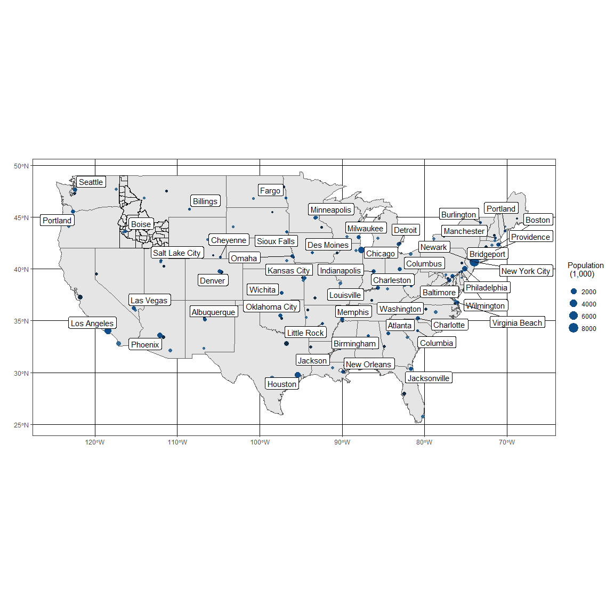

```r
us_cities <- us_cities(map_date = NULL) %>%
  filter(state != "AK", state != "HI") %>%  #city != "Belvedere" grouped right thanks to Blake and Dylan 
  group_by(state) %>%
  filter(row_number(desc(population)) %in% c(1,2,3)) %>%
  group_by(state) %>%
  mutate(rank = rank(population))

big_city <- us_cities %>%
  group_by(state) %>%
  filter(row_number(desc(population)) == 1) 
```


```r
#http://sape.inf.usi.ch/quick-reference/ggplot2/colour
#R for data science chapter 28 for labels

ggplot() +
  geom_sf(data = states) +
  geom_sf( data = id, colour = "black", fill = NA) +
  geom_point(data = us_cities, aes(x = lon, y = lat, size = population/1000, color = rank), show.legend = FALSE) +
  geom_point(data = big_city, aes(x = lon, y = lat, size = population/1000), color = "dodgerblue4") +
  labs(size = "Population \n (1,000)",
       x = "",
       y = "") +
  geom_label_repel(aes(x = lon, y = lat, label = city), data = big_city) +
  theme_bw()
```

<!-- -->
