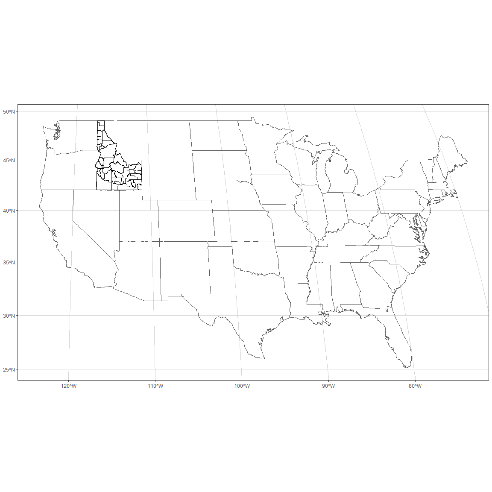

```r
us_cities <- us_cities(map_date = NULL) %>%
  filter(state != "AK", state != "HI") %>%  #city != "Belvedere" grouped right thanks to Blake and Dylan 
  group_by(state) %>%
  filter(row_number(desc(population)) %in% c(1,2,3)) %>%
  mutate(rank = rank(desc(population))) #Thanks Wolfe for this new idea!

big_city <- us_cities %>%
  group_by(state) %>%
  filter(row_number(desc(population)) == 1) 

states_tr <- states %>% 
  st_transform( crs = my_proj)
id1 <- id %>%
  st_transform( crs = my_proj)
```


```r
#http://sape.inf.usi.ch/quick-reference/ggplot2/colour
#R for data science chapter 28 for labels

ggplot() +
  geom_sf(data = states_tr, fill = NA, inherit.aes = TRUE) +
  geom_sf( data = id1, colour = "black", fill = NA, inherit.aes = TRUE) +
  theme_bw() +
    theme(panel.grid.major = element_line(colour = "lightgray"))
```

<!-- -->

```r
#stuff you can do in theme for the grid
#panel.grid.minor = element_blank(), 
#   panel.grid.major = element_blank(),
#   plot.background = element_rect(fill = "transparent", colour = NA)
```
