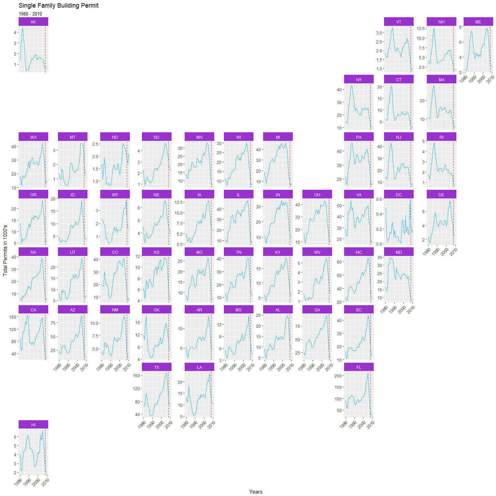
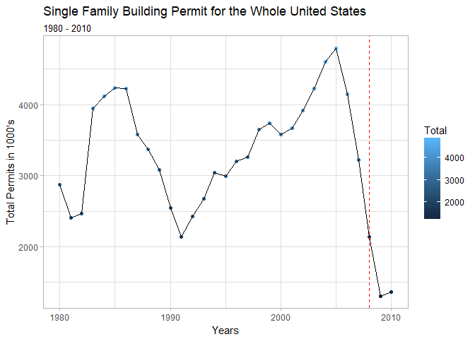

```r
 #single family
permit <- permits %>%
  filter(variable == "Single Family") %>%
  group_by(StateAbbr, year) %>%
  summarise(value = sum(value))

ggplot(data = permit) +
  geom_line(aes(x = year, y = value/1000), color = "deepskyblue2", linetype = "F1" ) +
  geom_vline(xintercept = 2008, color = "red", linetype = "dashed") +
  facet_geo(~ StateAbbr, grid = "us_state_grid2", scales = "free_y") +
  scale_x_continuous(breaks = seq(1980, 2010, by = 10)) +
  labs(title = "Single Family Building Permit",
       subtitle = "1980 - 2010",
       x = "Years",
       y = "Total Permits in 1000's") +
  theme(axis.text.x = element_text(angle = 45, hjust = 1), strip.background = element_rect(fill = "darkorchid"), strip.text = element_text(colour = 'white'))
```

<!-- -->


```r
top_permit <- permits %>% 
  group_by(year) %>%
  summarise(total = sum(value))

ggplot(data = top_permit, aes(x = year, y = total/1000)) +
  geom_point(aes(color = total/1000)) +
  geom_line() +
  geom_vline(xintercept = 2008, color = "red", linetype = "dashed") +
   labs(title = "Single Family Building Permit for the Whole United States",
       subtitle = "1980 - 2010",
       x = "Years",
       y = "Total Permits in 1000's",
       color = "Total") +
  theme_light()
```

<!-- -->

I have created two graphics for this case study. The first graph shows the amount of permits issued per state from 1980-2010. I have put a dashed red line in 2008 because several major financial institutions collapsed in September 2008. I changed some colors to make it more readable and I feel that the first graph is able to answer depict permit patterns across your state as well as the patterns in the US. The second graph sums up every state each year so you can see which year had the highest total permits issued. I also put a dashed line to show the collapse in 2008.
